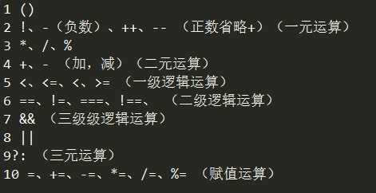

## 操作符与优先级

### 1.操作符种类

1.  算数运算符（+---\*/\...）

    a.  一元运算符：正号、负号、++、\--、平方等一个变量就能运算

    b.  二元运算符：+-\*/%等两个变量才能运算

    c.  三元运算符： 值1？值2：值3；

2.  逻辑运算符（ \|& ! ）（或且非）

3.  比较运算符（\<、\>、==、\>=\...）

4.  赋值运算符（=、+=、-=、\*=、/=、%=）

### 2.执行顺序(优先级)

### 3.短路运算

### 1. &&链接两个boolean类型，有一个是false结果就是false。

链接值不是布尔类型时，按照成布尔类型计算，结果本身不变。（非布尔）

如果不是boolean类型值，会按照对应的布尔类型之计算，然后返回的值不变。

例子： 1 = 2&&1； 0 = 0 && 1； 都是true取后面，都是false取前面。

### 2.||链接两个boolean类型，有一个是true结果就是true。

链接值不是布尔类型时，按照成布尔类型计算，结果本身不变。（非布尔）

如果不是boolean类型值，会按照对应的布尔类型之计算，然后返回的值不变。

例子： 2= 2\|\|1； 1 = 0 \|\| 1； 都是true取前面，都是false取后面。

三、流程控制

> 1.选择结构:
> 共有两种，if语句和switch语句。If常用，switch为特殊情况使用，判断条件出现的情况特别多的时候用switch，其他时候if语句比较方便。
>
> 2.循环结构: 共3种，for/while/do\...while；可根据需求选择使用；
>
> (1)遍历数组首选for循环，简单循环使用for。
>
> (2)而while循环强调，不记循环次数（不知道循环多少次），首选while。
>
> (3)最后do\...while循环强调，无论怎样，至少执行一次是，使用do\...while。

1.if语句

1.  If语句用法有三种

<!-- -->

1.  if(条件1){程序1}

2.  if(条件1){程序1}else{程序2}

3.  if(条件1){程序1}else if(条件2){程序2}\...else{程序n}

<!-- -->

2.  三目运算（也叫三元运算）（目或者元代表几个表达式）

> 三目运算可以替代部分if\...else\...功能，运算简单，使用方便，代码清晰。

表达式1？值1：值2. Switch语句

2. switch语句
-------------

> switch (值1) {
>
> case value1:
>
> 程序1；
>
> break; // break 关键字会导致代码执行流跳出 switch 语句
>
> case value2:
>
> 程序2；
>
> break;
>
> default:
>
> 程序3；
>
> }
>
> 注意：
>
> break可以省略，如果省略，代码会继续执行下一个case
>
> switch 语句在比较值时使用的是全等操作符，因此不会发生类型转换
>
> （例如，字符串 \"10\" 不等于数值 10）。

3.for循环
---------

1)  执行流程

> for (变量;条件1;条件2){ 执行程序 }
>
> 执行过程：变量-\>条件1-\>执行程序-\>条件2-\>条件1-\>执行程序\.....
>
> 直到条件1不成立，跳出循环。

2)  三个表达式均为可选，但是必须写分号！！！

> for(;;){程序} 死循环;