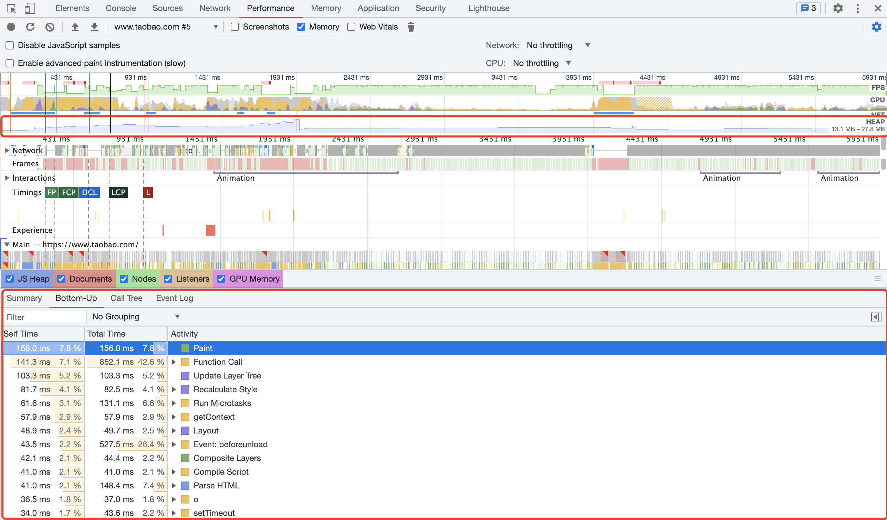
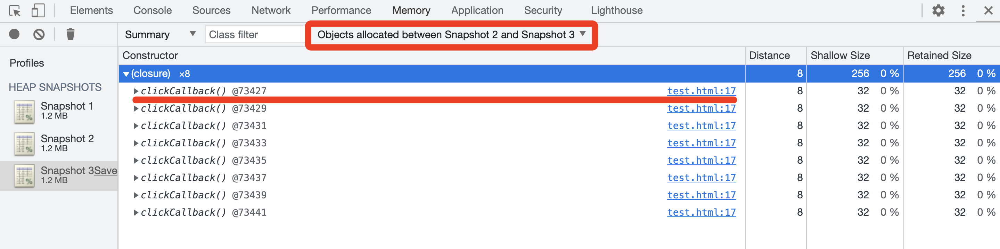
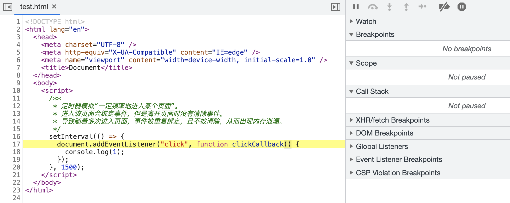
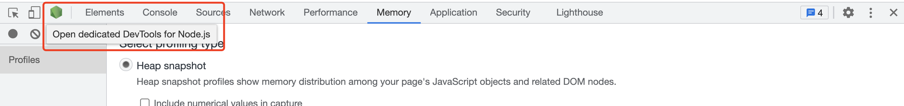

## 前言

> [yanyue404 - #223 从输入 URL 到页面加载的过程（上）](https://github.com/yanyue404/blog/issues/223)
>
> [yanyue404 - #227 从输入 URL 到页面加载的过程（下）](https://github.com/yanyue404/blog/issues/227)

这一部分涉及事件机制、跨域、存储、缓存机制、渲染原理，性能优化和安全等内容。

## 进程与线程

**多进程的浏览器**

浏览器是多进程的，有一个主控进程，以及每一个 tab 标签页面都会新开一个进程（某些情况下多个 tab 会合并进程）

进程可能包括浏览器主控进程，插件进程，渲染进程、GPU (图形处理进程)，tab 页（浏览器内核）等等

Browser 进程：浏览器的主进程（负责协调、主控），只有一个
第三方插件进程：每种类型的插件对应一个进程，仅当使用该插件时才创建
GPU 进程：最多一个，用于 3D 绘制
浏览器渲染进程（内核）：默认每个 Tab 页面一个进程，互不影响，控制页面渲染，脚本执行，事件处理等（有时候会优化，如多个空白 tab 会合并成一个进程）

> Shift+Esc 查看进程信息

**多线程的浏览器内核**

每一个 tab 页面可以看作是浏览器内核进程，然后这个进程是多线程的，它有几大类子线程

- GUI 渲染线程
- JS 引擎线程
- 事件触发线程
- 定时器线程
- 网络请求线程

> GUI 渲染线程 负责渲染浏览器界面（解析 HTML ，CSS，构建 DOM 树 CSSOM 树和 Render 树，布局和绘制等）。 GUI 更新会被保存在一个队列中等到 JS 引擎空闲时立即被执行，当界面需要重绘或由于某种操作引发的重排时，该线程就会执行。 GUI 渲染线程与 JS 引擎线程是互斥的，这也是造成 JS 堵塞的原因所在。

> 可以看到，里面的 JS 引擎是内核进程中的一个线程，这也是为什么常说 JS 引擎是单线程的

**网络请求都是单独的线程**

每次网络请求时都需要开辟单独的线程进行，譬如如果 URL 解析到 http 协议，就会新建一个网络线程去处理资源下载

因此浏览器会根据解析出得协议，开辟一个网络线程，前往请求资源（这里，暂时理解为是浏览器内核开辟的）

## 浏览器同源策略

同源策略限制了从同一个源加载的文档或脚本如何与来自另一个源的资源进行交互。这是一个用于隔离潜在恶意文件的重要安全机制。如果是两个网页的协议，域名，端口一致，则这两个页面有相同的源。

那么不遵守同源策略则会涉及到跨域问题。

补充：非同源的限制：

```
（1） Cookie、LocalStorage 和 IndexDB 无法读取。

（2） DOM 无法获得。

（3） AJAX 请求不能发送。
```

但是 HTML 中几个标签能逃避过同源策略——`<script src="xxx">`、``、`<link href="xxxx">`，这三个标签的`src/href`可以加载其他域的资源，不受同源策略限制。

因此，这使得这三个标签可以做一些特殊的事情。

- ``可以做打点统计，因为统计方并不一定是同域的，在讲解 JS 基础知识异步的时候有过代码示例。除了能跨域之外，``几乎没有浏览器兼容问题，它是一个非常古老的标签。
- `<script>`和`<link>`可以使用 CDN，CDN 基本都是其他域的链接。
- 另外`<script>`还可以实现 JSONP，能获取其他域接口的信息，接下来马上讲解。

但是请注意，所有的跨域请求方式，最终都需要信息提供方来做出相应的支持和改动，也就是要经过信息提供方的同意才行，否则接收方是无法得到它们的信息的，浏览器是不允许的。

## 跨域以及解决办法

CORS[1] 同源策略[2]

跨域问题的来源是浏览器为了请求安全而引入的基于同源策略的安全特性。当页面和请求的协议、主机名或端口不同时，浏览器判定两者不同源，即为跨域请求。需要注意的是跨域是浏览器的限制，服务端并不受此影响。当产生跨域时，我们可以通过 JSONP、CORS、postMessage 等方式解决。

### 跨域的解决方案

前端常见的跨域解决方案有 CORS、反向代理（Reverse Proxy）、JSONP 等。

#### 1 CORS (Cross-Origin Resource Sharing)

CORS 是目前最为广泛的解决跨域问题的方案。方案依赖服务端/后端在响应头中添加  `Access-Control-Allow-*`  头，告知浏览器端通过此请求。

涉及到的端

CORS 只需要服务端/后端支持即可，不涉及前端改动。

具体实现方式

CORS 将请求分为简单请求（Simple Requests）和需预检请求（Preflighted requests），不同场景有不同的行为：

简单请求

不会触发预检请求的称为简单请求。当请求满足以下条件时就是一个简单请求：

- 请求方法：`GET`、`HEAD`、`POST`。
- 请求头：`Accept`、`Accept-Language`、`Content-Language`、`Content-Type`。
  - Content-Type 仅支持：`application/x-www-form-urlencoded`、`multipart/form-data`、`text/plain`。

需预检请求

当一个请求不满足以上简单请求的条件时，浏览器会自动向服务端发送一个  OPTIONS  请求，通过服务端返回的  `Access-Control-Allow-*`  判定请求是否被允许。

CORS 引入了以下几个以  `Access-Control-Allow-*`  开头：

- `Access-Control-Allow-Origin`  表示允许的来源
- `Access-Control-Allow-Methods`  表示允许的请求方法
- `Access-Control-Allow-Headers`  表示允许的请求头
- `Access-Control-Allow-Credentials`  表示允许携带认证信息

当请求符合响应头的这些条件时，浏览器才会发送并响应正式的请求。

#### 2 反向代理

反向代理解决跨域问题的方案依赖同源的服务端对请求做一个转发处理，将请求从跨域请求转换成同源请求。

涉及到的端

反向代理只需要服务端/后端支持，几乎不涉及前端改动，只用切换接口即可。

具体实现方式

反向代理的实现方式为在页面同域下配置一套反向代理服务，页面请求同域的服务端，服务端请求上游的实际的服务端，之后将结果返回给前端。

#### 3. JSONP

JSONP 是一个相对古老的跨域解决方案，只支持 GET 请求。主要是利用了浏览器加载 JavaScript 资源文件时不受同源策略的限制而实现跨域获取数据。

涉及到的端

JSONP 需要服务端和前端配合实现。

具体实现方式

JSONP 的原理是利用了浏览器加载 JavaScript 资源文件时不受同源策略的限制而实现的。具体流程如下：

1.  全局注册一个函数，例如：`window.getHZFEMember = (num) => console.log('HZFE Member: ' + num);`。
2.  构造一个请求 URL，例如：`https://hzfe.org/api/hzfeMember?callback=getHZFEMember`。
3.  生成一个  `<script>`  并把  `src`  设为上一步的请求 URL 并插入到文档中，如  `<script src="https://hzfe.org/api/hzfeMember?callback=getHZFEMember" />`。
4.  服务端构造一个 JavaScript 函数调用表达式并返回，例如：`getHZFEMember(17)`。
5.  浏览器加载并执行以上代码，输出  `HZFE Member: 17`。

#### 非常用方式

- postMessage
  - 即在两个 origin 下分别部署一套页面 A 与 B，A 页面通过  `iframe`  加载 B 页面并监听消息，B 页面发送消息。
- window.name
  - 主要是利用  `window.name`  页面跳转不改变的特性实现跨域，即  `iframe`  加载一个跨域页面，设置  `window.name`，跳转到同域页面，可以通过  `$('iframe').contentWindow.name`  拿到跨域页面的数据。
- document.domain
  - 可将相同一级域名下的子域名页面的  `document.domain`  设置为一级域名实现跨域。
  - 可将同域不同端口的  `document.domain`  设置为同域名实现跨域（端口被置为 null）。

参考资料：

- [yanyue404 - #8 跨域请求数据](https://github.com/yanyue404/blog/issues/8)
- [跨域资源共享 CORS 阮一峰](http://www.ruanyifeng.com/blog/2016/04/cors.html)

## cookie、localStorage、sessionStorage 区别

| 特性           | cookie                                                                       | localStorage       | sessionStorage                   |
| -------------- | ---------------------------------------------------------------------------- | ------------------ | -------------------------------- |
| 由谁初始化     | 客户端或服务器，服务器可以使用`Set-Cookie`请求头。                           | 客户端             | 客户端                           |
| 数据的生命周期 | 一般由服务器生成，可设置失效时间，如果在浏览器生成，默认是关闭浏览器之后失效 | 永久保存，可清除   | 仅在当前会话有效，关闭页面后清除 |
| 存放数据大小   | 4KB                                                                          | 5MB                | 5MB                              |
| 与服务器通信   | 每次都会携带在 HTTP 头中，如果使用 cookie 保存过多数据会带来性能问题         | 仅在客户端保存     | 仅在客户端保存                   |
| 用途           | 一般由服务器生成，用于标识用户身份                                           | 用于浏览器缓存数据 | 用于浏览器缓存数据               |
| 访问权限       | 任意窗口                                                                     | 任意窗口           | 当前页面窗口                     |

## 关键渲染路径

关键渲染路径是浏览器将 HTML，CSS 和 JavaScript 转换为屏幕上的像素所经历的步骤序列。优化关键渲染路径可提高渲染性能。关键渲染路径包含了 文档对象模型 (DOM)，CSS 对象模型 (CSSOM)，渲染树和布局。

在解析 HTML 时会创建文档对象模型。HTML 可以请求 JavaScript，而 JavaScript 反过来，又可以更改 DOM。HTML 包含或请求样式，依次来构建 CSS 对象模型。浏览器引擎将两者结合起来以创建渲染树。布局确定页面上所有内容的大小和位置。确定布局后，将像素绘制到屏幕上。

优化关键渲染路径可以缩短首次渲染的时间。了解和优化关键渲染路径对于确保重排和重绘可以每秒 60 帧的速度进行，以确保高效的用户交互并避免讨厌是很重要的。

Web 性能包含了服务器请求和响应、加载、执行脚本、渲染、布局和绘制每个像素到屏幕上。

网页请求从 HTML 文件请求开始。服务器返回 HTML -- 响应头和数据。然后浏览器开始解析 HTML，转换收到的数据为 DOM 树。浏览器每次发现外部资源就初始化请求，无论是样式、脚本或者嵌入的图片引用。有时请求会阻塞，这意味着解析剩下的 HTML 会被终止直到重要的资源被处理。浏览器接着解析 HTML，发请求和构造 DOM 直到文件结尾 ，这时开始构造 CSS 对象模型。等到 DOM 和 CSSOM 完成之后，浏览器构造渲染树，计算所有可见内容的样式。一旦渲染树完成布局开始，定义所有渲染树元素的位置和大小。完成之后，页面被渲染完成，或者说是绘制到屏幕上。

- [关键渲染路径](https://developer.mozilla.org/zh-CN/docs/Web/Performance/Critical_rendering_path)
- [css 性能优化](https://developer.mozilla.org/zh-CN/docs/Learn/Performance/CSS)

## 浏览器渲染原理

渲染过程

1. 解析 HTML 生成 DOM 树。
2. 解析 CSS 生成 CSSOM 规则树。
3. 解析 JS，操作 DOM 树和 CSSOM 规则树。
4. 将 DOM 树与 CSSOM 规则树合并在一起生成渲染树。
5. 遍历渲染树开始布局，计算每个节点的位置大小信息。
6. 浏览器将所有图层的数据发送给 GPU，GPU 将图层合成并显示在屏幕上。

- [浏览器渲染原理](https://developer.mozilla.org/zh-CN/docs/Web/Performance/How_browsers_work)

## 加载页面和渲染过程

### 渲染过程

要点如下：

- 根据 HTML 结构生成 DOM 树
- 根据 CSS 生成 CSSOM
- 将 DOM 和 CSSOM 整合形成 RenderTree
- 根据 RenderTree 开始渲染和展示
- 遇到`<script>`时，会执行并阻塞渲染

上文中，浏览器已经拿到了 server 端返回的 HTML 内容，开始解析并渲染。最初拿到的内容就是一堆字符串，必须先结构化成计算机擅长处理的基本数据结构，因此要把 HTML 字符串转化成 DOM 树 —— 树是最基本的数据结构之一。

解析过程中，如果遇到`<link href="...">`和`<script src="...">`这种外链加载 CSS 和 JS 的标签，浏览器会异步下载，下载过程和上文中下载 HTML 的流程一样。只不过，这里下载下来的字符串是 CSS 或者 JS 格式的。

浏览器将 CSS 生成 CSSOM，再将 DOM 和 CSSOM 整合成 RenderTree ，然后针对 RenderTree 即可进行渲染了。大家可以想一下，有 DOM 结构、有样式，此时就能满足渲染的条件了。另外，这里也可以解释一个问题 —— **为何要将 CSS 放在 HTML 头部？**—— 这样会让浏览器尽早拿到 CSS 尽早生成 CSSOM，然后在解析 HTML 之后可一次性生成最终的 RenderTree，渲染一次即可。如果 CSS 放在 HTML 底部，会出现渲染卡顿的情况，影响性能和体验。

最后，渲染过程中，如果遇到`<script>`就停止渲染，执行 JS 代码。因为浏览器渲染和 JS 执行共用一个线程，而且这里必须是单线程操作，多线程会产生渲染 DOM 冲突。待`<script>`内容执行完之后，浏览器继续渲染。最后再思考一个问题 —— **为何要将 JS 放在 HTML 底部？**—— JS 放在底部可以保证让浏览器优先渲染完现有的 HTML 内容，让用户先看到内容，体验好。另外，JS 执行如果涉及 DOM 操作，得等待 DOM 解析完成才行，JS 放在底部执行时，HTML 肯定都解析成了 DOM 结构。JS 如果放在 HTML 顶部，JS 执行的时候 HTML 还没来得及转换为 DOM 结构，可能会报错。

## 浏览器的重排重绘

**渲染性能 Layout Paint**

浏览器渲染大致分为四个阶段，其中在解析 HTML 后，会依次进入 Layout 和 Paint 阶段。样式或节点的更改，以及对布局信息的访问等，都有可能导致重排和重绘。而重排和重绘的过程在主线程中进行，这意味着不合理的重排重绘会导致渲染卡顿，用户交互滞后等性能问题。

**什么是重排重绘**


1. Parse HTML：相关引擎分别解析文档和样式表以及脚本，生成 DOM 和 CSSOM ，最终合成为 Render 树。
2. Layout：浏览器通过 Render 树中的信息，以递归的形式计算出每个节点的尺寸大小和在页面中的具体位置。
3. Paint：浏览器将 Render 树中的节点转换成在屏幕上绘制实际像素的指令，这个过程发生在多个图层上。
4. Composite：浏览器将所有层按照一定顺序合并为一个图层并绘制在屏幕上。

图中所示步骤为浏览器渲染的关键路径。浏览器从获取文档、样式、脚本等内容，到最终渲染结果到屏幕上，通常需要经过如图所示的步骤。而 DOM 或 CSSOM 被修改，会导致浏览器重复执行图中的步骤。重排和重绘，本质上指的就是触发 Layout 和 Paint 的过程，且重排必定导致重绘。

#### Reflow 重排

当涉及到 DOM 节点的布局属性发生变化时，就会重新计算该属性，浏览器会重新描绘相应的元素，此过程叫 Reflow（回流或重排）。

#### Repaint 重绘

当影响 DOM 元素可见性的属性发生变化 (如 color、opacity 等) 时, 浏览器会重新描绘相应的元素, 此过程称为 Repaint（重绘）。因此重排必然会引起重绘。

#### 引起 Repaint 和 Reflow 的一些操作

- 调整窗口大小
- 字体大小
- 样式表变动
- 元素内容变化，尤其是输入控件
- CSS 伪类激活，在用户交互过程中发生
- DOM 操作，DOM 元素增删、修改
- 获取布局信息时，会导致重排。相关的方法属性如 offsetTop getComputedStyle 等。

#### Repaint 和 Reflow 是不可避免的，只能说对性能的影响减到最小，给出下面几条建议：

- 避免逐条更改样式。建议集中修改样式，例如操作 className。
- 对 DOM 进行批量写入和读取（通过虚拟 DOM 或者 DocumentFragment 实现）
- 使用变量对布局信息（如 clientTop）进行缓存，避免因频繁读取布局信息而触发重排和重绘。
- 绝对定位使它脱离文档流，避免引起父元素及后续元素大量的回流
- 合理利用特殊样式属性（如 transform: translateZ(0) 或者 will-change），将渲染层提升为合成层，开启 GPU 加速，提高页面性能。

参考资料：

- [减少页面重排与重绘（Reflow & Repaint）](https://harttle.land/2015/08/11/reflow-repaint.html)
- [页面重构应注意的 repaint 和 reflow](http://www.blueidea.com/tech/web/2011/8365.asp)

## 浏览器缓存机制

缓存可以说是性能优化中**简单高效**的一种优化方式了，它可以**显著减少网络传输所带来的损耗**。

对于一个数据请求来说，可以分为发起网络请求、后端处理、浏览器响应三个步骤。浏览器缓存可以帮助我们在第一和第三步骤中优化性能。比如说直接使用缓存而不发起请求，或者发起了请求但后端存储的数据和前端一致，那么就没有必要再将数据回传回来，这样就减少了响应数据。

接下来的内容中我们将通过以下几个部分来探讨浏览器缓存机制：

- 缓存位置
- 缓存策略
- 实际场景应用缓存策略

## 缓存位置

从缓存位置上来说分为四种，并且各自有**优先级**，当依次查找缓存且都没有命中的时候，才会去请求网络

1.  Service Worker
2.  Memory Cache
3.  Disk Cache
4.  Push Cache
5.  网络请求

### Service Worker

Service Worker 的缓存与浏览器其他内建的缓存机制不同，它可以让我们**自由控制**缓存哪些文件、如何匹配缓存、如何读取缓存，并且**缓存是持续性的**。

当 Service Worker 没有命中缓存的时候，我们需要去调用 `fetch` 函数获取数据。也就是说，如果我们没有在 Service Worker 命中缓存的话，会根据缓存查找优先级去查找数据。**但是不管我们是从 Memory Cache 中还是从网络请求中获取的数据，浏览器都会显示我们是从 Service Worker 中获取的内容。**

### Memory Cache

Memory Cache 也就是内存中的缓存，读取内存中的数据肯定比磁盘快。**但是内存缓存虽然读取高效，可是缓存持续性很短，会随着进程的释放而释放。** 一旦我们关闭 Tab 页面，内存中的缓存也就被释放了。

当我们访问过页面以后，再次刷新页面，可以发现很多数据都来自于内存缓存

从内存中读取缓存

那么既然内存缓存这么高效，我们是不是能让数据都存放在内存中呢？

先说结论，这是**不可能**的。首先计算机中的内存一定比硬盘容量小得多，操作系统需要精打细算内存的使用，所以能让我们使用的内存必然不多。内存中其实可以存储大部分的文件，比如说 JSS、HTML、CSS、图片等等。但是浏览器会把哪些文件丢进内存这个过程就很**玄学**了，我查阅了很多资料都没有一个定论。

当然，我通过一些实践和猜测也得出了一些结论：

- 对于大文件来说，大概率是不存储在内存中的，反之优先
- 当前系统内存使用率高的话，文件优先存储进硬盘

### Disk Cache

Disk Cache 也就是存储在硬盘中的缓存，读取速度慢点，但是什么都能存储到磁盘中，比之 Memory Cache **胜在容量和存储时效性上。**

在所有浏览器缓存中，Disk Cache 覆盖面基本是最大的。它会根据 HTTP Herder 中的字段判断哪些资源需要缓存，哪些资源可以不请求直接使用，哪些资源已经过期需要重新请求。**并且即使在跨站点的情况下，相同地址的资源一旦被硬盘缓存下来，就不会再次去请求数据。**

### Push Cache

Push Cache 是 HTTP/2 中的内容，当以上三种缓存都没有命中时，它才会被使用。**并且缓存时间也很短暂，只在会话（Session）中存在，一旦会话结束就被释放。**

Push Cache 在国内能够查到的资料很少，也是因为 HTTP/2 在国内不够普及，但是 HTTP/2 将会是日后的一个趋势。这里推荐阅读 [HTTP/2 push is tougher than I thought](https://link.juejin.im/?target=https%3A%2F%2Fjakearchibald.com%2F2017%2Fh2-push-tougher-than-i-thought%2F) 这篇文章，但是内容是英文的，我翻译一下文章中的几个结论，有能力的同学还是推荐自己阅读

- 所有的资源都能被推送，但是 Edge 和 Safari 浏览器兼容性不怎么好
- 可以推送 `no-cache` 和 `no-store` 的资源
- 一旦连接被关闭，Push Cache 就被释放
- 多个页面可以使用相同的 HTTP/2 连接，也就是说能使用同样的缓存
- Push Cache 中的缓存只能被使用一次
- 浏览器可以拒绝接受已经存在的资源推送
- 你可以给其他域名推送资源

### 网络请求

如果所有缓存都没有命中的话，那么只能发起请求来获取资源了。

那么为了性能上的考虑，大部分的接口都应该选择好缓存策略，接下来我们就来学习缓存策略这部分的内容。

## 缓存策略

通常浏览器缓存策略分为两种：**强缓存**和**协商缓存**，并且缓存策略都是通过设置 HTTP Header 来实现的。

### 强缓存

强缓存可以通过设置两种 HTTP Header 实现：`Expires` 和 `Cache-Control` 。强缓存表示在缓存期间不需要请求，`state code` 为 200。

#### Expires

Expires: Wed, 22 Oct 2018 08:41:00 GMT

`Expires` 是 HTTP/1 的产物，表示资源会在 `Wed, 22 Oct 2018 08:41:00 GMT` 后过期，需要再次请求。并且 `Expires` **受限于本地时间**，如果修改了本地时间，可能会造成缓存失效。

#### Cache-control

Cache-control: max-age=30

`Cache-Control` 出现于 HTTP/1.1，**优先级高于 `Expires`** 。该属性值表示资源会在 30 秒后过期，需要再次请求。

`Cache-Control` **可以在请求头或者响应头中设置**，并且可以组合使用多种指令

多种指令配合流程图

从图中我们可以看到，我们可以将**多个指令配合起来一起使用**，达到多个目的。比如说我们希望资源能被缓存下来，并且是客户端和代理服务器都能缓存，还能设置缓存失效时间等等。

常见指令作用

### 协商缓存

如果缓存过期了，就需要发起请求验证资源是否有更新。协商缓存可以通过设置两种 HTTP Header 实现：`Last-Modified` 和 `ETag` 。

当浏览器发起请求验证资源时，如果资源没有做改变，那么服务端就会返回 304 状态码，并且更新浏览器缓存有效期。

**协商缓存**

#### Last-Modified 和 If-Modified-Since

`Last-Modified` 表示本地文件最后修改日期，`If-Modified-Since` 会将 `Last-Modified` 的值发送给服务器，询问服务器在该日期后资源是否有更新，有更新的话就会将新的资源发送回来，否则返回 304 状态码。

但是 `Last-Modified` 存在一些弊端：

- 如果本地打开缓存文件，即使没有对文件进行修改，但还是会造成 `Last-Modified` 被修改，服务端不能命中缓存导致发送相同的资源
- 因为 `Last-Modified` 只能以秒计时，如果在不可感知的时间内修改完成文件，那么服务端会认为资源还是命中了，不会返回正确的资源

因为以上这些弊端，所以在 HTTP / 1.1 出现了 `ETag` 。

#### ETag 和 If-None-Match

`ETag` 类似于文件指纹，`If-None-Match` 会将当前 `ETag` 发送给服务器，询问该资源 `ETag` 是否变动，有变动的话就将新的资源发送回来。并且 `ETag` 优先级比 `Last-Modified` 高。

以上就是缓存策略的所有内容了，看到这里，不知道你是否存在这样一个疑问。**如果什么缓存策略都没设置，那么浏览器会怎么处理？**

对于这种情况，浏览器会采用一个启发式的算法，通常会取响应头中的 `Date` 减去 `Last-Modified` 值的 10% 作为缓存时间。

## 实际场景应用缓存策略

单纯了解理论而不付诸于实践是没有意义的，接下来我们来通过几个场景学习下如何使用这些理论。

### 频繁变动的资源

对于频繁变动的资源，首先需要使用 `Cache-Control: no-cache` 使浏览器每次都请求服务器，然后配合 `ETag` 或者 `Last-Modified` 来验证资源是否有效。这样的做法虽然不能节省请求数量，但是能显著减少响应数据大小。

### 代码文件

这里特指除了 HTML 外的代码文件，因为 HTML 文件一般不缓存或者缓存时间很短。

一般来说，现在都会使用工具来打包代码，那么我们就可以对文件名进行哈希处理，只有当代码修改后才会生成新的文件名。基于此，我们就可以给代码文件设置缓存有效期一年 `Cache-Control: max-age=31536000`，这样只有当 HTML 文件中引入的文件名发生了改变才会去下载最新的代码文件，否则就一直使用缓存。

## 性能优化

性能优化的题目也是面试常考的，这类题目有很大的扩展性，能够扩展出来很多小细节，而且对个人的技术视野和业务能力有很大的挑战。这部分笔者会重点讲下常用的性能优化方案。

> 题目：总结前端性能优化的解决方案

### 优化原则和方向

性能优化的原则是**以更好的用户体验为标准**，具体就是实现下面的目标：

1.  多使用内存、缓存或者其他方法
2.  减少 CPU 和 GPU 计算，更快展现

优化的方向有两个：

- **减少页面体积，提升网络加载**
- **优化页面渲染**

### 减少页面体积，提升网络加载

- 静态资源的压缩合并（JS 代码压缩合并、CSS 代码压缩合并、雪碧图）
- 静态资源缓存（资源名称加 MD5 戳）
- 使用 CDN 让资源加载更快

### 优化页面渲染

- CSS 放前面，JS 放后面
- 懒加载（图片懒加载、下拉加载更多）
- 减少 DOM 查询，对 DOM 查询做缓存
- 减少 DOM 操作，多个操作尽量合并在一起执行（`DocumentFragment`）
- 事件节流
- 尽早执行操作（`DOMContentLoaded`）
- 使用 SSR 后端渲染，数据直接输出到 HTML 中，减少浏览器使用 JS 模板渲染页面 HTML 的时间

### 详细解释

#### 静态资源的压缩合并

如果不合并，每个都会走一遍之前介绍的请求过程

```js
<script src="a.js"></script>
<script src="b.js"></script>
<script src="c.js"></script>
```

如果合并了，就只走一遍请求过程

```js
<script src="abc.js"></script>
```

#### 静态资源缓存

通过链接名称控制缓存

```js
<script src="abc_1.js"></script>
```

只有内容改变的时候，链接名称才会改变

```js
<script src="abc_2.js"></script>
```

这个名称不用手动改，可通过前端构建工具根据文件内容，为文件名称添加 MD5 后缀。

#### 使用 CDN 让资源加载更快

CDN 会提供专业的加载优化方案，静态资源要尽量放在 CDN 上。例如：

```js
<script src="https://cdn.bootcss.com/zepto/1.0rc1/zepto.min.js"></script>
```

#### 使用 SSR 后端渲染

可一次性输出 HTML 内容，不用在页面渲染完成之后，再通过 Ajax 加载数据、再渲染。例如使用 smarty、Vue SSR 等。

#### CSS 放前面，JS 放后面

上文讲述浏览器渲染过程时已经提过，不再赘述。

#### 懒加载

一开始先给为 `src` 赋值成一个通用的预览图，下拉时候再动态赋值成正式的图片。如下，`preview.png`是预览图片，比较小，加载很快，而且很多图片都共用这个`preview.png`，加载一次即可。待页面下拉，图片显示出来时，再去替换`src`为`data-realsrc`的值。

```js

```

另外，这里为何要用`data-`开头的属性值？—— 所有 HTML 中自定义的属性，都应该用`data-`开头，因为`data-`开头的属性浏览器渲染的时候会忽略掉，提高渲染性能。

#### DOM 查询做缓存

两段代码做一下对比：

```js
var pList = document.getElementsByTagName('p') // 只查询一个 DOM ，缓存在 pList 中了
var i
for (i = 0; i < pList.length; i++) {}
```

```js
var i
for (i = 0; i < document.getElementsByTagName('p').length; i++) {
  // 每次循环，都会查询 DOM ，耗费性能
}
```

总结：DOM 操作，无论查询还是修改，都是非常耗费性能的，应尽量减少。

#### 合并 DOM 插入

DOM 操作是非常耗费性能的，因此插入多个标签时，先插入 Fragment 然后再统一插入 DOM。

```js
var listNode = document.getElementById('list')
// 要插入 10 个 li 标签
var frag = document.createDocumentFragment()
var x, li
for (x = 0; x < 10; x++) {
  li = document.createElement('li')
  li.innerHTML = 'List item ' + x
  frag.appendChild(li) // 先放在 frag 中，最后一次性插入到 DOM 结构中。
}
listNode.appendChild(frag)
```

#### 事件节流

例如要在文字改变时触发一个 change 事件，通过 keyup 来监听。使用节流。

```js
var textarea = document.getElementById('text')
var timeoutId
textarea.addEventListener('keyup', function() {
  if (timeoutId) {
    clearTimeout(timeoutId)
  }
  timeoutId = setTimeout(function() {
    // 触发 change 事件
  }, 100)
})
```

#### 尽早执行操作

```js
window.addEventListener('load', function() {
  // 页面的全部资源加载完才会执行，包括图片、视频等
})
document.addEventListener('DOMContentLoaded', function() {
  // DOM 渲染完即可执行，此时图片、视频还可能没有加载完
})
```

#### 性能优化怎么做

上面提到的都是性能优化的单个点，性能优化项目具体实施起来，应该按照下面步骤推进：

1.  建立性能数据收集平台，摸底当前性能数据，通过性能打点，将上述整个页面打开过程消耗时间记录下来
2.  分析耗时较长时间段原因，寻找优化点，确定优化目标
3.  开始优化
4.  通过数据收集平台记录优化效果
5.  不断调整优化点和预期目标，循环 2~4 步骤

性能优化是个长期的事情，不是一蹴而就的，应该本着先摸底、再分析、后优化的原则逐步来做。

我的文章

- [前端思考 —— 性能优化 ](https://github.com/yanyue404/blog/issues/120)

## Web 安全

## XSS

> 涉及面试题：什么是 XSS 攻击？如何防范 XSS 攻击？什么是 CSP？

XSS 简单点来说，就是攻击者想尽一切办法将可以执行的代码注入到网页中。

XSS 可以分为多种类型，但是总体上我认为分为两类：**持久型和非持久型**。

持久型也就是攻击的代码被服务端写入进**数据库**中，这种攻击危害性很大，因为如果网站访问量很大的话，就会导致大量正常访问页面的用户都受到攻击。

举个例子，对于评论功能来说，就得防范持久型 XSS 攻击，因为我可以在评论中输入以下内容

这种情况如果前后端没有做好防御的话，这段评论就会被存储到数据库中，这样每个打开该页面的用户都会被攻击到。

非持久型相比于前者危害就小的多了，一般通过**修改 URL 参数**的方式加入攻击代码，诱导用户访问链接从而进行攻击。

举个例子，如果页面需要从 URL 中获取某些参数作为内容的话，不经过过滤就会导致攻击代码被执行

```bash
<!-- http://www.domain.com?name=<script>alert(1)</script> --> <div>{{name}}</div>
```

但是对于这种攻击方式来说，如果用户使用 Chrome 这类浏览器的话，浏览器就能自动帮助用户防御攻击。但是我们不能因此就不防御此类攻击了，因为我不能确保用户都使用了该类浏览器。

对于 XSS 攻击来说，通常有两种方式可以用来防御。

### 转义字符

首先，对于用户的输入应该是永远不信任的。最普遍的做法就是转义输入输出的内容，对于引号、尖括号、斜杠进行转义

```js
function escape(str) {
  str = str.replace(/&/g, '&amp;')
  str = str.replace(/</g, '&lt;')
  str = str.replace(/>/g, '&gt;')
  str = str.replace(/"/g, '&quto;')
  str = str.replace(/'/g, '&#39;')
  str = str.replace(/`/g, '&#96;')
  str = str.replace(/\//g, '&#x2F;')
  return str
}
```

通过转义可以将攻击代码 `<script>alert(1)</script>` 变成

```
 // -> &lt;script&gt;alert(1)&lt;&#x2F;script&gt;
 escape('<script>alert(1)</script>')
```

但是对于显示富文本来说，显然不能通过上面的办法来转义所有字符，因为这样会把需要的格式也过滤掉。对于这种情况，通常采用白名单过滤的办法，当然也可以通过黑名单过滤，但是考虑到需要过滤的标签和标签属性实在太多，更加推荐使用白名单的方式。

```js
const xss = require('xss')
let html = xss('<h1 id="title">XSS Demo</h1><script>alert("xss");</script>')
// -> <h1>XSS Demo</h1>&lt;script&gt;alert("xss");&lt;/script&gt;
console.log(html)
```

以上示例使用了 `js-xss` 来实现，可以看到在输出中保留了 `h1` 标签且过滤了 `script` 标签。

### CSP

CSP ( Content Security Policy 内容安全策略), 它能帮助开发者保护自己的页面不受外部攻击，和保护资源不被盗用。本质上就是建立白名单，开发者明确告诉浏览器哪些外部资源可以加载和执行。我们只需要配置规则，如何拦截是由浏览器自己实现的。我们可以通过这种方式来尽量减少 XSS 攻击。

通常可以通过两种方式来开启 CSP：

1.  设置 HTTP Header 中的 `Content-Security-Policy`
2.  设置 `meta` 标签的方式 `<meta http-equiv="Content-Security-Policy">`

这里以设置 HTTP Header 来举例

```bash
# github.com

Content-Security-Policy: default-src 'none'
```

- 只允许加载本站资源: `Content-Security-Policy: default-src ‘self’`
- 只允许加载 HTTPS 协议图片: `Content-Security-Policy: img-src https://*`
- 允许加载任何来源框架: `Content-Security-Policy: child-src 'none'`

当然可以设置的属性远不止这些，你可以通过查阅 [文档](https://developer.mozilla.org/en-US/docs/Web/HTTP/Headers/Content-Security-Policy) 的方式来学习，这里就不过多赘述其他的属性了。

对于这种方式来说，只要开发者配置了正确的规则，那么即使网站存在漏洞，攻击者也不能执行它的攻击代码，并且 CSP 的兼容性也不错。

## CSRF

> 涉及面试题：什么是 CSRF 攻击？如何防范 CSRF 攻击？

CSRF 中文名为跨站请求伪造。原理就是攻击者构造出一个后端请求地址，诱导用户点击或者通过某些途径自动发起请求。如果用户是在登录状态下的话，后端就以为是用户在操作，从而进行相应的逻辑。

举个例子，假设网站中有一个通过 `GET` 请求提交用户评论的接口，那么攻击者就可以在钓鱼网站中加入一个图片，图片的地址就是评论接口

``

那么你是否会想到使用 `POST` 方式提交请求是不是就没有这个问题了呢？其实并不是，使用这种方式也不是百分百安全的，攻击者同样可以诱导用户进入某个页面，在页面中通过表单提交 `POST` 请求。

### 如何防御

防范 CSRF 攻击可以遵循以下几种规则：

1.  Get 请求不对数据进行修改
2.  不让第三方网站访问到用户 Cookie
3.  阻止第三方网站请求接口
4.  请求时附带验证信息，比如验证码或者 Token

#### SameSite

可以对 Cookie 设置 `SameSite` 属性。该属性支持设置（新版默认值 Lax 支持） Cookie 不随着跨域请求发送，可以很大程度减少 CSRF 的攻击，但是该属性目前并不是所有浏览器都兼容。

现代浏览器针对 Cookie 的 SameSite 属性的默认值已经很合理了，作为网站所有者通常不需要手动设置这个属性，一般只有当我们的服务需要和“第三方”对接时才考虑怎么设置更合理。

Strict 最为严格，表示完全禁止“第三方 Cookie”，只有当前网页的 URL 与请求目标一致时，才会带上 Cookie，一般用于保证系统的封闭性和安全性。

Lax 是目前大多数现代浏览器的默认值，他在保证安全性的前提下，也可以避免一些不好的用户体验，比如从别的网站跳转过时会没有登录态。

None 是最为宽松的一种设定，通常用于开放我们的服务给不同的第三方接入，同时又需要追踪用户的场景，比如广告，设置为 None 时需要考虑开放的安全性。

#### 验证 Referer

对于需要防范 CSRF 的请求，我们可以通过验证 Referer 来判断该请求是否为第三方网站发起的。

> 扩展：[如何绕开 referrer 防盗链](https://juejin.cn/post/6844903892170309640?searchId=202403242313176E57D7DF47C7B154B758)

#### Token

服务器下发一个随机 Token，每次发起请求时将 Token 携带上，服务器验证 Token 是否有效。

## 点击劫持

> 涉及面试题：什么是点击劫持？如何防范点击劫持？

点击劫持是一种视觉欺骗的攻击手段。攻击者将需要攻击的网站通过 `iframe` 嵌套的方式嵌入自己的网页中，并将 `iframe` 设置为透明，在页面中透出一个按钮诱导用户点击。

对于这种攻击方式，推荐防御的方法有两种。

### X-FRAME-OPTIONS

`X-FRAME-OPTIONS` 是一个 HTTP 响应头，在现代浏览器有一个很好的支持。这个 HTTP 响应头 就是为了防御用 `iframe` 嵌套的点击劫持攻击。

```bash
# github.com

X-Frame-Options: deny
```

该响应头有三个值可选，分别是

- `DENY`，表示页面不允许通过 `iframe` 的方式展示
- `SAMEORIGIN`，表示页面可以在相同域名下通过 `iframe` 的方式展示
- `ALLOW-FROM`，表示页面可以在指定来源的 `iframe` 中展示

### JS 防御

对于某些远古浏览器来说，并不能支持上面的这种方式，那我们只有通过 JS 的方式来防御点击劫持了。

```js
    <head>
      <style id="click-jack">
        html {
          display: none !important;
        }
      </style>
    </head>
    <body>
      <script>
        if (self == top) {
          var style = document.getElementById('click-jack')
          document.body.removeChild(style)
        } else {
          top.location = self.location
        }
      </script>
    </body>
```

以上代码的作用就是当通过 `iframe` 的方式加载页面时，攻击者的网页直接不显示所有内容了。

## 中间人攻击

> 涉及面试题：什么是中间人攻击？如何防范中间人攻击？

中间人攻击是攻击方同时与服务端和客户端建立起了连接，并让对方认为连接是安全的，但是实际上整个通信过程都被攻击者控制了。攻击者不仅能获得双方的通信信息，还能修改通信信息。

通常来说不建议使用公共的 Wi-Fi，因为很可能就会发生中间人攻击的情况。如果你在通信的过程中涉及到了某些敏感信息，就完全暴露给攻击方了。

当然防御中间人攻击其实并不难，只需要增加一个安全通道来传输信息。HTTPS 就可以用来防御中间人攻击，但是并不是说使用了 HTTPS 就可以高枕无忧了，因为如果你没有完全关闭 HTTP 访问的话，攻击方可以通过某些方式将 HTTPS 降级为 HTTP 从而实现中间人攻击。

对于开发者来说：

- 支持 HTTPS。
- 开启 HSTS 策略。（服务器可以通过开启 HSTS（HTTP Strict Transport Security）策略，告知浏览器必须使用 HTTPS 连接。但是有个缺点是用户首次访问时因还未收到 HSTS 响应头而不受保护。）

对于用户来说：

- 尽可能使用 HTTPS 链接。
- 避免连接不知名的 WiFi 热点。
- 不忽略不安全的浏览器通知。
- 公共网络不进行涉及敏感信息的交互。
- 用可信的第三方 CA 厂商，不下载来源不明的证书。

## 如何定位内存泄露

`垃圾回收` `DevTools`

内存泄漏是指不再使用的内存，没有被垃圾回收机制回收。当内存泄漏很大或足够频繁时，用户会有所感知：轻则影响应用性能，表现为迟缓卡顿；重则导致应用崩溃，表现为无法正常使用。为了避免内存泄漏带来的不良影响，需要对垃圾回收机制进行了解，掌握内存泄漏分析方法，完善线上相关监控措施。

内存泄漏定位和分析一般需要辅助工具，比如 Chrome DevTools。开发者可以通过 DevTools 记录页面活动概况，生成可视化分析结果，从时间轴中直观了解内存泄漏情况；利用 DevTools 获取若干次内存快照，检查内存堆栈变化；以及使用 Chrome 任务管理器，实时监控内存的使用情况。

### 知识点深入

### 1\. 排查内存泄漏常见问题

在 JavaScript 中，当一些不再需要的数据仍然可达时，V8 会认为这些数据仍在被使用，不会释放内存。为了调试内存泄漏，我们需要找到被错误保留的数据，并确保 V8 能够将其清理掉。

代码量较小时，开发者通常可以基于以下基本原则进行快速自查：

1.  是否滥用全局变量，没有手动回收。
2.  是否没有正确销毁定时器、闭包。
3.  是否没有正确监听事件和销毁事件。

除此之外，开发者可以借助外部工具进行内存泄漏排查。

### 2\. 使用 Chrome DevTools 定位内存泄漏

#### Performance



打开准备分析的页面和 DevTools 的 Performance 面板，勾选 Memory 并开始录制，在模拟用户操作一段时间后结束录制，DevTools 会将这段时间内的页面行为活动进行记录和分析。

通过生成的结果可以直观查看到内存时间线，了解内存随时间的占用变化，如果内存占用曲线成阶梯状一直上升，则可能存在内存泄漏。按需选取时间线中的区域片段，检查对应时间段内的活动类型和时间占用，作为排查和定位内存泄漏的辅助办法。

#### Memory



打开准备分析的页面和 DevTools 的 Memory 面板，按需生成快照。每个快照的内容是快照时刻，进行一次垃圾回收后，应用中所有可达的对象。

当开发者明确知道与内存泄漏关联的用户交互步骤时，可以生成多次内存快照进行对比，排查出泄漏的对象：在做用户交互操作之前，进行一次正常内存堆栈信息的快照；在做用户交互操作中或操作结束时，进行内存快照。使用 Comparison 视图或使用 filter 按需查看快照之间的差异。

上面的图中使用 filter 检查快照 2 和快照 3 的差异，通过结果可知在两个快照之间持续被分配 clickCallback 闭包。通过点击文件路径可以定位到内存泄漏的代码。



### 3\. Node.js 中的内存泄漏定位

如果需要定位 Node.js 中的内存泄漏，启动 Node.js 时带上 --inspect 参数，以便利用 Chrome DevTools 工具生成 Memory 快照数据。如图所示，启动 Node.js 服务后，打开 Chrome DevTools，会有 Node 标识，点击可以打开 Node 专用 DevTools。



除此之外，也可以借助第三方包 heapdump 生成快照文件，导入至 Chrome DevTools 中的 Memory 进行快照对比。

启动 Node.js 时带上 --expose-gc 参数以便调用  `global.gc()`  方法触发垃圾回收。借助  `process.memoryUsage().heapUsed`  检查内存大小，作为内存泄漏的辅助判断。

```js
const heapdump = require('heapdump')
const capture = function() {
  global.gc()
  heapdump.writeSnapshot('./HZFE_HEAPSNAPSHOT/' + Date.now() + '.heapsnapshot')
  console.log('heapUsed:', process.memoryUsage().heapUsed)
}
capture() /* 可能有内存泄漏的代码片段 start */ // code/* 可能有内存泄漏的代码片段 end */capture();
```

参考链接

- http://febook.hzfe.org/awesome-interview/book3/browser-memory-leaks
- [Chrome DevTools](https://developer.chrome.com/docs/devtools/)
- [Fix memory problems](https://developer.chrome.com/docs/devtools/memory-problems/)

## prefetch 和 preload 的区别和使用场景

**preload**

preload 属性用于指示浏览器在页面加载过程中提前加载指定的资源（如脚本、样式表、字体等）。它可以在 head 标签中的 link 元素或者 script 元素上使用。

- 对于脚本资源，可以使用 preload 属性来指示浏览器提前下载并缓存脚本文件，以便在稍后执行时能够更快地加载和执行。

`<link rel="preload" href="script.js" as="script">`

- 对于样式表资源，可以使用 preload 属性来指示浏览器提前下载并缓存样式表文件，以便在稍后应用到文档时能够更快地渲染页面。

`<link rel="preload" href="styles.css" as="style">`

- 对于字体资源，可以使用 preload 属性来指示浏览器提前下载并缓存字体文件，以便在稍后应用到文档时能够更快地显示文本内容。

`<link rel="preload" href="font.woff2" as="font">`

**prefetch**

prefetch 属性用于指示浏览器在空闲时间预先获取未来可能需要的资源。它可以在 head 标签中的 link 元素上使用。

- prefetch 属性适用于那些可能会被用户访问到的资源，但不是当前页面所必需的资源。例如，下一页的 HTML 文件、图片、视频等。

`<link rel="prefetch" href="next-page.html">`

- prefetch 属性可以帮助浏览器在空闲时间提前下载这些资源，以便在用户访问到它们时能够更快地加载和显示。 需要注意的是，preload 和 prefetch 属性并不会立即执行加载操作，而是在浏览器空闲时自动触发。此外，不同浏览器对 preload 和 prefetch 的支持程度可能有所差异。

**总结：**

preload 属性：用于预加载必需的资源，如脚本、样式表、字体等，以加快后续加载和渲染过程。
prefetch 属性：用于预先获取未来可能需要的资源，如下一页的 HTML 文件、图片、视频等，以提高用户访问时的加载速度。

## 参考链接

- Web 前端面试指南与高频考题解析
- 前端面试之道
