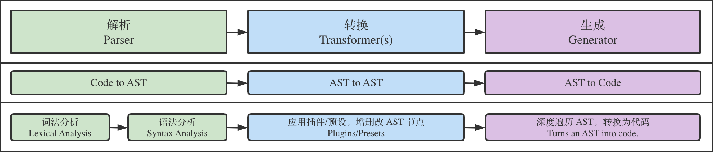

# 工程化

## webpack 常见 loader 和 plugin 有哪些？二者的区别是什么？

### 常见 loader

在 webpack 文档里写了：

[Loaders | webpack](https://webpack.js.org/loaders/)

你可以记住：

- `babel-loader` 把 JS/TS（ES6） 变成 JS（ES5）
- `ts-loader` 把 TS 变成 JS，**并提示类型错误**
- `markdown-loader` 把 markdown 变成 html
- `html-loader` 把 html 变成 JS 字符串
- `sass-loader` 把 SASS/SCSS 变成 CSS
- `css-loader` 把 CSS 变成 JS 字符串
- `style-loader` 把 JS 字符串变成 style 标签
- `postcss-loader` 把 CSS 变成更优化的 CSS
- `vue-loader` 把单文件组件（SFC）变成 JS 模块
- `file-loader` 把文件输出到一个文件夹中，在代码中通过相对 URL 去引用输出的文件
- `url-loader` 和 file-loader 类似，但是能在文件很小的情况下以 base64 的方式把文件内容注入到代码中去
- `eslint-loader` 通过 ESLint 检查 JavaScript 代码规范，**并提示类型错误**
- `thread-loader` 用于多进程打包
- `source-map-loader` 加载额外的 Source Map 文件，以方便代码调试

### 常见 plugin

也在 webpack 文档里写了：

[Plugins | webpack](https://webpack.js.org/plugins/)

你可以记住这些：

- `UglifyJsPlugin` 压缩和混淆代码
- `html-webpack-plugin` 用于创建 HTML 页面并自动引入 JS 和 CSS
- `clean-webpack-plugin` 用于清理之前打包的残余文件
- `mini-css-extract-plugin` 用于将 JS 中的 CSS 抽离成单独的 CSS 文件
- `HotModuleReplacementPlugin` 热跟新
- `SplitChunksPlugin` 用于代码分包（Code Split）
- `DllPlugin` + `DllReferencePlugin` 用于避免大依赖被频繁重新打包，大幅降低打包时间
  - [webpack 使用-详解 DllPlugin](https://segmentfault.com/a/1190000016567986)
- `CommonsChunkPlugin` 提高打包效率，将第三方库和业务代码分开打包
- `DefinePlugin` 用于在 webpack config 里添加全局变量
- `copy-webpack-plugin` 用于拷贝静态文件到 dist
- `webpack-bundle-analyzer` 代码分析；

### 二者的区别

- loader 是文件加载器，让 webpack 拥有加载和解析非 JavaScript 文件的能力
  - 功能：能够对文件进行编译、优化、混淆（压缩）等，比如 babel-loader / vue-loader
  - 运行时机：在创建最终产物之前运行
- plugin 是 webpack 插件（这句废话也很重要）
  - 功能：能实现更多功能，比如定义全局变量、Code Split、加速编译等 （基于事件机制工作，会监听 webpack 打包过程中的某些事件，执行改变输出结果的任务）
  - 运行时机：在整个打包过程（以及前后）都能运行

## webpack 怎么写一个 plugin 和 loader

[实现一个 webpack loader 和 webpack plugin](https://github.com/woai3c/Front-end-articles/issues/6)

## Babel 的原理

> 查看 AST https://astexplorer.net/

Babel 是 JavaScript 编译器：他能让开发者在开发过程中，直接使用各类方言（如 TS、Flow、JSX）或新的语法特性，而不需要考虑运行环境，因为 Babel 可以做到按需转换为低版本支持的代码；Babel 内部原理是将 JS 代码转换为 AST，对 AST 应用各种插件进行处理，最终输出编译后的 JS 代码。

**Babel 编译流程**

三大步骤



1.  解析阶段：Babel 默认使用  @babel/parser  将代码转换为 AST。解析一般分为两个阶段：词法分析和语法分析。

    - 词法分析：对输入的字符序列做标记化(tokenization)操作。
    - 语法分析：处理标记与标记之间的关系，最终形成一颗完整的 AST 结构。

2.  转换阶段：Babel 使用  @babel/traverse  提供的方法对 AST 进行深度优先遍历，调用插件对关注节点的处理函数，按需对 AST 节点进行增删改操作。

3.  生成阶段：Babel 默认使用  @babel/generator  将上一阶段处理后的 AST 转换为代码字符串。

## webpack 如何解决开发时的跨域问题？

在开发时，我们的页面在 `localhost:8080`，JS 直接访问后端接口（如 `https://xiedaimala.com` 或 `http://localhost:3000`）会报跨域错误。

为了解决这个问题，可以在 webpack.config.js 中添加如下配置：

```js
module.exports = {
  //...
  devServer: {
    proxy: {
      '/api': {
        target: 'http://xiedaimala.com',
        changeOrigin: true
      }
    }
  }
}
```

此时，在 JS 中请求 `/api/users` 就会自动被代理到 `http://xiedaimala.com/api/users` 。

如果希望请求中的 Origin 从 8080 修改为 xiedaimala.com，可以添加 `changeOrigin: true` 。

如果要访问的是 HTTPS API，那么就需要配置 HTTPS 证书，否则会报错。

不过，如果在 target 下面添加 `secure: false` ，就可以不配置证书且忽略 HTTPS 报错。

### 工作原理

`proxy`工作原理实质上是利用`http-proxy-middleware`  这个`http`代理中间件，实现请求转发给其他服务器

举个例子：

在开发阶段，本地地址为`http://localhost:3000`，该浏览器发送一个前缀带有`/api`标识的请求到服务端获取数据，但响应这个请求的服务器只是将请求转发到另一台服务器中

```js
const express = require('express')
const proxy = require('http-proxy-middleware')

const app = express()

app.use('/api', proxy({ target: 'http://www.example.org', changeOrigin: true }))
app.listen(3000)

// http://localhost:3000/api/foo/bar -> http://www.example.org/api/foo/bar
```

### 跨域

在开发阶段， `webpack-dev-server`  会启动一个本地开发服务器，所以我们的应用在开发阶段是独立运行在  `localhost`的一个端口上，而后端服务又是运行在另外一个地址上

所以在开发阶段中，由于浏览器同源策略的原因，当本地访问后端就会出现跨域请求的问题

通过设置`webpack proxy`实现代理请求后，相当于浏览器与服务端中添加一个代理者

当本地发送请求的时候，代理服务器响应该请求，并将请求转发到目标服务器，目标服务器响应数据后再将数据返回给代理服务器，最终再由代理服务器将数据响应给本地


在代理服务器传递数据给本地浏览器的过程中，两者同源，并不存在跨域行为，这时候浏览器就能正常接收数据

注意：服务器与服务器之间请求数据并不会存在跨域行为，跨域行为是浏览器安全策略限制

**参考文献**

- https://vue3js.cn/interview/webpack/proxy.htm
- https://webpack.docschina.org/configuration/dev-server/#devserverproxy

## webpack 如何实现 tree-shaking？

[Tree Shaking | webpack](https://webpack.js.org/guides/tree-shaking/#conclusion)

[Tree Shaking | webpack 中文文档](https://webpack.docschina.org/guides/tree-shaking/#conclusion)

### 是什么

tree-shaking 就是让没有用到的 JS 代码不打包，以减小包的体积。

### 怎么做

1.  怎么删

    1.  使用 ES Modules 语法（即 ES6 的 import 和 export 关键字）
    2.  CommonJS 语法无法 tree-shaking（即 require 和 exports 语法）
        - 需要给 bebel-loader 添加 `modules: false` 选项（避免 babel 将 js 自动编译为 CommonJS ）
    3.  引入的时候只引用需要的模块
        - 要写 `import {cloneDeep} from 'lodash-es'` 因为方便 tree-shaking
        - 不要写 `import _ from 'lodash'` 因为会导致无法 tree-shaking 无用模块

2.  怎么不删：在 package.json 中配置 `sideEffects`，防止某些文件被删掉
    1.  比如我 import 了 x.js，而 x.js 只是添加了 `window.x` 属性，那么 x.js 就要放到 sideEffects 里
    2.  比如所有被 import 的 CSS 都要放在 sideEffects 里
3.  怎么开启：在 webpack config 中将 mode 设置为 production（开发环境没必要 tree-shaking）
    - `mode: production` 给 webpack 加了非常多[优化](https://github.com/webpack/webpack/blob/f43047c4c2aa4b0a315328e4c34a319dc2662254/lib/config/defaults.js#L1125)。

原理： tree-shaking 通过静态分析，对代码进行扫描分析，经过词法分析、语法分析、AST 树等分析手段，识别未被引用的代码，标记为冗余代码，真正剔除操作一般是 uglifyjs 模块。

## webpack 热更新原理

webpack 在热更新模式下，启动服务后，服务端会与客户端建立一个长连接（websocket）。文件修改后，服务端会通过长链接向客户端推送一条消息，客户端收到后，会重新请求一个 js 文件，返回的 js 文件会调用 webpackHotUpdatehmr 方法，用于替换掉 **webpack_modules** 中的部分代码。

1. webpack-dev-server 启动本地服务，与 Client 建立长连接
2. Webpack 监听文件修改，修改后通过长连接通知客户端；
3. Client 重新请求文件，替换 **webpack_modules** 中对应部分

首先，介绍 webpack-dev-server:\
webpack-dev-server 主要包含了三个部分：\
1.webpack: 负责编译代码\
2.webpack-dev-middleware: 主要负责构建内存文件系统，把 webpack 的 OutputFileSystem 替换成 InMemoryFileSystem。同时作为 Express 的中间件拦截请求，从内存文件系统中把结果拿出来。\
3.express：负责搭建请求路由服务。

其次，介绍工作流程:\
1.启动 dev-server，webpack 开始构建，在编译期间会向 entry 文件注入热更新代码；\
2.Client 首次打开后，Server 和 Client 基于 Socket 建立通讯渠道；\
3.修改文件，Server 端监听文件发送变动，webpack 开始编译，直到编译完成会触发"Done"事件；\
4.Server 通过 socket 发送消息告知 Client；\
5.Client 根据 Server 的消息（hash 值和 state 状态），通过 ajax 请求获取 Server 的 manifest 描述文件；\
6.Client 对比当前 modules tree ，再次发请求到 Server 端获取新的 JS 模块；\
7.Client 获取到新的 JS 模块后，会更新 modules tree 并替换掉现有的模块；\
8.最后调用 module.hot.accept() 完成热更新；

## 如何利用 webpack 来优化前端性能

webpack 做性能优化主要是考虑打包体积和打包速度。

打包体积分析用 `webpack-bundle-analyzer` 插件，速度分析用：`speed-measure-webpack-plugin` 插件。

- [从前端工程的角度进行性能优化](https://github.com/yanyue404/blog/issues/241)

## 如何提高 webpack 构建速度？

[构建性能 | webpack 中文文档](https://webpack.docschina.org/guides/build-performance/)

0. speed-measure-webpack-plugin 分析构建时间
1. externals 拆包采用 cdn 方式引入 vue, vue-router 及组件库
1. 使用 DllPlugin 将不常变化的 node_modules 代码提前打包，并复用，如 echarts 下选用的模块
1. 使用 thread-loader 进行多线程打包，加速耗时的 loader （例如 babel-loader）
1. 处于开发环境时，在 webpack config 中 使用 cache-loader 加速 Vue/Babel/TypeScript 编译开启缓存
1. import 优化，运用这个插件（babel-plugin-dynamic-import-node）能在代码使用了 import 语法的情况下，大大提高代码的编译速度。
1. 处于生产环境时，关闭不必要的环节，比如可以关闭 source map
1. 网传的 HardSourceWebpackPlugin 已经一年多没更新了，谨慎使用

## webpack 能做哪些性能优化

1. 压缩代码
2. tree-shaking
3. 根据文件内容生成 hash 当作文件名，配合 CDN 做文件缓存
4. 分割代码，按需加载
5. 将第三方插件或公共代码单独提取出来打包

[三十分钟掌握 Webpack 性能优化](https://juejin.cn/post/6844903651291447309)

### webpack 模块加载原理

[深入了解 webpack 模块加载原理](https://juejin.cn/post/6872354325553741838)

### webpack 的构建流程是什么

[webpack 构建流程分析](https://juejin.cn/post/6844904000169607175)

### webpack 的分包策略

[webpack 的分包策略](https://panjiachen.github.io/awesome-bookmarks/blog/webpack/webpack4-b.html)

## webpack 与 vite 的区别是什么？

1.  开发环境区别

    1.  vite 自己实现 server，不对代码打包，充分利用浏览器对 `<script type=module>` 的支持

        1.  假设 main.js 引入了 vue

        2.  该 server 会把 `import { createApp } from 'vue'` 改为 `import { createApp } from "/node_modules/.vite/vue.js"` 这样浏览器就知道去哪里找 vue.js 了

    2.  webpack-dev-server 常使用 babel-loader 基于内存打包，比 vite 慢很多很多很多
        1.  该 server 会把 vue.js 的代码（递归地）打包进 main.js

2.  生产环境区别

    1.  vite 使用 rollup \+ esbuild 来打包 JS 代码

    2.  webpack 使用 babel 来打包 JS 代码，比 esbuild 慢很多很多很多
        1.  webpack 能使用 esbuild 吗？可以，你要自己配置（很麻烦）。

3.  文件处理时机

    1.  vite 只会在你请求某个文件的时候处理该文件

    2.  webpack 会提前打包好 main.js，等你请求的时候直接输出打包好的 JS 给你

目前已知 vite 的缺点有：

1.  热更新常常失败，原因不清楚（F5, ctrl + R）

2.  有些功能 rollup 不支持，需要自己写 rollup 插件

3.  不支持非现代浏览器（浏览器需要支持`<script type=module>` ）

## webpack 和 rollup 的区别

rollup 从设计之初就是面向 ES module 的，它诞生时 AMD、CMD、UMD 的格式之争还很火热，作者希望充分利用 ES module 机制，构建出结构扁平，性能出众的类库.

```js
// rollup.config.js
import resolve from 'rollup-plugin-node-resolve'
import commonjs from 'rollup-plugin-commonjs'
import babel from 'rollup-plugin-babel'

export default [
  {
    input: 'src/index.js',
    output: {
      file: 'dist/bundle.js',
      format: 'umd',
      name: 'test'
    },
    plugins: [
      resolve(),
      commonjs(),
      babel({
        exclude: 'node_modules/**'
      })
    ]
  }
]
```

webpack 致力于复杂 SPA 的模块化构建，优势在于：

1. 通过 loader 处理各种各样的资源依赖
2. HMR 模块热替换
3. 代码按需加载
4. 提取公共模块

rollup 致力于打造性能出众的类库，有如下优势：

1. 编译出来的代码`可读性好`
2. rollup 打包后生成的 bundle 内容十分`干净`，没有什么多余的代码。相比 webpack(webpack 打包后会生成**webpack_require**等 runtime 代码)，rollup 拥有无可比拟的性能优势，这是由依赖处理方式决定的，`编译时依赖处理（rollup）自然比运行时依赖处理（webpack）性能更好`
3. 对于 ES 模块依赖库，rollup 会静态分析代码中的 import，并将排除任何未实际使用的代码
4. 支持程序流分析，能更加正确的判断项目本身的代码是否有副作用(配合 tree-shaking)
5. 支持导出`es`模块文件（webpack 不支持导出 es 模块）

参考资料：

- [【第九期】Rollup：下一代 ES 模块打包工具](https://zhuanlan.zhihu.com/p/75717476)
- http://www.caoyuanpeng.com/Webpack/rollup跟webpack打包的区别.html

## webpack 怎么配置多页应用？

这是对应的 webpack config：

```js
const HtmlWebpackPlugin = require('html-webpack-plugin')

module.exports = {
  entry: {
    app: './src/app.js',
    admin: './src/admin.js'
  },
  plugins: [
    new HtmlWebpackPlugin({
      filename: 'index.html',
      chunks: ['app']
    }),
    new HtmlWebpackPlugin({
      filename: 'admin.html',
      chunks: ['admin']
    })
  ]
}
```

但是，这样配置会有一个「重复打包」的问题：假设 app.js 和 admin.js 都引入了 vue.js，那么 vue.js 的代码既会打包进 app.js，也会打包进 admin.js。我们需要使用 `optimization.splitChunks` 将共同依赖单独打包成 common.js（HtmlWebpackPlugin 会自动引入 common.js）。

### webpack 如何支持无限多页面呢？

写点 Node.js 代码不就实现了么？

```js
const HtmlWebpackPlugin = require('html-webpack-plugin')
const fs = require('fs')
const path = require('path')

const filenames = fs
  .readdirSync('./src/pages')
  .filter((file) => file.endsWith('.js'))
  .map((file) => path.basename(file, '.js'))

const entries = filenames.reduce((result, name) => ({ ...result, [name]: `./src/pages/${name}.js` }), {})
const plugins = filenames.map(
  (name) =>
    new HtmlWebpackPlugin({
      filename: name + '.html',
      chunks: [name]
    })
)

module.exports = {
  entry: {
    ...entries
  },
  plugins: [...plugins]
}
```

## swc、esbuild 是什么？

### swc

实现语言：Rust

功能：编译 JS/TS、打包 JS/TS

优势：比 babel 快很多很多很多（20 倍以上）

能否集成进 webpack：能

使用者：Next.js、Parcel、Deno、Vercel、ByteDance、Tencent、Shopify……

做不到：

1.  对 TS 代码进行类型检查（用 tsc 可以）

2.  打包 CSS、SVG

### esbuild

实现语言：Go

功能：同上

优势：比 babel 快很多很多很多很多很多很多（10~100 倍）

能否集成进 webpack：能

使用者：vite、vuepress、snowpack、umijs、blitz.js 等

做不到：

1.  对 TS 代码进行类型检查

2.  打包 CSS、SVG

## 谈谈对于工程化的理解

前端工程化，其实是软件工程在前端方面的应用。什么是软件工程？百度百科的定义：

软件工程是一门研究用工程化方法构建和维护有效的、使用的和高质量的软件的学科。

换句话说，工程化的目的就是为了提升团队的开发效率。例如大家所熟悉的构建打包、性能优化、自动化部署等知识，都属于工程化的内容。

### 重要的几个概念

1、模块化：JS 的模块化、css 的模块化、资源的模块化（模块化是在文件层面上，对代码或资源的拆分）

2、组件化：组件化是在设计层面上，对 UI（用户界面）的拆分，组件化更重要是一种分治思想，封装组件需要注意组件之间的依赖关系（继承、扩展、嵌套）

3、规范化：编码规范、前后端接口规范、文档规范、组件规范、git 分支管理、commit 描述规范...

4、自动化：雪碧图、持续集成、自动化构建、自动化部署、自动化测试（任何简单机械的重复劳动都应该让机器去完成）

### 目录

1. 技术选型：如何进行技术选型？
2. 统一规范
3. 模块化、组件化
4. 构建工具
5. 自动化
6. 性能优化
7. 监控
8. 重构
9. 项目拆分
10. 测试
11. 创造性

参考

- [yanyue404 - 对前端工程化的理解](https://github.com/yanyue404/blog/issues/244)
- https://woai3c.gitee.io/introduction-to-front-end-engineering/

## 性能优化

> 我的优化策略：[从前端工程的角度进行性能优化](https://github.com/yanyue404/blog/issues/241)

### 如何在 H5 和小程序项目中计算白屏时间和首屏时间

> https://github.com/Advanced-Frontend/Daily-Interview-Question/issues/272

### 前端项目如何找出性能瓶颈

> https://github.com/Advanced-Frontend/Daily-Interview-Question/issues/300

## 前端基建可以做哪些事情？

> https://juejin.cn/post/7256879435339628604

> 来自 ChatGPT 的回答-～～ ⬇️ ⬇️ ⬇️

前端基建是指在前端开发过程中，为提高开发效率、代码质量和团队协作而构建的一些基础设施和工具。下面是前端基建可以做的一些事情：

1.  `脚手架工具`：开发和维护一个通用的脚手架工具，可以帮助团队快速初始化项目结构、配置构建工具、集成常用的开发依赖等。

2.  `组件库`：开发和维护一个内部的组件库，包含常用的 UI 组件、业务组件等，提供给团队成员复用，减少重复开发的工作量。

3.  `构建工具和打包工具`：搭建和维护一套完善的构建和打包工具链，包括使用 Webpack、Parcel 等工具进行代码的压缩、合并、打包等工具，优化前端资源加载和性能。

4.  `自动化测试工具`：引入自动化测试工具，如 Jest、Mocha 等，编写和维护测试用例，进行单元测试、集成测试、UI 测试等，提高代码质量和可靠性。

5.  `文档工具`：使用工具如 JSDoc、Swagger 等，生成项目的 API 文档、接口文档等，方便团队成员查阅和维护。

6.  `Git工作流`：制定和规范团队的 Git 工作流程，使用版本控制工具管理代码，方便团队协作和代码回退。

7.  `性能监控和优化`：引入性能监控工具，如 Lighthouse、Web Vitals 等，对项目进行性能分析，优化网页加载速度、响应时间等。

8.  `工程化规范`：制定并推广团队的代码规范、目录结构规范等，提高代码的可读性、可维护性和可扩展性。

9.  `持续集成和部署`：搭建持续集成和部署系统，如 Jenkins、Travis CI 等，实现代码的自动构建、测试和部署，提高开发效率和代码质量。

10. `项目文档和知识库`：建立一个内部的项目文档和知识库，记录项目的技术细节、开发经验、常见问题等，方便团队成员查阅和学习。

通过建立和维护前端基建，可以提高团队的协作效率，减少重复劳动，提高代码质量和项目的可维护性。

当涉及到前端基建时，还有一些其他的事情可以考虑：

1.  `代码质量工具`：引入代码质量工具，如 ESLint、Prettier 等，对代码进行静态分析和格式化，提高代码的一致性和可读性。

2.  `国际化支持`：为项目添加国际化支持，可以通过引入国际化库，如 i18next、vue-i18n 等，实现多语言的切换和管理。

3.  `错误监控和日志收集`：引入错误监控工具，如 Sentry、Bugsnag 等，实时监控前端错误，并收集错误日志，方便进行问题排查和修复。

4.  `前端性能优化工具`：使用工具如 WebPageTest、Chrome DevTools 等，对项目进行性能分析和优化，提高页面加载速度、响应时间等。

5.  `缓存管理`：考虑合理利用浏览器缓存和服务端缓存，减少网络请求，提升用户访问速度和体验。

6.  `移动端适配`：针对移动端设备，采用响应式设计或使用 CSS 媒体查询等技术，实现移动端适配，保证页面在不同尺寸的设备上有良好的显示效果。

7.  `安全防护`：对项目进行安全审计，使用安全防护工具，如 CSP（Content Security Policy）、XSS 过滤等，保护网站免受常见的安全攻击。

8.  `性能优化指标监控`：监控和分析关键的性能指标，如页面加载时间、首次渲染时间、交互响应时间等，以便及时发现和解决性能问题。

9.  `前端日志分析`：使用日志分析工具，如 ELK（Elasticsearch、Logstash、Kibana）等，对前端日志进行收集和分析，了解用户行为和页面异常情况。

10. `跨平台开发`：考虑使用跨平台开发框架，如 React Native、Flutter 等，实现一套代码在多个平台上复用，提高开发效率。

11. `编辑器配置和插件`：为团队提供统一的编辑器配置文件，包括代码格式化、语法高亮、代码自动补全等，并推荐常用的编辑器插件，提高开发效率。

12. `文档生成工具`：使用工具如 Docusaurus、VuePress 等，为项目生成漂亮的文档网站，方便团队成员查阅和维护项目文档。

13. `Mock数据和接口管理`：搭建一个 Mock 服务器，用于模拟后端接口数据，方便前端开发和测试，同时可以考虑使用接口管理工具，如 Swagger 等，方便接口的定义和调试。

14. `前端监控和统计`：引入前端监控工具，如 Google Analytics、百度统计等，收集用户访问数据和行为信息，用于分析和优化用户体验。

15. `移动端调试工具`：使用工具如 Eruda、VConsole 等，帮助在移动端设备上进行调试和错误排查，提高开发效率。

16. `自动化部署`：配置自动化部署流程，将项目的代码自动部署到服务器或云平台，减少人工操作，提高发布效率和稳定性。

17. `前端团队协作工具`：使用团队协作工具，如 GitLab、Bitbucket 等，提供代码托管、项目管理、任务分配和团队沟通等功能，增强团队协作效率。

18. `前端培训和知识分享`：组织定期的前端培训和技术分享会，让团队成员相互学习和交流，推动技术的共享和提升。

19. `客户端性能优化`：针对移动端应用，可以使用工具如 React Native Performance、Weex 等，进行客户端性能优化，提高应用的响应速度和流畅度。

20. `技术选型和评估`：定期评估和研究前端技术的发展趋势，选择适用的技术栈和框架，以保持项目的竞争力和可持续发展。

以上是一些可以考虑的前端基建事项，根据项目需求和团队情况，可以选择适合的工具和技术进行实施。同时，持续关注前端领域的最新技术和工具，不断优化和改进前端基建，以提高开发效率和项目质量。

当涉及到前端基建时，还有一些其他的事情可以考虑：

1.  `统一的状态管理`：引入状态管理工具，如 Redux、Vuex 等，帮助团队管理前端应用的状态，提高代码的可维护性和可扩展性。

2.  `前端日志记录`：引入前端日志记录工具，如 log4javascript、logrocket 等，记录前端应用的运行日志，方便排查和解决问题。

3.  `前端代码扫描`：使用静态代码扫描工具，如 SonarQube、CodeClimate 等，对前端代码进行扫描和分析，发现潜在的问题和漏洞。

4.  `前端数据可视化`：使用数据可视化工具，如 ECharts、Chart.js 等，将数据以图表或图形的形式展示，增强数据的可理解性和可视化效果。

5.  `前端容灾和故障处理`：制定容灾方案和故障处理流程，对前端应用进行监控和预警，及时处理和恢复故障，提高系统的可靠性和稳定性。

6.  `前端安全加固`：对前端应用进行安全加固，如防止 XSS 攻击、CSRF 攻击、数据加密等，保护用户数据的安全性和隐私。

7.  `前端版本管理`：建立前端代码的版本管理机制，使用工具如 Git、SVN 等，管理和追踪代码的变更，方便团队成员之间的协作和版本控制。

8.  `前端数据缓存`：考虑使用 Local Storage、Session Storage 等技术，对一些频繁使用的数据进行缓存，提高应用的性能和用户体验。

9.  `前端代码分割`：使用代码分割技术，如 Webpack 的动态导入（Dynamic Import），将代码按需加载，减少初始加载的资源大小，提高页面加载速度。

10. `前端性能监测工具`：使用性能监测工具，如 WebPageTest、GTmetrix 等，监测前端应用的性能指标，如页面加载时间、资源加载时间等，进行性能优化。

以上是一些可以考虑的前端基建事项，根据项目需求和团队情况，可以选择适合的工具和技术进行实施。同时，持续关注前端领域的最新技术和工具，不断优化和改进前端基建，以提高开发效率和项目质量。

## Monorepo vs Multirepo

Monorepo 的全称是 monolithic repository，即单体式仓库，与之对应的是 Multirepo(multiple repository)，这里的"单"和"多"是指每个仓库中所管理的模块数量。

Multirepo 是比较传统的做法，即每一个 package 都单独用一个仓库来进行管理。例如：Rollup, ...

Monorep 是把所有相关的 package 都放在一个仓库里进行管理，**每个 package 独立发布**。 例如：React, Angular, Babel, Jest, Umijs, Vue ...

一图胜千言：


当然到底哪一种管理方式更好，仁者见仁，智者见智。前者允许多元化发展（各项目可以有自己的构建工具、依赖管理策略、单元测试方法），后者希望集中管理，减少项目间的差异带来的沟通成本。

虽然拆分子仓库、拆分子 npm 包是进行项目隔离的天然方案，但当仓库内容出现关联时，没有任何一种调试方式比源码放在一起更高效。

结合我们项目的实际场景和业务需要，天然的 MonoRepo ! 因为工程化的最终目的是让业务开发可以 100% 聚焦在业务逻辑上，那么这不仅仅是脚手架、框架需要从自动化、设计上解决的问题，这涉及到仓库管理的设计。

一个理想的开发环境可以抽象成这样：

"**只关心业务代码，可以直接跨业务复用而不关心复用方式，调试时所有代码都在源码中。**"

在前端开发环境中，多 Git Repo，多 npm 则是这个理想的阻力，它们导致复用要关心版本号，调试需要 npm link。而这些是 MonoRepo 最大的优势。

上图中提到的利用相关工具就是今天的主角 Lerna ! Lerna 是业界知名度最高的 Monorepo 管理工具，功能完整。

**单一仓库如何产出不同项目？**

简要思路：

1. 项目目录划分：在 packages 目录下管理需要复用的代码，如（utils 公共函数、components 公共组件、templates 公共模板、store 数据流层等），prd 目录下划分不同项目的页面文件夹

2. 构建参数设计：区分运行环境、执行的 prd 子项目和配置文件（如 vue.config.js）

3. 正确运行：通过 spawnSync 等进程执行工具运行 prd 子项目

## pnpm

> https://pnpm.io/zh/

pnpm 是新一代快速的，节省磁盘空间的包管理工具

- 快速: pnpm is up to 2x faster than npm
- 高效: node_modules 中的文件为复制或链接自特定的内容寻址存储库
- 严格: pnpm 默认创建了一个非平铺的 node_modules，因此代码无法访问任意包

**支持 monorepos** :pnpm 内置支持单仓多包

pnpm 内置了对单一存储库（也称为多包存储库、多项目存储库或单体存储库）的支持， 你可以创建一个 [workspace](https://pnpm.io/zh/workspaces) 以将多个项目合并到一个仓库中。

pnpm 版本兼容性: https://pnpm.io/zh/installation#%E5%85%BC%E5%AE%B9%E6%80%A7

pnpm 的命令,以下是简便的 npm 命令等效列表：

| npm 命令              | pnpm 等效                                            |
| --------------------- | ---------------------------------------------------- |
| `npm install`         | [`pnpm install`](https://pnpm.io/zh/cli/install)     |
| `npm i <pkg>`         | [`pnpm add <pkg>`](https://pnpm.io/zh/cli/add)       |
| `npm run <cmd>`       | [`pnpm <cmd>`](https://pnpm.io/zh/cli/run)           |
| `npm uninstall <cmd>` | [`pnpm remove <cmd>`](https://pnpm.io/zh/cli/remove) |

## 谈谈微前端

微前端就是微服务在前端的应用，也就是前端微服务.

#### 如果使用微服务来重构整个应用有什么好处？

一个应用分解成多个服务，每个服务独自服务内部的功能。例如原来的应用有 abcd 四个页面，现在分解成两个服务，第一个服务有 ab 两个页面，第二个服务有 cd 两个页面，组合在一起就和原来的应用一样。

当应用其中一个服务出故障时，其他服务仍可以正常访问。例如第一个服务出故障了， ab 页面将无法访问，但 cd 页面仍能正常访问。

好处：不同的服务独立运行，服务与服务之间解耦。我们可以把服务理解成组件，就像本小书第 3 章《前端组件化》中所说的一样。每个服务可以独自管理，修改一个服务不影响整体应用的运行，只影响该服务提供的功能。

另外在开发时也可以快速的添加、删除功能。例如电商网站，在不同的节假日时推出的活动页面，活动过后马上就可以删掉。

难点：不容易确认服务的边界。当一个应用功能太多时，往往多个功能点之间的关联会比较深。因而就很难确定这一个功能应该归属于哪个服务。

- https://woai3c.github.io/introduction-to-front-end-engineering/11.html

现在我们将使用微前端框架  [qiankun](https://qiankun.umijs.org/zh/guide)来构建一个微前端应用。之所以选用 qiankun 框架，是因为它有以下几个优点：

- 技术栈无关，任何技术栈的应用都能接入。
- 样式隔离，子应用之间的样式互不干扰。
- 子应用的 JavaScript 作用域互相隔离。
- 资源预加载，在浏览器空闲时间预加载未打开的微应用资源，加速微应用打开速度。

- [微前端 demo](https://github.com/woai3c/micro-frontend-demo/tree/main)

## 前端监控

> https://woai3c.github.io/introduction-to-front-end-engineering/07.html

### 什么时候需要监控

1.  当你的应用频繁报错找不到原因的时候。(集成性能监控的探针 sdk, 收集错误信息)
2.  需要分析用户兴趣爱好、购买习惯。 (集成神策埋点, 收集自定义事件, 通过 PV UV 用户点击,页面跳转等事件漏斗进行统计分析)
3.  需要优化程序的时候，可以做监控收集数据，做针对性的优化。(集成性能监控的探针 sdk, 性能分析)
4.  需要保证服务可靠性稳定性。(集成性能监控的探针 sdk)

如果你的应用符合以上任意一条，就可以对应用实行监控了。监控的作用有两个：事前预警和事后分析。

事前预警：提前设置一个阈值，当监控的数据达到阈值时，通过短信或者邮件通知管理员。例如 API 请求数量突然间暴涨，就得进行报警，否则可能会造成服务器宕机。

事后分析：通过监控日志文件，分析故障原因和故障发生点。从而做出修改，防止这种情况再次发生。

本章内容分为前端监控原理分析和如何对项目实行监控两个部分。第一部分是讲如何写一个简易的监控 SDK，第二部分是讲如何使用  [sentry](https://docs.sentry.io/)实现项目监控。

好了，下面让我们开始进入正文吧。

一个完整的前端监控平台包括三个部分：数据采集与上报、数据整理和存储、数据展示。

本章要讲的就是其中的第一个环节------数据采集与上报。下图是本章要讲述内容的大纲，大家可以先大致了解一下：


仅看理论知识是比较难以理解的，为此我结合本章要讲的技术要点写了一个简单的[监控 SDK](https://github.com/woai3c/monitor-demo)，可以用它来写一些简单的 DEMO，帮助加深理解。再结合本章一起阅读，效果更好。

### 性能数据采集

chrome 开发团队提出了一系列用于检测网页性能的指标：

- FP(first-paint)，从页面加载开始到第一个像素绘制到屏幕上的时间
- FCP(first-contentful-paint)，从页面加载开始到页面内容的任何部分在屏幕上完成渲染的时间
- LCP(largest-contentful-paint)，从页面加载开始到最大文本块或图像元素在屏幕上完成渲染的时间
- CLS(layout-shift)，从页面加载开始和其[生命周期状态](https://developers.google.com/web/updates/2018/07/page-lifecycle-api)变为隐藏期间发生的所有意外布局偏移的累积分数

这四个性能指标都需要通过  [PerformanceObserver](https://developer.mozilla.org/zh-CN/docs/Web/API/PerformanceObserver)来获取（也可以通过  `performance.getEntriesByName()`  获取，但它不是在事件触发时通知的）。PerformanceObserver 是一个性能监测对象，用于监测性能度量事件。

### 错误数据采集

1. 资源加载错误: 使用 addEventListener() 监听 error 事件，可以捕获到资源加载失败错误。
2. js 错误: 使用 window.onerror 可以监听 js 错误。
3. promise 错误: 使用 addEventListener() 监听 unhandledrejection 事件，可以捕获到未处理的 promise 错误。
4. 生产报错信息还原: 使用 source-map.
5. Vue 错误: 利用 window.onerror 是捕获不到 Vue 错误的，它需要使用 Vue 提供的 API 进行监听。 `Vue.config.errorHandler`

### 数据上报

**上报方法**

数据上报可以使用以下几种方式：

- [sendBeacon](https://developer.mozilla.org/zh-CN/docs/Web/API/Navigator/sendBeacon)
- [XMLHttpRequest](https://developer.mozilla.org/zh-CN/docs/Web/API/XMLHttpRequest)
- image

我写的简易 SDK 采用的是第一、第二种方式相结合的方式进行上报。利用 sendBeacon 来进行上报的优势非常明显。

> 使用  `sendBeacon()`  方法会使用户代理在有机会时异步地向服务器发送数据，同时不会延迟页面的卸载或影响下一导航的载入性能。这就解决了提交分析数据时的所有的问题：数据可靠，传输异步并且不会影响下一页面的加载。

在不支持 sendBeacon 的浏览器下我们可以使用 XMLHttpRequest 来进行上报。一个 HTTP 请求包含发送和接收两个步骤。其实对于上报来说，我们只要确保能发出去就可以了。也就是发送成功了就行，接不接收响应无所谓。为此，我做了个实验，在 beforeunload 用 XMLHttpRequest 传送了 30kb 的数据（一般的待上报数据很少会有这么大），换了不同的浏览器，都可以成功发出去。当然，这和硬件性能、网络状态也是有关联的。

**上报时机**

上报时机有三种：

1.  采用  `requestIdleCallback/setTimeout`  延时上报。
2.  在  `beforeunload()`  回调函数里上报。
3.  缓存上报数据，达到一定数量后再上报。

建议将三种方式结合一起上报：

1.  先缓存上报数据，缓存到一定数量后，利用  `requestIdleCallback/setTimeout`  延时上报。
2.  在页面离开时统一将未上报的数据进行上报。

**上报时机代码参考**

- https://github.com/woai3c/monitor-demo/blob/main/src/utils/report.js

```js
import { originalOpen, originalSend } from './xhr'
import { addCache, getCache, clearCache } from './cache'
import generateUniqueID from '../utils/generateUniqueID'
import config from '../config'

export function isSupportSendBeacon() {
  return !!window.navigator?.sendBeacon
}

const sendBeacon = isSupportSendBeacon() ? window.navigator.sendBeacon.bind(window.navigator) : reportWithXHR

const sessionID = generateUniqueID()
export function report(data, isImmediate = false) {
  if (!config.url) {
    console.error('请设置上传 url 地址')
  }

  const reportData = JSON.stringify({
    id: sessionID,
    appID: config.appID,
    userID: config.userID,
    data
  })

  if (isImmediate) {
    sendBeacon(config.url, reportData)
    return
  }

  if (window.requestIdleCallback) {
    window.requestIdleCallback(
      () => {
        sendBeacon(config.url, reportData)
      },
      { timeout: 3000 }
    )
  } else {
    setTimeout(() => {
      sendBeacon(config.url, reportData)
    })
  }
}

let timer = null
export function lazyReportCache(data, timeout = 3000) {
  addCache(data)

  clearTimeout(timer)
  timer = setTimeout(() => {
    const data = getCache()
    if (data.length) {
      report(data)
      clearCache()
    }
  }, timeout)
}

export function reportWithXHR(data) {
  const xhr = new XMLHttpRequest()
  originalOpen.call(xhr, 'post', config.url)
  originalSend.call(xhr, JSON.stringify(data))
}
```

### 前端监控部署

前面说的都是监控原理，但要实现还是得自己动手写代码。为了避免麻烦，我们可以用现有的工具  [sentry](https://docs.sentry.io/)去做这件事。

sentry 是一个用 python 写的性能和错误监控工具，你可以使用 sentry 提供的服务（免费功能少），也可以自己部署服务.

## Nginx

轻量级、高性能的 Web 服务器，在现今的大型应用、网站基本都离不开 Nginx，已经成为了一项必选的技术；其实可以把它理解成 **入口网关**，这里我举个例子可能更好理解:

> 当你去银行办理业务时，刚走进银行，需要到入门处的机器排队取号，然后按指令到对应的柜台办理业务，或者也有可能告诉你，今天不能排号了，回家吧！
>
> 这样一个场景中，**取号机器就是 Nginx(入口网关)**。一个个柜台就是我们的业务服务器(办理业务)；银行中的保险箱就是我们的数据库(存取数据)；🤣

[](https://github.com/xd-tayde/blog/blob/master/images/interview/10.png)

- **特点**:

  - 轻量级，配置方便灵活，无侵入性；
  - 占用内存少，启动快，性能好；
  - 高并发，事件驱动，异步；
  - 热部署，修改配置热生效；

- **架构模型**:

  - 基于 **socket 与 Linux epoll (I/O 事件通知机制)**，实现了 **高并发**；
    - 使用模块化、事件通知、回调函数、计时器、轮询实现非阻塞的异步模式；
    - 磁盘不足的情况，可能会导致阻塞；
  - **Master-worker 进程模式**:
    - Nginx 启动时会在内存中常驻一个 **Master 主进程**，功能:
      - 读取配置文件；
      - 创建、绑定、关闭 socket；
      - 启动、维护、配置 worker 进程；
      - 编译脚本、打开日志；
    - master 进程会开启配置数量的 **worker 进程**，比如根据 CPU 核数等:
      - 利用 socket 监听连接，不会新开进程或线程，节约了创建与销毁进程的成本；
      - 检查网络、存储，把新连接加入到轮询队列中，异步处理；
      - 能有效利用 cpu 多核，并避免了线程切换和锁等待；
  - **热部署模式**:
    - 当我们修改配置热重启后，master 进程会以新的配置新创建 worker 进程，新连接会全部交给新进程处理；
    - 老的 worker 进程会在处理完之前的连接后被 kill 掉，逐步全替换成新配置的 worker 进程；

- **配置**:

  - 官网下载；

  - 配置文件路径： `/usr/local/etc/nginx/nginx.conf`；

  - 启动: 终端输入 `nginx`，访问 `localhost:8080` 就能看到 `Welcome...`；

  - `nginx -s stop`: 停止服务；

  - `nginx -s reload`: 热重启服务；

  - 配置代理: `proxy_pass`

    - 在配置文件中配置即可完成；

    ```source-js
     server {
         listen 80;
         location / {
             proxy_pass http://xxx.xxx.xx.xx:3000;
         }
     }
    ```

- **常用场景**:

  - **代理**:
    - 其实 Nginx 可以算一层 **代理服务器**，将客户端的请求处理一层后，再转发到业务服务器，这里可以分成两种类型，其实实质就是 **请求的转发**，使用 Nginx 非常合适、高效；
  - **正向代理**:
    - 即用户通过访问这层正向代理服务器，再由代理服务器去到原始服务器请求内容后，再返回给用户；
    - 例如我们常使用的 VPN 就是一种常见的正向代理模式。通常我们无法直接访问谷歌服务器，但是通过访问一台国外的服务器，再由这台服务器去请求谷歌返回给用户，用户即可访问谷歌；
    - **特点**:
      - 代理服务器属于 **客户端层**，称之为正向代理；
      - 代理服务器是 **为用户服务**，对于用户是透明的，用户知道自己访问代理服务器；
      - 对内容服务器来说是 **隐藏** 的，内容服务器并无法分清访问是来自用户或者代理；[](https://github.com/xd-tayde/blog/blob/master/images/interview/11.png)
  - **反向代理**:
    - 用户访问头条的反向代理网关，通过网关的一层处理和调度后，再由网关将访问转发到内部的服务器上，返回内容给用户；
    - **特点**:
      - 代理服务器属于 **服务端层**，因此称为反向代理。通常代理服务器与内部内容服务器会隶属于同一内网或者集群；
      - 代理服务器是 **为内容服务器服务** 的，对用户是隐藏的，用户不清楚自己访问的具体是哪台内部服务器；
      - 能有效保证内部服务器的 **稳定与安全**；[](https://github.com/xd-tayde/blog/blob/master/images/interview/12.png)
  - **反向代理的好处**:

    - **安全与权限**:
      - 用户访问必须通过反向代理服务器，也就是便可以在做这层做统一的请求校验，过滤拦截不合法、危险的请求，从而就能更好的保证服务器的安全与稳定；
    - **负载均衡**: 能有效分配流量，最大化集群的稳定性，保证用户的访问质量；

  - **负载均衡**:

    - 负载均衡是基于反向代理下实现的一种 **流量分配** 功能，目的是为了达到服务器资源的充分利用，以及更快的访问响应；
    - 其实很好理解，还是以上面银行的例子来看: **通过门口的取号器，系统就可以根据每个柜台的业务排队情况进行用户的分，使每个柜台都保持在一个比较高效的运作状态，避免出现分配不均的情况**；
    - 由于用户并不知道内部服务器中的队列情况，而反向代理服务器是清楚的，因此通过 Nginx，便能很简单地实现流量的均衡分配；
    - Nginx 实现: `Upstream`模块， 这样当用户访问 `http://xxx` 时，流量便会被按照一定的规则分配到`upstream`中的3台服务器上；

    ```source-js
     http {
         upstream xxx {
             server 1.1.1.1:3001;
             server 2.2.2.2:3001;
             server 3.3.3.3:3001;
         }
         server {
             listen 8080;
             location / {
                 proxy_pass http://xxx;
             }
         }
     }
    ```

    - **分配策略**:

      - **服务器权重(`weight`)**:

        - 可以为每台服务器配置访问权重，传入参数`weight`，例如:

        ```source-js
          upstream xxx {
             server 1.1.1.1:3001 weight=1;
             server 2.2.2.2:3001 weight=1;
             server 3.3.3.3:3001 weight=8;
         }
        ```

      - **时间顺序(默认)**: 按用户的访问的顺序逐一的分配到正常运行的服务器上；

      - **连接数优先(`least_conn`)**: 优先将访问分配到列表中连接数队列最短的服务器上；

      - **响应时间优先(`fair`)**: 优先将访问分配到列表中访问响应时间最短的服务器上；

      - **ip_hash**: 通过 ip_hash 指定，使每个 ip 用户都访问固定的服务器上，有利于用户特异性数据的缓存，例如本地 session 服务等；

      - **url_hash**: 通过 url_hash 指定，使每个 url 都分配到固定的服务器上，有利于缓存；

  - **Nginx 对于前端的作用**:

    - **1\. 快速配置静态服务器**，当访问 `localhost:80` 时，就会默认访问到 `/Users/files/index.html`；

    ```source-js
     server {
     	listen 80;
     	server_name localhost;

     	location / {
     		root   /Users/files;
     		index  index.html;
     	}
     }
    ```

    - **2\. 访问限制**: 可以制定一系列的规则进行访问的控制，例如直接通过 ip 限制:

    ```source-js
     # 屏蔽 192.168.1.1 的访问；
     # 允许 192.168.1.2 ~ 10 的访问；
     location / {
         deny  192.168.1.1;
         allow 192.168.1.2/10;
         deny  all;
     }
    ```

    - **3\. 解决跨域**: 其实跨域是 **浏览器的安全策略**，这意味着只要不是通过浏览器，就可以绕开跨域的问题。所以只要通过在同域下启动一个 Nginx 服务，转发请求即可；

    ```source-js
     location ^~/api/ {
    		 # 重写请求并代理到对应域名下
         rewrite ^/api/(.*)$ /$1 break;
         proxy_pass https://www.cross-target.com/;
     }
    ```

    - **4\. 图片处理**: 通过 ngx_http_image_filter_module 这个模块，可以作为一层图片服务器的代理，在访问的时候 **对图片进行特定的操作，例如裁剪，旋转，压缩等**；

    - **5\. 本地代理，绕过白名单限制**: 例如我们在接入一些第三方服务时经常会有一些域名白名单的限制，如果我们在本地通过`localhost`进行开发，便无法完成功能。这里我们可以做一层本地代理，便可以直接通过指定域名访问本地开发环境；

    ```source-js
     server {
     listen 80;
     server_name www.toutiao.com;

     location / {
         proxy_pass http://localhost:3000;
     }
    }
    ```

## 参考

- [一本小书《带你入门前端工程》](https://woai3c.gitee.io/introduction-to-front-end-engineering/)
- https://github.com/xd-tayde/blog/blob/master/interview-3.md
