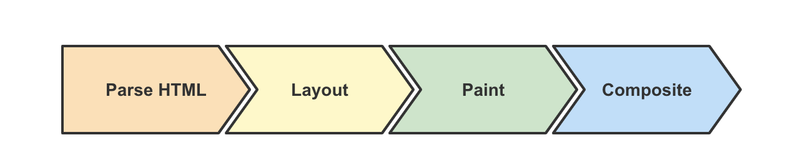

# HTML

## HTML 5 的新特性

（1）标签增删

8 个语义元素 header section footer aside nav main article figure

内容元素 mark 高亮 progress 进度

新的表单控件 calander date time email url search

新的 input 类型 color date datetime datetime-local email

移除过时标签 big font frame frameset

（2）canvas 绘图，支持内联 SVG。支持 MathML

（3）多媒体 audio video source embed track

（4）本地离线存储，把需要离线存储在本地的文件列在一个 manifest 配置文件

（5）web 存储。localStorage、SessionStorag

## HTML 5 有哪些新标签？

文章相关：header main footer nav section article figure mark

多媒体相关：video audio svg canvas

表单相关：type=email type=tel

更多标签，[MDN](https://developer.mozilla.org/zh-CN/docs/Web/HTML/Element)。

## HTML5 语义化

什么是语义化？就是用合理、正确的标签来展示内容，比如 h1~h6 定义标题。

#### 好处

- 易于用户阅读，样式丢失的时候能让页面呈现清晰的结构。
- 有利于 SEO，搜索引擎根据标签来确定上下文和各个关键字的权重。
- 方便其他设备解析，如盲人阅读器根据语义渲染网页
- 有利于开发和维护，语义化更具可读性，代码更好维护，与 CSS3 关系更和谐。

## Canvas 和 SVG 的区别是什么？

Canvas 主要是用笔刷来绘制 2D 图形的。

SVG 主要是用标签来绘制不规则矢量图的。

相同点：都是主要用来画 2D 图形的。
不同点：Canvas 画的是位图，SVG 画的是矢量图。
不同点：SVG 节点过多时渲染慢，Canvas 性能更好一点，但写起来更复杂。
不同点：SVG 支持分层和事件，Canvas 不支持，但是可以用库实现。

## viewport

Viewport ：字面意思为视图窗口，在移动 web 开发中使用。表示将设备浏览器宽度虚拟成一个特定的值（或计算得出），这样利于移动 web 站点跨设备显示效果基本一致。移动版的 Safari 浏览器最新引进了 viewport 这个 meta tag，让网页开发者来控制 viewport 的大小和缩放，其他手机浏览器也基本支持。

在移动端浏览器当中，存在着两种视口，一种是可见视口（也就是我们说的设备大小），另一种是视窗视口（网页的宽度是多少）。
举个例子：如果我们的屏幕是 320 像素 \* 480 像素的大小（iPhone4），假设在浏览器中，320 像素的屏幕宽度能够展示 980 像素宽度的内容。那么 320 像素的宽度就是可见视口的宽度，而能够显示的 980 像素的宽度就是视窗视口的宽度。

为了显示更多的内容，大多数的浏览器会把自己的视窗视口扩大，简易的理解，就是让原本 320 像素的屏幕宽度能够容下 980 像素甚至更宽的内容（将网页等比例缩小）。

### Viewport 属性值

- width 设置 layout viewport 的宽度，为一个正整数，或字符串"width-device"。device-width 指的是设备的物理宽度，width 是页面宽度。
- initial-scale 设置页面的初始缩放值，为一个数字，可以带小数
- minimum-scale 允许用户的最小缩放值，为一个数字，可以带小数
- maximum-scale 允许用户的最大缩放值，为一个数字，可以带小数
- height 设置 layout viewport 的高度，这个属性对我们并不重要，很少使用
- user-scalable 是否允许用户进行缩放，值为"no"或"yes", no 代表不允许，yes 代表允许这些属性可以同时使用，也可以单独使用或混合使用，多个属性同时使用时用逗号隔开就行了。

```html
<!DOCTYPE html>
<html lang="en">
  <head>
    <meta charset="UTF-8" />
    <meta http-equiv="X-UA-Compatible" content="IE=edge" />
    <meta name="viewport" content="width=device-width, initial-scale=1.0" />
    <title>Document</title>
  </head>
  <body></body>
</html>
```

## `<link>`标签与 `<script>` 标签的放置位置

问： 为什么最好把 CSS 的`<link>`标签放在`<head></head>`之间？为什么最好把 JS 的`<script>`标签恰好放在`</body>`之前，有例外情况吗？

把`<link>`放在`<head>`中

这种做法可以让页面逐步呈现，提高了用户体验。将样式表放在文档底部附近，会使许多浏览器（包括 Internet Explorer）不能逐步呈现页面。一些浏览器会阻止渲染，以避免在页面样式发生变化时，重新绘制页面中的元素。这种做法可以防止呈现给用户空白的页面或没有样式的内容。

把`<script>`标签恰好放在`</body>`之前

脚本在下载和执行期间会阻止 HTML 解析。把`<script>`标签放在底部，保证 HTML 首先完成解析，将页面尽早呈现给用户。

如果一定要放在 `<head>` 中，可以让 `<script>` 标签使用 defer 属性。

## 浏览器的重排重绘

**渲染性能 Layout Paint**

浏览器渲染大致分为四个阶段，其中在解析 HTML 后，会依次进入 Layout 和 Paint 阶段。样式或节点的更改，以及对布局信息的访问等，都有可能导致重排和重绘。而重排和重绘的过程在主线程中进行，这意味着不合理的重排重绘会导致渲染卡顿，用户交互滞后等性能问题。

**什么是重排重绘**



1. Parse HTML：相关引擎分别解析文档和样式表以及脚本，生成 DOM 和 CSSOM ，最终合成为 Render 树。
2. Layout：浏览器通过 Render 树中的信息，以递归的形式计算出每个节点的尺寸大小和在页面中的具体位置。
3. Paint：浏览器将 Render 树中的节点转换成在屏幕上绘制实际像素的指令，这个过程发生在多个图层上。
4. Composite：浏览器将所有层按照一定顺序合并为一个图层并绘制在屏幕上。

图中所示步骤为浏览器渲染的关键路径。浏览器从获取文档、样式、脚本等内容，到最终渲染结果到屏幕上，通常需要经过如图所示的步骤。而 DOM 或 CSSOM 被修改，会导致浏览器重复执行图中的步骤。重排和重绘，本质上指的就是触发 Layout 和 Paint 的过程，且重排必定导致重绘。

#### Reflow 重排

当涉及到 DOM 节点的布局属性发生变化时，就会重新计算该属性，浏览器会重新描绘相应的元素，此过程叫 Reflow（回流或重排）。

#### Repaint 重绘

当影响 DOM 元素可见性的属性发生变化 (如 color、opacity 等) 时, 浏览器会重新描绘相应的元素, 此过程称为 Repaint（重绘）。因此重排必然会引起重绘。

#### 引起 Repaint 和 Reflow 的一些操作

- 调整窗口大小
- 字体大小
- 样式表变动
- 元素内容变化，尤其是输入控件
- CSS 伪类激活，在用户交互过程中发生
- DOM 操作，DOM 元素增删、修改
- 获取布局信息时，会导致重排。相关的方法属性如 offsetTop getComputedStyle 等。

#### Repaint 和 Reflow 是不可避免的，只能说对性能的影响减到最小，给出下面几条建议：

- 避免逐条更改样式。建议集中修改样式，例如操作 className。
- 对 DOM 进行批量写入和读取（通过虚拟 DOM 或者 DocumentFragment 实现）
- 使用变量对布局信息（如 clientTop）进行缓存，避免因频繁读取布局信息而触发重排和重绘。
- 绝对定位使它脱离文档流，避免引起父元素及后续元素大量的回流
- 合理利用特殊样式属性（如 transform: translateZ(0) 或者 will-change），将渲染层提升为合成层，开启 GPU 加速，提高页面性能。

参考资料：

- [减少页面重排与重绘（Reflow & Repaint）](https://harttle.land/2015/08/11/reflow-repaint.html)
- [页面重构应注意的 repaint 和 reflow](http://www.blueidea.com/tech/web/2011/8365.asp)

## window.onload 和 DOMContentLoaded 的区别

当整个页面及所有依赖资源如样式表和图片都已完成加载时，将触发 load 事件。

它与 DOMContentLoaded 不同，当纯 HTML 被完全加载以及解析时，DOMContentLoaded 事件会被触发，而不必等待样式表，图片或者子框架完成加载。

- [load](https://developer.mozilla.org/zh-CN/docs/Web/API/Window/load_event)
- [DOMContentLoaded 事件](https://developer.mozilla.org/zh-CN/docs/Web/API/Document/DOMContentLoaded_event)

## 跨标签页通信

有如下几个方式：

- cookie
- web worker
- localeStorage 和 sessionStorage

## hash 和 history 两种路由

前端框架创建创建单页应用做的就是将我们的组件映射到路由上，有两种模式实现路由 HTML5 history 模式或 hash 模式。

**hash**

hash 模式是一种把前端路由的路径用井号 `#` 拼接在真实 url 后面的模式。当井号 `#` 后面的路径发生变化时，浏览器并不会重新发起请求，而是会触发 `hashchange` 事件, 浏览器的前进和后退载入网页。

hash 模式的缺点在于不够美观。

**history**

history API 是 H5 提供的新特性，允许开发者直接更改前端路由，即更新浏览器 URL 地址而不重新发起请求。通过 `popstate` 事件监听浏览器的路由的变化。

history 模式的特点：

1. 新的 url 可以是与当前 url 同源的任意 url ，也可以是与当前 url 一样的地址，但是这样会导致的一个问题是，会把重复的这一次操作记录到栈当中

2. 使用 history 模式时，在对当前的页面进行刷新时，此时浏览器会重新发起请求。因此，在使用 history 模式时，需要通过 nginx 服务端来允许地址可访问，如果没有设置，就很容易导致出现 404 的局面。

## 页面大量图片，如何优化加载，优化用户体验

1. 图片懒加载。在页面的未可视区域添加一个滚动事件，判断图片位置与浏览器顶端的距离与页面的距离，如果前者小于后者，优先加载。

2. 如果为幻灯片、相册等，可以使用图片预加载技术，将当前展示图片的前一张和后一张优先下载。

3. 如果图片为 css 图片，可以使用 CSSsprite，SVGsprite 等技术。

4. 如果图片过大，可以使用特殊编码的图片，加载时会先加载一张压缩的特别厉害的缩略图，以提高用户体验。

5. 如果图片展示区域小于图片的真实大小，应在服务器端根据业务需要先进行图片压缩，图片压缩后大小与展示一致。

## 行内元素和块级元素有哪些

**行内元素**

一个行内元素只占据它对应标签的边框所包含的空间

一般情况下，行内元素只能包含数据和其他行内元素

```
b, big, i, small, tt
abbr, acronym, cite, code, dfn, em, kbd, strong, samp, var
a, bdo, br, img, map, object, q, script, span, sub, sup
button, input, label, select, textarea
```

**块级元素**

占据一整行，高度、行高、内边距和外边距都可以改变，可以容纳块级标签和其他行内标签

```bash
header,form,ul,ol,table,article,div,hr,aside,figure,canvas,video,audio,footer
```

**行内元素、块级元素区别**

行内元素：和其他元素都在一行上，高度、行高及外边距和内边距都不可改变（边距上下方向不可改变，左右方向可以改变），文字图片的宽度不可改变，只能容纳文本或者其他行内元素；其中 img 是行元素

块级元素：总是在新行上开始，高度、行高及外边距和内边距都可控制，可以容纳内敛元素和其他元素；行元素转换为块级元素方式：display：block；

## HTML 拖放 API

> [MDN](https://developer.mozilla.org/zh-CN/docs/Web/API/HTML_Drag_and_Drop_API)

- dragstart：事件主体是被拖放元素，在开始拖放被拖放元素时触发。
- darg：事件主体是被拖放元素，在正在拖放被拖放元素时触发。
- dragenter：事件主体是目标元素，在被拖放元素进入某元素时触发。
- dragover：事件主体是目标元素，在被拖放在某元素内移动时触发。
- dragleave：事件主体是目标元素，在被拖放元素移出目标元素是触发。
- drop：事件主体是目标元素，在目标元素完全接受被拖放元素时触发。
- dragend：事件主体是被拖放元素，在整个拖放操作结束时触发

## DOM 和 BOM 有什么区别

**DOM**

Document Object Model，文档对象模型

DOM 是为了操作文档出现的 API，document 是其的一个对象

DOM 和文档有关，这里的文档指的是网页，也就是 html 文档。DOM 和浏览器无关，他关注的是网页本身的内容。

DOM 对象：Document、Body、Button、Canvas 等

查看更多 [MDN](https://developer.mozilla.org/zh-CN/docs/Glossary/DOM)

**BOM**

Browser Object Model，浏览器对象模型

BOM 是为了操作浏览器出现的 API，window 是其的一个对象

window 对象既为 javascript 访问浏览器提供 API，同时在 ECMAScript 中充当 Global 对象

BOM 对象： Window、Navigator、Screen、History、Location

(1) location 对象

例子为 https://yanyue404.github.io/my-bookmarks/?a=123

```js
assign: ƒ assign() // 当前文档的 URL
hash: "" // 返回 URL#后面的内容，如果没有#，返回空
host: "yanyue404.github.io" // 域名部分
hostname: "yanyue404.github.io" // 主域名部分
href: "https://yanyue404.github.io/my-bookmarks/?a=123" // 返回或设置当前文档的 URL
origin: "https://yanyue404.github.io"
pathname: "/my-bookmarks/" // 域名后的部分
port: ""  // 端口部分
protocol: "https:" // 协议部分
reload: ƒ reload() // 重载当前页面
replace: ƒ replace() // 设置当前文档的 URL，并且在 history 对象的地址列表中移除这个
  URL
search: "?a=123" // 查询字符串部分, 返回包括(?)后面的内容
```

(2) history 对象

```js
history.go() //  前进或后退指定的页面数 history.go(num);
history.back() //  后退一页
history.forward() // 前进一页
```

(3) Navigator 对象

```js
cookieEnabled // 返回浏览器是否支持(启用)cookie
language: 'zh-CN' // 浏览器界面语言
platform: 'Win32' // 标识用户浏览器运行平台的字符串
sendBeacon: ƒ sendBeacon() // 该方法可用于通过 HTTP POST 将少量数据 异步 传输到 Web 服务器
userAgent: 'Mozilla/5.0 (Windows NT 10.0; Win64; x64) AppleWebKit/537.36 (KHTML, like Gecko) Chrome/96.0.4664.110 Safari/537.36' // 浏览器版本信
```

### 参考

- https://developer.mozilla.org/zh-CN/docs/Web/API
