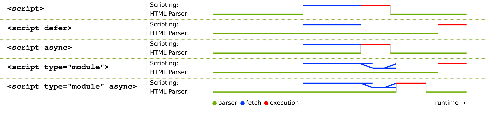

# JavaScript

> 前端工程师吃饭的家伙，深度、广度一样都不能差。

Javascript 基础知识

- 数据类型
  - 浮点数精度
- 变量提升
- 深浅拷贝
- 原型链
  - instanceof 原理
  - new 操作符
- 继承
- 作用域
- 闭包
  - 柯里化
- this 指向
- 立即执行函数
- 事件循环机制
- promise 原理
- v8 垃圾回收机制
- 模块化

## 强类型语言和弱类型语言的区别

- 强类型语言：强类型语言也称为强类型定义语言，是一种总是强制类型定义的语言，要求变量的使用要严格符合定义，所有变量都必须先定义后使用。Java 和 C++等语言都是强制类型定义的，也就是说，一旦一个变量被指定了某个数据类型，如果不经过强制转换，那么它就永远是这个数据类型了。例如你有一个整数，如果不显式地进行转换，你不能将其视为一个字符串。
- 弱类型语言：弱类型语言也称为弱类型定义语言，与强类型定义相反。JavaScript 语言就属于弱类型语言。简单理解就是一种变量类型可以被忽略的语言。比如 JavaScript 是弱类型定义的，在 JavaScript 中就可以将字符串'12'和整数 3 进行连接得到字符串'123'，在相加的时候会进行强制类型转换。

两者对比：强类型语言在速度上可能略逊色于弱类型语言，但是强类型语言带来的严谨性可以有效地帮助避免许多错误。

## 解释性语言和编译型语言的区别

（1）解释型语言 使用专门的解释器对源程序逐行解释成特定平台的机器码并立即执行。是代码在执行时才被解释器一行行动态翻译和执行，而不是在执行之前就完成翻译。解释型语言不需要事先编译，其直接将源代码解释成机器码并立即执行，所以只要某一平台提供了相应的解释器即可运行该程序。其特点总结如下

- 解释型语言每次运行都需要将源代码解释称机器码并执行，效率较低；
- 只要平台提供相应的解释器，就可以运行源代码，所以可以方便源程序移植；
- JavaScript、Python 等属于解释型语言。

（2）编译型语言 使用专门的编译器，针对特定的平台，将高级语言源代码一次性的编译成可被该平台硬件执行的机器码，并包装成该平台所能识别的可执行性程序的格式。在编译型语言写的程序执行之前，需要一个专门的编译过程，把源代码编译成机器语言的文件，如 exe 格式的文件，以后要再运行时，直接使用编译结果即可，如直接运行 exe 文件。因为只需编译一次，以后运行时不需要编译，所以编译型语言执行效率高。其特点总结如下：

- 一次性的编译成平台相关的机器语言文件，运行时脱离开发环境，运行效率高；
- 与特定平台相关，一般无法移植到其他平台；
- C、C++等属于编译型语言。

两者主要区别在于： 前者源程序编译后即可在该平台运行，后者是在运行期间才编译。所以前者运行速度快，后者跨平台性好。

## 数据类型

JavaScript 中的值都具有特定的类型。例如，字符串或数字。

在 JavaScript 中有 8 种基本的数据类型（7 种原始类型 Undefined、Null、Number、Boolean、String（ES6 新增 2 个 Symbol 和 BigInt）和 1 种引用类型 Object）。

我们可以将任何类型的值存入变量。例如，一个变量可以在前一刻是个字符串，下一刻就存储一个数字：

```js
// 没有错误
let message = 'hello'
message = 123456
```

允许这种操作的编程语言，例如 JavaScript，被称为“**动态类型**”（dynamically typed）的编程语言，意思是虽然编程语言中有不同的数据类型，但是你定义的变量并不会在定义后，被限制为某一数据类型。

**原始类型**

Symbol 和 BigInt 是 ES6 中新增的数据类型：

- Symbol 代表创建后独一无二且不可变的数据类型，它主要是为了解决可能出现的全局变量冲突的问题。
- BigInt 是一种数字类型的数据，它可以表示任意精度格式的整数，使用 BigInt 可以安全地存储和操作大整数，即使这个数已经超出了 Number 能够表示的安全整数范围。

首先原始类型存储的都是值，是没有函数可以调用的，比如 undefined.toString();

此时你肯定会有疑问，这不对呀，明明 '1'.toString() 是可以使用的。其实在这种情况下，'1' 已经不是原始类型了，而是被强制转换成了 String 类型也就是对象类型，所以可以调用 toString 函数。

除了会在必要的情况下强转类型以外，原始类型还有一些坑。

string 类型是不可变的，无论你在 string 类型上调用何种方法，都不会对值有改变。

相比较于其他编程语言，JavaScript 中的 null 不是一个“对不存在的 object 的引用”或者 “null 指针”。

JavaScript 中的 null 仅仅是一个代表“无”、“空”或“值未知”的特殊值。用 null 声明的变量表示其是未知的。

**对象类型**

在 JS 中，除了原始类型那么其他的都是对象类型了。对象类型和原始类型不同的是，原始类型存储的是`值`，对象类型存储的是`地址`（指针）。当你创建了一个对象类型的时候，计算机会在内存中帮我们开辟一个空间来存放值，但是我们需要找到这个空间，这个空间会拥有一个地址（指针）。

```js
const a = []
```

对于常量 a 来说，假设内存地址（指针）为 #001，那么在地址 #001 的位置存放了值 []，常量 a 存放了地址（指针） #001，再看以下代码

```js
const a = []
const b = a
b.push(1)
```

当我们将变量赋值给另外一个变量时，复制的是原本变量的地址（指针），也就是说当前变量 b 存放的地址（指针）也是 #001，当我们进行数据修改的时候，就会修改存放在地址（指针） #001 上的值，也就导致了两个变量的值都发生了改变。

**两种类型的区别**

两种类型的区别在于**存储位置**的不同：

- 原始数据类型直接存储在栈（stack）中的简单数据段，占据空间小、大小固定，属于被频繁使用数据，所以放入栈中存储；
- 引用数据类型存储在堆（heap）中的对象，占据空间大、大小不固定。如果存储在栈中，将会影响程序运行的性能；引用数据类型在栈中存储了指针，该指针指向堆中该实体的起始地址。当解释器寻找引用值时，会首先检索其在栈中的地址，取得地址后从堆中获得实体。

堆和栈的概念存在于数据结构和操作系统内存中，在数据结构中：

- 在数据结构中，栈中数据的存取方式为先进后出。
- 堆是一个优先队列，是按优先级来进行排序的，优先级可以按照大小来规定。

在操作系统中，内存被分为栈区和堆区：

- 栈区内存由编译器自动分配释放，存放函数的参数值，局部变量的值等。其操作方式类似于数据结构中的栈。
- 堆区内存一般由开发着分配释放，若开发者不释放，程序结束时可能由垃圾回收机制回收。

## null 和 undefined 的区别

`null` 表示一个对象是“没有值”的值，也就是值为“空”

`undefined` 表示一个变量声明了没有初始化(赋值)

`undefined` 和 `null` 在 if 语句中，都会被自动转为 false

`undefined` 不是一个有效的 JSON，而 `null` 是 （JSON.parse(undefined), Uncaught SyntaxError: "undefined" is not valid JSON）

`undefined` 的类型(typeof)是 `undefined`

`null` 的类型(typeof)是 `object`

Javascript 将未赋值的变量默认值设为 `undefined`

Javascript 从来不会将变量设为 `null`。 它是用来表明某个声明的变量是没有值、未知的

## 值类型 vs 引用类型

ES 分为原始类型和引用类型，只有`object`和`function`是引用类型，其他都是值类型。

根据 JavaScript 中的变量类型传递方式，又分为**值类型**和**引用类型**，值类型变量包括 Boolean、String、Number、Undefined、Null，引用类型包括了 Object 类的所有，如 Date、Array、Function 等。在参数传递方式上，值类型是按值传递，引用类型是按共享传递。

下面通过一个小题目，来看下两者的主要区别，以及实际开发中需要注意的地方。

```js
// 值类型
var a = 10
var b = a
b = 20
console.log(a) // 10
console.log(b) // 20
```

上述代码中，`a` `b`都是值类型，两者分别修改赋值，相互之间没有任何影响。再看引用类型的例子：

```js
// 引用类型
var a = { x: 10, y: 20 }
var b = a
b.x = 100
b.y = 200
console.log(a) // {x: 100, y: 200}
console.log(b) // {x: 100, y: 200}
```

上述代码中，`a` `b`都是引用类型。在执行了`b = a`之后，修改`b`的属性值，`a`的也跟着变化。因为`a`和`b`都是引用类型，指向了同一个内存地址，即两者引用的是同一个值，因此`b`修改属性时，`a`的值随之改动。

再借助题目进一步讲解一下。

> 说出下面代码的执行结果，并分析其原因。

```js
function foo(a) {
  a = a * 10
}
function bar(b) {
  b.value = 'new'
}
var a = 1
var b = { value: 'old' }
foo(a)
bar(b)
console.log(a) // 1
console.log(b) // value: new
```

通过代码执行，会发现：

- `a`的值没有发生改变
- 而`b`的值发生了改变

这就是因为`Number`类型的`a`是按值传递的，而`Object`类型的`b`是按共享传递的。

JS 中这种设计的原因是：按值传递的类型，复制一份存入栈内存，这类类型一般不占用太多内存，而且按值传递保证了其访问速度。按共享传递的类型，是复制其引用，而不是整个复制其值（C 语言中的指针），保证过大的对象等不会因为不停复制内容而造成内存的浪费。

引用类型经常会在代码中按照下面的写法使用，或者说**容易不知不觉中造成错误**！

```js
var obj = {
  a: 1,
  b: [1, 2, 3]
}
var a = obj.a
var b = obj.b
a = 2
b.push(4)
console.log(obj, a, b) // {a: 1, b: Array(4)} 2 (4) [1, 2, 3, 4]
```

虽然`obj`本身是个引用类型的变量（对象），但是内部的`a`和`b`一个是值类型一个是引用类型，`a`的赋值不会改变`obj.a`，但是`b`的操作却会反映到`obj`对象上。

## 内置函数(原生函数)

- String
- Number
- Boolean
- Object
- Function
- Array
- Date
- RegExp
- Error
- Symbol

原始值 "I am a string" 并不是一个对象，它只是一个字面量，并且是一个不可变的值。

如果要在这个字面量上执行一些操作，比如获取长度、访问其中某个字符等，那需要将其转换为 String 对象。

幸好，在必要时语言会自动把字符串字面量转换成一个 String 对象，也就是说你并不需要显式创建一个对象。

## 类型判断

**typeof vs instanceof**

typeof 对于原始类型来说，除了 null 都可以显示正确的类型，null 可以使用 `String(null) === 'null'` 来判断

```js
typeof 1 // 'number'
typeof '1' // 'string'
typeof undefined // 'undefined'
typeof true // 'boolean'
typeof Symbol() // 'symbol'
```

typeof 对于对象来说，除了函数都会显示 object，所以说 typeof 并不能准确判断变量到底是什么类型

```js
typeof [] // 'object'
typeof {} // 'object'
typeof console.log // 'function'
```

如果我们想判断一个对象的正确类型，这时候可以考虑使用 instanceof，因为内部机制是通过原型链来判断的。instanceof 能在实例的 原型对象链 中找到该构造函数的 prototype 属性所指向的 原型对象，就返回 true。即:

```js
const Person = function () {}
const p1 = new Person()
p1 instanceof Person // true

var str = 'hello world'
str instanceof String // false

var str1 = new String('hello world')
str1 instanceof String // true
```

```js
// __proto__: 代表原型对象链
str1 instanceof Object // true
str1 .__proto__.__proto__ = Object.prototype // true
instance.[__proto__...] === instance.constructor.prototype

// return true
```

**Object.prototype.toString.call(obj)**

很稳的类型判断， 调用 toString 后根据[object XXX]进行判断

```js
Object.prototype.toString.call(null) // '[object Null]'
Object.prototype.toString.call([]) // '[object Array]'
```

```js
/**
 * 判断数据类型
 *
 * @param {*} a
 * @returns Boolean String Array Object Function Number Undefined Null [Object ]
 */
function getType(a) {
  return Object.prototype.toString.call(a).slice(8, -1)
}
```

## 类型转换

**隐式转换**

在 JS 中在使用运算符号或者对比符时，会自带隐式转换：

- -、\*、/、% ：一律转换成数值后计算
- +：
  - 数字 + 字符串 = 字符串， 运算顺序是从左到右
  - 数字 + 对象， 优先调用对象的 valueOf -> toString
  - 数字 + boolean/null -> 数字
  - 数字 + undefined -> NaN
- [1].toString() === '1'
- {}.toString() === '[object object]'

**转 Boolean**

在条件判断时，除了 undefined， null， false， NaN， ''， 0， -0，其他所有值都转为 true，包括所有对象。

**转字符串**

- [1].toString() // '1'
- [{"a":1}].toString() // '[object Object]'
- alert({}) String({}) // '[object Object]'

**转数字**

- Number('1') // 1
- Number('a') // NaN
- Number([]) // 0
- Number(['1']) // 1
- Number(['a']) // NaN
- Number({}) // NaN
- Number(Symbol()) // Uncaught TypeError: Cannot convert a Symbol value to a number

## 对象的拷贝

- 浅拷贝: 以赋值的形式拷贝引用对象，仍指向同一个地址，**修改时原对象也会受到影响**
  - `Object.assign`
  - 展开运算符\(...\)
- 深拷贝: 完全拷贝一个新对象，**修改时原对象不再受到任何影响**

  - `JSON.parse(JSON.stringify(obj))`: 性能最快
    - 具有循环引用的对象时，报错
    - 当值为函数、`undefined`、或`symbol`时，无法拷贝
  - 递归进行逐一赋值

这种方法有缺陷，详情请看[关于 JSON.parse(JSON.stringify(obj))实现深拷贝应该注意的坑](https://www.jianshu.com/p/b084dfaad501)

```js
let o1 = {
  a: {
    val: 1
  },
  b: function () {
    alert('b')
  },
  c: () => {
    alert('c')
  }
}
let o2 = JSON.parse(JSON.stringify(o1)) // { a: {val: 1}}
```

基础版

```js
var deepCopy = function (obj) {
  if (typeof obj !== 'object') return
  var newObj = obj instanceof Array ? [] : {}
  for (var key in obj) {
    if (obj.hasOwnProperty(key)) {
      newObj[key] = typeof obj[key] === 'object' ? deepCopy(obj[key]) : obj[key]
    }
  }
  return newObj
}
```

进阶版（新增函数函数类型支持），推荐使用 [lodash 的深拷贝函数](https://www.lodashjs.com/docs/lodash.cloneDeep)。

```js
function deepCopy(target) {
  if (typeof target == 'object') {
    const result = Array.isArray(target) ? [] : {}
    for (const key in target) {
      let item = target[key]
      // 时间
      if (item instanceof Date) {
        result[key] = new Date(item)
        // 正则
      } else if (item instanceof RegExp) {
        result[key] = new RegExp(item.source, item.flags)
      } else if (typeof item == 'object' && item !== null) {
        result[key] = deepCopy(item)
      } else {
        result[key] = item
      }
    }

    return result
  } else if (typeof target == 'function') {
    return eval('(' + target.toString() + ')')
    // 也可以这样克隆函数
    // return new Function('return ' + target.toString())()
  } else {
    return target
  }
}

const a = {
  number: 1,
  bool: false,
  str: 'hi',
  empty1: undefined,
  empty2: null,
  array: [
    { name: 'frank', age: 18 },
    { name: 'jacky', age: 19 }
  ],
  date: new Date(2000, 0, 1, 20, 30, 0),
  regex: /\.(j|t)sx/i,
  obj: { name: 'frank', age: 18 },
  f1: (a, b) => a + b,
  f2: function (a, b) {
    return a + b
  }
}
console.log(a)
var b = deepCopy(a)
console.log(b) // 支持上面的类型
```

参考链接：

- [yanyue404 - #6 Javascript 之深浅拷贝](https://github.com/yanyue404/blog/issues/6)
- [如何写出一个惊艳面试官的深拷贝?](https://juejin.cn/post/6844903929705136141)

## 数组(array) API

**改变原数组**

- `unshift / shift`: 头部推入和弹出，改变原数组，`unshift` 返回数组长度，`shift` 返回原数组第一项 ；
- `push / pop`: 末尾推入和弹出，改变原数组， `push` 返回数组长度, `pop` 返回原数组最后一项；
- `sort(fn) / reverse`: 排序与反转，改变原数组
- `splice(start, number, value...)`: 返回删除元素组成的数组，value 为插入项，改变原数组

**不改变原数组**

- `map`: 遍历数组，返回回调返回值组成的新数组
- `forEach`: 无法`break`，可以用`try/catch`中`throw new Error`来停止
- `filter`: 过滤
- `some`: 有一项返回`true`，则整体为`true`
- `every`: 有一项返回`false`，则整体为`false`
- `join`: 通过指定连接符生成字符串
- `concat`: 连接数组，不影响原数组， 浅拷贝
- `slice(start, end)`: 返回截断后的新数组，不改变原数组
- `indexOf / lastIndexOf(value, fromIndex)`: 查找数组项，返回对应的下标
- `reduce / reduceRight(fn(prev, cur)， defaultPrev)`: 两两执行，prev 为上次化简函数的`return`值，cur 为当前值
  - 当传入 `defaultPrev` 时，从第一项开始；
  - 当未传入时，则为第二项
  - 数组乱序：

```js
var arr = [1, 2, 3, 4, 5, 6, 7, 8, 9, 10]
arr.sort(function () {
  return Math.random() - 0.5
})
```

- 数组拆解: flat: \[1,\[2,3\]\] --> \[1, 2, 3\]

```js
Array.prototype.flat = function () {
  return this.toString()
    .split(',')
    .map((item) => +item)
}
```

参考链接

- [yanyue404 - JavaScript 数组 API](https://github.com/yanyue404/blog/issues/131)

## 如何判断数组与对象

```js
let obj = { a: 1 }
let arr = [1, 2, 3]

typeof arr // "object"
typeof obj // "object"

obj instanceof Array // false
arr instanceof Array // true

Array.isArray(arr) // true
Array.isArray(obj) // false

// 校验构造函数

arr.constructor === Array // true
obj.constructor === Array // false
arr.constructor === Object // false
obj.constructor === Object // true

// 校验原型

Object.prototype == arr.__proto__ // false
Object.prototype == obj.__proto__ // true
Array.prototype == arr.__proto__ // true
Array.prototype == obj.__proto__ // false

Object.prototype.toString.call(obj) === '[object Object]' // true
Object.prototype.toString.call(arr) === '[object Object]' // fasle
Object.prototype.toString.call(obj) === '[object Array]' // true
Object.prototype.toString.call(arr) === '[object Array]' // fasle
```

## 数组去重

ES5

```js
function unique(arr) {
  const result = []
  arr.forEach(function (item) {
    if (result.indexOf(item) == -1) {
      result.push(item)
    }
  })

  return result
}
```

ES6

```js
function unique(arr) {
  return Array.from(new Set(arr))
}
```

空间换时间

```js
function unique(arr) {
  const result = []
  const map = new Map()

  for (const val of arr) {
    if (!map.has(val)) {
      result.push(val)
      map.set(val, true)
    }
  }

  return result
}
```

## 原型 / 构造函数 / 实例

- 原型`(prototype)`: 一个简单的对象，用于实现对象的 **属性继承**。可以简单的理解成对象的爹。在 Firefox 和 Chrome 中，每个`JavaScript`对象中都包含一个`__proto__` \(非标准\)的属性指向它爹\(该对象的原型\)，可`obj.__proto__`进行访问。

- 构造函数: 可以通过`new`来 **新建一个对象** 的函数。

- 实例: 通过构造函数和`new`创建出来的对象，便是实例。 **实例通过`__proto__`指向原型，通过`constructor`指向构造函数**。

说了一大堆，大家可能有点懵逼，这里来举个栗子，以`Object`为例，我们常用的`Object`便是一个构造函数，因此我们可以通过它构建实例。

```js
// 实例
const instance = new Object()
```

则此时， **实例为`instance`**, **构造函数为`Object`**，我们知道，构造函数拥有一个`prototype`的属性指向原型，因此原型为:

```js
// 原型
const prototype = Object.prototype
```

这里我们可以来看出三者的关系:

```js
实例.__proto__ === 原型

原型.constructor === 构造函数

构造函数.prototype === 原型

//  注意: 其实实例上并不是真正有 constructor 这个指针，它其实是从原型链上获取的
// 例如:
// const o = new Object()
// o.constructor === Object   --> true
// o.__proto__ = null;
// o.constructor === Object   --> false
// instance.hasOwnProperty('constructor') === false
实例.constructor === 构造函数
```


参考链接

- [yanyue404 - #17Javascript 的继承与原型链](https://github.com/yanyue404/blog/issues/17)

## 原型链

**原型链是由原型对象组成**，每个对象都有 `__proto__` 属性，指向了创建该对象的构造函数的原型，`__proto__` 将对象连接起来组成了原型链。是一个用来**实现继承和共享属性**的有限的对象链。

```js
[].__proto__ === Array.prototype // true
[].__proto__.__proto__ === Object.prototype // true
[].__proto__.__proto__.__proto__ === null// true
```

- **属性查找机制**: 当查找对象的属性时，如果实例对象自身不存在该属性，则沿着原型链往上一级查找，找到时则输出，不存在时，则继续沿着原型链往上一级查找，直至最顶级的原型对象`Object.prototype`，如还是没找到，则输出 `undefined`；

- **属性修改机制**: 只会修改实例对象本身的属性，如果不存在，则进行添加该属性，如果需要修改原型的属性时，则可以用: `b.prototype.x = 2`；但是这样会造成所有继承于该对象的实例的属性发生改变。

## instanceof 原理

语法：object instanceof constructor

instanceof 运算符用来检测 constructor.prototype 是否存在于参数 object 的原型链上。

能在实例的 原型对象链 中找到该构造函数的 `prototype` 属性所指向的 `原型对象`，就返回 true。即:

```js
// __proto__: 代表原型对象链
instance.[__proto__...] === instance.constructor.prototype

// return true

function instance_of(left, right) {
  const RP = right.prototype; // 构造函数的原型
  while(true) {
    if (left === null || left === undefined) {
      return false;
    }
    if (left === RP) { // 一定要严格比较
      return true;
    }
    left = left.__proto__; // 沿着原型链重新赋值
  }
}

```

参考链接

- [instanceof](https://developer.mozilla.org/zh-CN/docs/Web/JavaScript/Reference/Operators/instanceof)
- https://segmentfault.com/a/1190000018874474

## new 操作符的执行过程

```js
function Test() {}
const test = new Test()
```

1. 创建一个新对象：

```js
const obj = {}
```

2.<del> 设置新对象的 constructor 属性为构造函数的名称(从原型链上取)，</del>设置新对象的\***\*proto\*\***属性指向构造函数的 prototype 对象

```js
obj.__proto__ = Test.prototype
```

3. 绑定 this 并通过构造函数生成对象，this 被指向新实例对象

```js
Test.call(obj)
```

4. 返回新对象(必须是一个对象形式，判断函数的返回值类型，如果是值类型，返回创建的对象。如果是引用类型，就返回这个引用类型的对象。)

**手写一个**

```js
function create() {
  let obj = {}
  let Con = [].shift.call(arguments)
  obj.__proto__ = Con.prototype
  let result = Con.apply(obj, arguments)
  return result instanceof Object ? result : obj
}
```

## bind、call、apply 的区别

call 和 apply 其实是一样的，区别就在于传参时参数是一个一个传或者是以一个数组的方式来传。<br>
call 和 apply 都是在调用时生效，改变调用者的 this 指向。<br>

```js
let name = 'Jack'
const obj = { name: 'Tom' }
function sayHi() {
  console.log('Hi! ' + this.name)
}

sayHi() // Hi! Jack
sayHi.call(obj) // Hi! Tom
```

bind 也是改变 this 指向，不过不是在调用时生效，而是返回一个新函数。

```js
const newFunc = sayHi.bind(obj)
newFunc() // Hi! Tom
```

## 实现 bind call apply 函数

> 这个更好：http://febook.hzfe.org/awesome-interview/book4/coding-apply-call-bind

### bind

```js
Function.prototype.bind = function (context, ...extra) {
  const self = this
  // 这里不能用箭头函数，防止绑定函数为构造函数
  return function (...arg) {
    return self.call(context, ...extra.concat(arg))
  }
}
```

### call

```js
Function.prototype.call = function (context, ...args) {
  if (context === null || context === undefined) {
    context = window
  }

  context = context instanceof Object ? context : {}

  let key = Math.random()
  while (context[key]) {
    key = Math.random()
  }

  context[key] = this
  const result = context[key](...args)
  delete context[key]

  return result
}
```

### apply

```js
Function.prototype.apply = function (context, args = []) {
  if (!Array.isArray(args)) throw '参数必须为数组'

  if (context === null || context === undefined) {
    context = window
  }

  context = context instanceof Object ? context : {}

  let key = Math.random()
  while (context[key]) {
    key = Math.random()
  }

  context[key] = this
  const result = context[key](...args)
  delete context[key]

  return result
}
```

## JS 如何实现继承？

**方法一：使用原型链**

```js
function Animal(legsNumber) {
  this.legsNumber = legsNumber
}
Animal.prototype.kind = '动物'
Animal.prototype.sayHi = function () {
  console.log('hi，我是' + this.kind)
}

function Dog(name) {
  this.name = name
  Animal.call(this, 4) // 借 call 设置自己的 legsNumber
}

// 实例的原型指向 Animal，实例的构造函数是 Dog
Dog.prototype.__proto__ = Animal.prototype

const huang = new Dog('huang')

console.log(huang)
huang.sayHi() // hi，我是动物

Dog.prototype.kind = '狗'
Dog.prototype.say = function () {
  console.log(`汪汪汪~ 我是${this.name}，我有${this.legsNumber}条腿。`)
}

huang.say() // 汪汪汪~ 我是huang，我有4条腿。

const d1 = new Dog('啸天') // Dog 函数就是一个类
console.dir(d1)
```

**方法二：寄生组合式继承**

寄生式组合继承通过盗用构造函数继承属性，但使用混合式原型链继承方法。基本思路是不通过调用父类构造函数给子类原型赋值，而是取得父类原型的一个副本。说到底就是使用寄生式继承来继承父类原型，然后将返回的新对象赋值给子类原型。寄生式组合继承的基本模式如下所示：

```js
function inheritPrototype(subType, superType) {
  let prototype = Object(superType.prototype) // 创建对象
  prototype.constructor = subType // 增强对象
  subType.prototype = prototype // 赋值对象
}
```

它主要是基于一个已有的类型，在实例化时对实例化的对象进行扩展。

```js
function SuperType(name) {
  this.name = name
  this.colors = ['red', 'blue', 'green']
}
SuperType.prototype.sayName = function () {
  console.log(this.name)
}
function SubType(name, age) {
  SuperType.call(this, name)
  this.age = age
}
inheritPrototype(SubType, SuperType)
SubType.prototype.sayAge = function () {
  console.log(this.age)
}
const sub = new SubType('pink', '18')
sub.sayAge() // 18
console.dir(sub)
```

**方法三：使用 class**

```js
class Animal {
  constructor(legsNumber) {
    this.kind = '动物'
    this.legsNumber = legsNumber
  }
  sayHi() {
    console.log('hi，我是' + this.kind)
  }
}
class Dog extends Animal {
  constructor(name) {
    super(4) // 传入 Animal 的 constructor
    this.name = name
  }
  say() {
    console.log(`汪汪汪~ 我是${this.name}，我有${this.legsNumber}条腿。`)
  }
}

const d2 = new Dog('旺财') // Dog 函数就是一个类
d2.sayHi() // hi，我是动物
console.dir(d2)
```

## 浮点数精度

因为 JS 采用 IEEE 754 双精度版本（64 位），并且只要采用 IEEE 754 的语言都有该问题。

```js
0.1 + 0.2 === 0.3 // false

// 原生解决办法 - toFixed
/**
 * 按指定精度格式化小数
 * @param {number} number 待格式化数字
 * @param {number} precision 精度
 * @returns
 */
function toFixed(number, precision) {
  const val = Math.round(Math.abs(precision))
  precision = isNaN(val) ? 2 : precision
  const power = Math.pow(10, precision)
  return (Math.round((number + 1e-8) * power) / power).toFixed(precision)
}
Number(toFixed(0.1 + 0.2, 1)) === 0.3 // true
```

对于这个问题，还有一个直接的解决方法就是设置一个误差范围，通常称为“机器精度”。对 JavaScript 来说，这个值通常为 2-52，在 ES6 中，提供了 Number.EPSILON 属性，而它的值就是 2-52，只要判断`0.1+0.2-0.3`是否小于`Number.EPSILON`，如果小于，就可以判断为 0.1+0.2 ===0.3

```js
function numberepsilon(arg1, arg2) {
  return Math.abs(arg1 - arg2) < Number.EPSILON
}

console.log(numberepsilon(0.1 + 0.2, 0.3)) // true
```

## 变量提升

JS 为什么要进行变量提升？

首先我们要知道，JS 在拿到一个变量或者一个函数的时候，会有两步操作，即解析和执行。

在解析阶段，JS 会检查语法，并对函数进行预编译。解析的时候会先创建一个全局执行上下文环境，先把代码中即将执行的变量、函数声明都拿出来，变量
先赋值为 undefined，函数先声明好可使用。在一个函数执行之前，也会创建一个函数执行上下文环境，跟全局执行上下文类似，不过函数执行上下文会多出
this、arguments 和函数的参数。

- 全局上下文：变量定义，函数声明
- 函数上下文：变量定义，函数声明，this，arguments

在执行阶段，就是按照代码的顺序依次执行。

那为什么会进行变量提升呢？主要有以下两个原因：

- 提高性能
- 容错性更好

var 会使变量提升，这意味着变量可以在声明之前使用。let 和 const 不会使变量提升，提前使用会报错。

变量提升（hoisting）是用于解释代码中变量声明行为的术语。使用 var 关键字声明或初始化的变量，会将声明语句“提升”到当前作用域的顶部。 但是，只有声明才会触发提升，赋值语句（如果有的话）将保持原样。

函数提升，需要注意函数声明和函数表达式的区别。无论在哪儿定义函数,只要是外层函数并且满足不被包裹，就都可以进行全局范围的调用。而函数表达式需要等到表达式赋值 完成 才可以使用。

## 作用域

作用域是指程序源代码中定义变量的区域。

作用域规定了如何查找变量，也就是确定当前执行代码对变量的访问权限。

JavaScript 采用词法作用域(lexical scoping)，也就是静态作用域。

因为 JavaScript 采用的是词法作用域，函数的作用域在函数定义的时候就决定了。

而与词法作用域相对的是动态作用域，函数的作用域是在函数调用的时候才决定的。

```js
var value = 1

function foo() {
  console.log(value)
}

function bar() {
  var value = 2
  foo()
}

bar()

// 结果是 ???
```

- [JavaScript 深入之词法作用域和动态作用域](https://github.com/mqyqingfeng/Blog/issues/3)
- [JavaScript 深入之执行上下文栈](https://github.com/mqyqingfeng/Blog/issues/4)

## 执行上下文

当 JavaScript 代码执行一段可执行代码(executable code)时，会创建对应的执行上下文(execution context)。

对于每个执行上下文，都有三个重要属性：

- 变量对象(Variable object，VO)
- 作用域链(Scope chain) 词法作用域链，查找变量
- this

**全局上下文**

在全局上下文中的变量对象就是全局对象。

**函数上下文**

在函数上下文中，我们用活动对象(activation object, AO)来表示变量对象。

活动对象和变量对象其实是一个东西，只是变量对象是规范上的或者说是引擎实现上的，不可在 JavaScript 环境中访问，只有到当进入一个执行上下文中，这个执行上下文的变量对象才会被激活，所以才叫 activation object 呐，而只有被激活的变量对象，也就是活动对象上的各种属性才能被访问。

活动对象是在进入函数上下文时刻被创建的，它通过函数的 arguments 属性初始化。arguments 属性值是 Arguments 对象。

1. 函数上下文的变量对象初始化只包括 Arguments 对象

2. 在进入执行上下文时会给变量对象添加形参、函数声明、变量声明等初始的属性值

3. 在代码执行阶段，会再次修改变量对象的属性值

- [JavaScript 深入之变量对象](https://github.com/mqyqingfeng/Blog/issues/5)

## 作用域链

我们知道，我们可以在执行上下文中访问到**父级甚至全局的变量**，这便是作用域链的功劳。作用域链可以理解为一组对象列表，包含 父级和自身的变量对象，因此我们便能通过作用域链访问到父级里声明的变量或者函数，原理和原型链很相似。

由两部分组成:

- [[scope]]属性: 指向父级变量对象和作用域链，也就是包含了父级的[[scope]]和 VO
- AO: 自身活动对象（当函数被调用者激活，AO 就被创建了）

如此 `[[scope]]`包含`[[scope]]`，便自上而下形成一条链式作用域。

**一个例子**

以下面的例子为例，结合着之前讲的变量对象和执行上下文栈，我们来总结一下函数执行上下文中作用域链和变量对象的创建过程：

```js
var scope = 'global scope'
function checkscope() {
  var scope2 = 'local scope'
  return scope2
}
checkscope()
```

执行过程如下：

1.checkscope 函数被创建，保存作用域链到 内部属性[[scope]]

```js
checkscope.[[scope]] = [
    globalContext.VO
];
```

2.执行 checkscope 函数，创建 checkscope 函数执行上下文，checkscope 函数执行上下文被压入执行上下文栈

```js
ECStack = [checkscopeContext, globalContext]
```

3.checkscope 函数并不立刻执行，开始做准备工作，第一步：复制函数[[scope]]属性创建作用域链

```js
checkscopeContext = {
    Scope: checkscope.[[scope]],
}

```

4.第二步：用 arguments 创建活动对象，随后初始化活动对象，加入形参、函数声明、变量声明

```js
checkscopeContext = {
    AO: {
        arguments: {
            length: 0
        },
        scope2: undefined
    }，
    Scope: checkscope.[[scope]],
}

```

5.第三步：将活动对象压入 checkscope 作用域链顶端

```js
checkscopeContext = {
  AO: {
    arguments: {
      length: 0
    },
    scope2: undefined
  },
  Scope: [AO, [[Scope]]]
}
```

6.准备工作做完，开始执行函数，随着函数的执行，修改 AO 的属性值

```js
checkscopeContext = {
  AO: {
    arguments: {
      length: 0
    },
    scope2: 'local scope'
  },
  Scope: [AO, [[Scope]]]
}
```

7.查找到 scope2 的值，返回后函数执行完毕，函数上下文从执行上下文栈中弹出

```js
ECStack = [globalContext]
```

**思考闭包的作用域链：**

```js
let value = 'Surprise!'

function f() {
  let value = 'the closest value'

  function g() {
    return value
  }

  return g
}

let g = f()
console.dir(g) // 这里作用域链的顺序是 Closure > Script > Global

// ƒ g()
//   arguments: null
//   caller: null
//   length: 0
//   name: "g"
//   prototype: {constructor: ƒ}
//   [[FunctionLocation]]: aa.html:16
//   [[Prototype]]: ƒ ()
//   [[Scopes]]: Scopes[3]
//   0: Closure (f) {value: 'the closest value'}
//   1: Script {value: 'Surprise!', g: ƒ}
//   2: Global {window: Window, self: Window, document: document, name: '', location: Location, …}

console.log(g()) // the closest value
```

参考链接

- [冴羽 - JavaScript 深入之作用域链](https://juejin.cn/post/6844903473683628046)
- [冴羽 - JavaScript 深入之执行上下文](https://juejin.cn/post/6844903474027560968)

## 闭包

闭包属于一种特殊的作用域，称为 静态作用域。它的定义可以理解为: 父函数被销毁 的情况下，返回出的子函数的`[[scope]]`中仍然保留着父级的单变量对象和作用域链，因此可以继续访问到父级的变量对象，这样的函数称为闭包。

作用：能够在函数定义的作用域外，使用函数定义作用域内的局部变量，并且不会污染全局。

原理：基于词法作用域链和垃圾回收机制，通过维持函数作用域的引用，让函数作用域可以在当前作用域外被访问到。

```js
// 函数作为返回值
function F1() {
  var a = 100
  return function () {
    console.log(a)
  }
}
var f1 = F1()
var a = 200
f1() // 100
```

```js
function F1() {
  var a = 100
  return function () {
    alert(a)
  }
}
function F2(f1) {
  var a = 200
  alert(f1())
}
var f1 = F1()
F2(f1) // 100 undefined
```

使⽤闭包主要是为了设计私有的⽅法和变量。

闭包有三个特性:

1. 避免污染全局环境。（因为用的是局部变量）
2. 函数内部可以引⽤外部的参数和变量
3. 维持变量，参数和变量不会被垃圾回收机制回收

闭包的优点是简单好用避免全局变量的污染的同时提供对局部变量的访问，缺点是闭包会常驻内存，会增⼤内存使⽤量，使⽤不当很容易造成内存泄露。

闭包会产生一个很经典的问题（在循环中使用闭包）:

多个子函数的`[[scope]]`都是同时指向父级，是完全共享的。因此当父级的变量对象被修改时，所有子函数都受到影响。

解决:

- 变量可以通过 `函数参数`的形式 传入，避免使用默认的[[scope]]向上查找
- 使用 `setTimeout` 包裹，通过第三个参数传入
- 使用 `块级作用域`，让变量成为自己上下文的属性，避免共享

例子 1：

```js
function foo() {
  var arr = []
  for (var i = 0; i < 2; i++) {
    arr[i] = function () {
      return i
    }
  }
  return arr
}
var bar = foo()
console.log(bar[0]()) //2
```

犯错原因是在循环的过程中，并没有把函数的返回值赋值给数组元素，而仅仅是把函数赋值给了数组元素。这就使得在调用匿名函数时，通过作用域找到的执行环境中 AO 中查找不到 i 而再往函数外的 VO 查找，这时，变量的值已经不是循环时的瞬时索引值，而是循环执行完毕之后的索引值。

`ar[0]()` 访问 bar 的第 0 个元素并执行。此时，执行栈创建并进入匿名函数执行环境，匿名函数中存在自由变量 i，需要使用其作用域链匿名函数 -> foo()函数 -> 全局作用域进行查找，最终在 foo()函数的作用域找到了 i，然后在 foo()函数的执行环境中找到了 i 的值 2，于是给 i 赋值 2.

解决方案 1:IIFE

由此，可以利用 IIFE 传参和闭包来创建多个执行环境来保存循环时各个状态的索引值。因为函数传参是按值传递的，不同参数的函数被调用时，会创建不同的执行环境

```js
function foo() {
  var arr = []
  for (var i = 0; i < 2; i++) {
    arr[i] = (function fn(j) {
      return function test() {
        return j
      }
    })(i)
  }
  return arr
}
var bar = foo()
console.log(bar[0]()) //0
```

解决方案 2:块作用域

使用 IIFE 还是较为复杂，使用块作用域则更为方便

由于块作用域可以将索引值 i 重新绑定到了循环的每一个迭代中，确保使用上一个循环迭代结束时的值重新进行赋值，相当于为每一次索引值都创建一个执行环境

```js
function foo() {
  var arr = []
  for (let i = 0; i < 2; i++) {
    arr[i] = function () {
      return i
    }
  }
  return arr
}
var bar = foo()
console.log(bar[0]()) //0
```

参考: https://www.xiaohuochai.site/JS/ECMA/closure/commonError.html

例子 2： 不正确的无法打印索引：

```js
for (var i = 0; i < 5; i++) {
  setTimeout(function () {
    console.log(new Date(), i)
  }, 1000)
}

console.log(new Date(), i) // 输入结果： 5 -> 5,5,5,5,5，即第 1 个 5 直接输出，1 秒之后，输出 5 个 5；
```

**改造为 5 -> 0,1,2,3,4**

1. 巧妙的利用 IIFE（Immediately Invoked Function Expression：声明即执行的函数表达式）来解决闭包造成的问题

```js
for (var i = 0; i < 5; i++) {
  ;(function (j) {
    // j = i
    setTimeout(function () {
      console.log(new Date(), j)
    }, 1000)
  })(i)
}

console.log(new Date(), i)
```

2. [setTimeout](https://developer.mozilla.org/en-US/docs/Web/API/setTimeout) 的第三个参数

```js
for (var i = 0; i < 5; i++) {
  setTimeout(
    function (j) {
      console.log(new Date(), j)
    },
    1000,
    i
  )
}

console.log(new Date(), i)
```

3. 对循环体稍做手脚，让负责输出的那段代码能拿到每次循环的 i 值即可。该怎么做呢？利用 JS 中基本类型（Primitive Type）的参数传递是按值传递（Pass by Value）的特征

```js
var output = function (i) {
  setTimeout(function () {
    console.log(new Date(), i)
  }, 1000)
}

for (var i = 0; i < 5; i++) {
  output(i) // 这里传过去的 i 值被复制了
}

console.log(new Date(), i)
```

**改造为 0 -> 1 -> 2 -> 3 -> 4 -> 5**

原有的代码块中的循环和两处 console.log 不变，该怎么改造代码？新的需求可以精确的描述为：代码执行时，立即输出 0，之后每隔 1 秒依次输出 1,2,3,4，循环结束后在大概第 5 秒的时候输出 5。

```js
const tasks = [] // 这里存放异步操作的 Promise
const output = (i) =>
  new Promise((resolve) => {
    setTimeout(() => {
      console.log(new Date(), i)
      resolve()
    }, 1000 * i)
  })

// 生成全部的异步操作
for (var i = 0; i < 5; i++) {
  tasks.push(output(i))
}

// 异步操作完成之后，输出最后的 i
Promise.all(tasks).then(() => {
  setTimeout(() => {
    console.log(new Date(), i)
  }, 1000)
})
```

```js
// 模拟其他语言中的 sleep，实际上可以是任何异步操作
const sleep = (timeountMS) =>
  new Promise((resolve) => {
    setTimeout(resolve, timeountMS)
  })

;(async () => {
  // 声明即执行的 async 函数表达式
  for (var i = 0; i < 5; i++) {
    if (i > 0) {
      await sleep(1000)
    }
    console.log(new Date(), i)
  }

  await sleep(1000)
  console.log(new Date(), i)
})()
```

参考链接

- [yanyue404 - 理解 JS 中的闭包](https://github.com/yanyue404/blog/issues/73)
- [破解前端面试（80% 应聘者不及格系列）：从闭包说起](https://juejin.cn/post/6844903474212143117)
- http://febook.hzfe.org/awesome-interview/book1/js-closures

## 事件触发的流程

1. 捕获阶段：从外到内
2. 目标阶段：在目标元素上触发事件
3. 冒泡阶段：从内到外

## 事件委托

事件委托利用了事件冒泡，只指定一个事件处理程序，就可以管理某一类型的所有事件。所有用到按钮的事件（多数鼠标事件和键盘事件）都适合采用事件委托技术， 使用事件委托可以节省内存。

```html
<div id="root"></div>
```

```js
// bad
;(() => {
  var ndContainer = document.getElementById('root')
  if (!ndContainer) {
    return
  }
  let ndUL = document.createElement('ul')
  for (let i = 0; i < 300; i++) {
    var li = document.createElement('li')
    li.innerText = i + 1
    li.addEventListener('click', function () {
      alert(i + 1)
    })
    ndUL.appendChild(li)
  }
  ndContainer.appendChild(ndUL)
})()

// good
;(() => {
  var ndContainer = document.getElementById('root')
  if (!ndContainer) {
    return
  }
  let ndUL = document.createElement('ul')
  let html = ''
  for (var i = 0; i < 300; i++) {
    html += `<li>${i + 1}</li>`
  }
  ndUL.innerHTML = html
  ndUL.addEventListener('click', function (e) {
    let target = e.target
    if (target.nodeName === 'LI') {
      alert(target.innerText)
    }
  })
  ndContainer.appendChild(ndUL)
})()
```

> target 和 currentTarget 区别：event.target 返回触发事件的元素，event.currentTarget 返回绑定事件的元素

参考链接

- [破解前端面试（80% 应聘者不及格系列）：从 DOM 说起](https://juejin.cn/post/6844903474547671047)

## 事件模型

### DOM0

直接绑定

```js
;<input onclick="sayHi()" />

btn.onclick = function () {}
btn.onclick = null
```

### DOM2

- DOM2 级事件可以冒泡和捕获
- 通过 addEventListener 绑定
- 通过 removeEventListener 解绑

```js
// 绑定
btn.addEventListener('click', sayHi)
// 解绑
btn.removeEventListener('click', sayHi)
```

### DOM3

- DOM3 具有更多事件类型
- DOM3 级事件在 DOM2 级事件的基础上添加了更多的事件类型，全部类型如下：

```
UI事件，当用户与页面上的元素交互时触发，如：load、scroll
焦点事件，当元素获得或失去焦点时触发，如：blur、focus
鼠标事件，当用户通过鼠标在页面执行操作时触发如：dbclick、mouseup
滚轮事件，当使用鼠标滚轮或类似设备时触发，如：mousewheel
文本事件，当在文档中输入文本时触发，如：textInput
键盘事件，当用户通过键盘在页面上执行操作时触发，如：keydown、keypress
合成事件，当为IME（输入法编辑器）输入字符时触发，如：compositionstart
变动事件，当底层DOM结构发生变化时触发，如：DOMsubtreeModified
```

参考资料：

- [dom0、dom2、dom3 事件](https://www.jianshu.com/p/3acdf5f71d5b)

## 如何自定义事件

### 事件列表

[事件参考-MDN](https://developer.mozilla.org/zh-CN/docs/Web/Events#%E6%A0%87%E5%87%86%E4%BA%8B%E4%BB%B6)

### 新模式

```js
const div = document.createElement('div') // 不创建元素，直接用 window 对象也可以
const event = new Event('build')

div.addEventListener('build', function (e) {
  console.log(111)
})

div.dispatchEvent(event)
```

### 过时的模式

1. 原生提供了 3 个方法实现自定义事件
2. `document.createEvent('Event')` 创建事件
3. `initEvent` 初始化事件
4. `dispatchEvent` 触发事件

```js
const events = {}

function registerEvent(name) {
  const event = document.createEvent('Event')
  event.initEvent(name, true, true) // 事件名称，是否允许冒泡，该事件的默认动作是否可以被取消
  events[name] = event
}

function triggerEvent(name) {
  window.dispatchEvent(events[name])
}

registerEvent('resize') // 注册 resize 事件
triggerEvent('resize') // 触发 resize 事件
```

## this 的指向

先搞明白一个很重要的概念 —— **`this`的值是在执行的时候才能确认，定义的时候不能确认！** 为什么呢 —— 因为`this`是执行上下文环境的一部分，而执行上下文需要在代码执行之前确定，而不是定义的时候。看如下例子

```js
var a = {
  name: 'A',
  fn: function () {
    console.log(this.name)
  }
}
a.fn() // this === a
a.fn.call({ name: 'B' }) // this === {name: 'B'}
var fn1 = a.fn
fn1() // this === window
```

1. 在全局环境中使用时候，this 代表全局对象
2. 在对象方法中使用时，this 代表此对象 (上述代码中`a.fn()`)
3. 调用无上下文的函数时，this 代表全局对象 (上述代码中`fn1()`)
4. 在构造函数内部使用时，this 代表正在构建的新对象
5. 当在原型链上定义的函数内部使用时， this 代表此对象
6. 在 call(),apply(),和 bind()函数调用时，this 代表对应方法传入的第一个参数 (上述代码中`a.fn.call({name: 'B'})`)
7. 在事件处理中于 js 中绑定或注册，或在 html 中注册并直接使用 this 关键字（非丢失 this 指向），this 代表 html 元素，在事件处理与元素上直接绑定事件方法名会使得 this 指向 window
8. 箭头函数中，this 代表其位置外层的 this 对象

参考链接

- [yanyue404 - #18 Javascript 中的 this 指向](https://github.com/yanyue404/blog/issues/18)

## 事件循环机制 Event-Loop

> 简单来说： 事件循环是一个单线程循环，用于监视调用堆栈并检查是否有工作即将在任务队列中完成。如果调用堆栈为空并且任务队列中有回调函数，则将回调函数出队并推送到调用堆栈中执行。

众所周知 JS 是门非阻塞单线程语言，因为在最初 JS 就是为了和浏览器交互而诞生的。如果 JS 是门多线程的语言话，我们在多个线程中处理 DOM 就可能会发生问题（一个线程中新加节点，另一个线程中删除节点），当然可以引入读写锁解决这个问题。

JS 在执行的过程中会产生执行环境，这些执行环境会被顺序的加入到执行栈中。如果遇到异步的代码，会被挂起并加入到 Task（有多种 task） 队列中。一旦执行栈为空，Event Loop 就会从 Task 队列中拿出需要执行的代码并放入执行栈中执行，所以本质上来说 JS 中的异步还是同步行为。

```js
console.log('script start')

setTimeout(function () {
  console.log('setTimeout')
}, 0)

console.log('script end')
```

以上代码虽然 setTimeout 延时为 0，其实还是异步。这是因为 HTML5 标准规定这个函数第二个参数不得小于 4 毫秒，不足会自动增加。所以 setTimeout 还是会在 script end 之后打印。

不同的任务源会被分配到不同的 Task 队列中，任务源可以分为 微任务（microtask） 和 宏任务（macrotask）。在 ES6 规范中，microtask 称为 jobs，macrotask 称为 task。

```js
console.log('script start')

setTimeout(function () {
  console.log('setTimeout')
}, 0)

new Promise((resolve) => {
  console.log('Promise')
  resolve()
})
  .then(function () {
    console.log('promise1')
  })
  .then(function () {
    console.log('promise2')
  })

console.log('script end')
// script start => Promise => script end => promise1 => promise2 => setTimeout
```

以上代码虽然 setTimeout 写在 Promise 之前，但是因为 Promise 属于微任务而 setTimeout 属于宏任务，所以会有以上的打印。

属于微任务（microtask）的事件有以下几种：

- Promise.then
- await 之后的所有代码（等同于在 Promise.then 中的回调）
- MutationObserver (监视对 DOM 树所做更改)
- process.nextTick（Node 环境）
- setImmediate （Node 环境）

属于宏任务（macrotask）的事件有以下几种：

- script 代码块
- setTimeout
- setInterval
- MessageChannel
- requestAnimationFrame
- I/O
- UI 交互事件

很多人有个误区，认为微任务快于宏任务，其实是错误的。因为宏任务中包括了 script ，浏览器会先执行一个宏任务，接下来有异步代码的话就先执行微任务。
所以正确的一次 Event loop 顺序是这样的

1. 执行同步代码，这属于宏任务
2. 执行栈为空，查询是否有微任务需要执行
3. 执行所有微任务
4. 必要的话渲染 UI
5. 然后开始下一轮 Event loop，执行宏任务中的异步代码

通过上述的 Event loop 顺序可知，如果宏任务中的异步代码有大量的计算并且需要操作 DOM 的话，为了更快的 界面响应，我们可以把操作 DOM 放入微任务中。

参考链接

- https://juejin.cn/post/6844903598707441672

## js 脚本加载，阻塞与异步

JS 脚本资源的处理有几个特点：

- 阻塞浏览器的解析，也就是说发现一个外链脚本时，需等待脚本下载完成并执行后才会继续解析 HTML
- 浏览器的优化，一般现代浏览器有优化，在脚本阻塞时，也会继续下载其它资源（当然有并发上限），但是虽然脚本可以并行下载，解析过程仍然是阻塞的，也就是说必须这个脚本执行完毕后才会接下来的解析，并行下载只是一种优化而已
- defer 与 async，普通的脚本是会阻塞浏览器解析的，但是可以加上 defer 或 async 属性，这样脚本就变成异步了，可以等到解析完毕后再执行

注意，defer 和 async 是有区别的： **defer 是延迟执行，而 async 是异步执行。**

- defer 属性： 给 js 脚本添加 defer 属性，这个属性会让脚本的加载与文档的解析同步解析，然后在文档解析完成后再执行这个脚本文件，这样的话就能使页面的渲染不被阻塞。多个设置了 defer 属性的脚本按规范来说最后是顺序执行的，但是在一些浏览器中可能不是这样。
- async 属性： 给 js 脚本添加 async 属性，这个属性会使脚本异步加载，不会阻塞页面的解析过程，但是当脚本加载完成后立即执行 js 脚本，这个时候如果文档没有解析完成的话同样会阻塞。多个 async 属性的脚本的执行顺序是不可预测的，一般不会按照代码的顺序依次执行。

简单的说：

- `async`是异步执行，异步下载完毕后就会执行，不确保执行顺序，一定在`onload`前，但不确定在`DOMContentLoaded`事件的前或后
- `defer`是延迟执行，在浏览器看起来的效果像是将脚本放在了`body`后面一样（虽然按规范应该是在`DOMContentLoaded`事件前，但实际上不同浏览器的优化效果不一样，也有可能在它后面）

1.  async

- 当浏览器遇到带有 async 属性的脚本标签时，它会立即开始下载该脚本，并继续解析 HTML 文档。
- 下载完成后，浏览器会立即执行该脚本。这意味着脚本的执行可能发生在整个文档解析过程中的任何时刻。
- 多个带有 async 属性的脚本标签之间的执行顺序是不确定的。因此，如果一个脚本依赖于另一个脚本加载完成后才能执行，就不能使用 async 属性。

2.  defer

- 当浏览器遇到带有 defer 属性的脚本标签时，它会立即开始下载该脚本，并继续解析 HTML 文档。
- 与 async 不同的是，在整个文档解析完成后（包括其他资源的下载和处理），浏览器会按照脚本在文档中出现的顺序依次执行这些脚本。
- 多个带有 defer 属性的脚本标签之间的执行顺序是确定的，即按照它们在文档中出现的顺序依次执行。
- defer 属性适用于那些需要等待整个文档解析完成后再执行的脚本，或者依赖于 DOM 元素的脚本。

综上所述，async 和 defer 属性可以提高页面加载性能，并且可以控制脚本加载和执行顺序。如果一个脚本不依赖于其他资源或 DOM 元素，并且可以独立运行，则可以使用 async 属性。如果一个脚本需要等待整个文档解析完成后才能执行，或者依赖于其他资源或 DOM 元素，则应使用 defer 属性。



## 节流与防抖

防抖与节流函数是一种最常用的 高频触发优化方式，能对性能有较大的帮助。

- **节流(throttle)**: 每隔一段时间后执行一次，也就是降低频率，将高频操作优化成低频操作，通常使用场景: 滚动条事件 或者 resize 事件，通常每隔 100~500 ms 执行一次即可。

```js
function throttle(fn, wait = 500, immediate) {
  let timer = null
  let callNow = immediate

  return function () {
    let context = this,
      args = arguments

    if (callNow) {
      fn.apply(context, args)
      callNow = false
    }

    if (!timer) {
      timer = setTimeout(() => {
        fn.apply(context, args)
        timer = null
      }, wait)
    }
  }
}
```

- **防抖 (debounce)**: 将多次高频操作优化为只在最后一次执行，通常使用的场景是：用户输入，只需再输入完成后做一次输入校验即可。

```js
function debounce(fn, wait = 1500, immediate) {
  let timer = null

  return function () {
    let args = arguments
    let context = this

    if (immediate && !timer) {
      fn.apply(context, args)
    }

    if (timer) clearTimeout(timer)
    timer = setTimeout(() => {
      fn.apply(context, args)
    }, wait)
  }
}
```

- [yanyue404 - 节流与防抖如何区分？](https://github.com/yanyue404/blog/issues/74)

## 函数柯里化

在一个函数中，首先填充几个参数，然后再返回一个新的函数的技术，称为函数的柯里化。通常可用于在不侵入函数的前提下，为函数 预置通用参数，供多次重复调用。

```js
const curry = (fn) => {
  const len = fn.length
  return function curried(...args) {
    if (args.length === len) {
      return fn.apply(null, args)
    }
    return (...rest) => {
      return curried.apply(null, [...args, ...rest])
    }
  }
}

const sum = (x, y, z) => x + y + z
const add = curry(sum)

// 6
add(1, 2, 3)

// 6
add(1, 2)(3)

// 6
add(1)(2, 3)

// 6
add(1)(2)(3)
```

## 自执行函数?用于什么场景？好处?

**例子**

```js
// es5
;(function () {
  // todo...
})()

// es6
;(() => {
  // todo...
})()

// es7
;(async () => {
  // todo...
})()
```

**自执行函数:**

1. 声明一个匿名函数
2. 马上调用这个匿名函数。

作用：创建一个独立的作用域。

**好处**

1. 防止变量弥散到全局，以免各种 js 库冲突。
2. 隔离作用域避免污染，或者截断作用域链，避免闭包造成引用变量无法释放。
3. 利用立即执行特性，返回需要的业务函数或对象，避免每次通过条件判断来处理。

**场景**

一般用于框架、插件等场景

## arguments 对象了解吗？如何转换为数组？

arguments 是一个对应于传递给函数的参数的类数组对象。arguments 对象是所有（非箭头）函数中都可用的局部变量。

```js
function func1(a, b, c) {
  console.log(arguments[0])
  // expected output: 1

  console.log(arguments[1])
  // expected output: 2

  console.log(arguments[2])
  // expected output: 3
}

func1(1, 2, 3)
```

```js
function add(x, y, z) {
  console.log('arguments', arguments) // arguments {"0": 1,"1": 2,"2": 3}
  // ES5
  console.log(Array.prototype.slice.call(arguments)) // [1,2,3]
  console.log([].slice.call(arguments)) // [1,2,3]
  console.log(Array.apply(null, arguments)) // [1,2,3]

  // ES6
  console.log([...arguments]) // [1,2,3]
  console.log(Array.from(arguments)) // [1,2,3]
}
add(1, 2, 3)
```

参考链接

- https://developer.mozilla.org/zh-CN/docs/Web/JavaScript/Reference/Functions/arguments

## 使用 let、var 和 const 创建变量有什么区别

用 var 声明的变量的作用域是它当前的执行上下文，它可以是嵌套的函数，也可以是声明在任何函数外的变量。let 和 const 是块级作用域，意味着它们只能在最近的一组花括号（function、if-else 代码块或 for 循环中）中访问。

var 声明的全局变量和函数都会成为 window 对象的属性和方法。使用 let 和 const 的顶级声明不会定义在全局上下文中，但在作用域链解析上效果是一样的。

```js
function foo() {
  // 所有变量在函数中都可访问
  var bar = 'bar'
  let baz = 'baz'
  const qux = 'qux'

  console.log(bar) // bar
  console.log(baz) // baz
  console.log(qux) // qux
}

console.log(bar) // ReferenceError: bar is not defined
console.log(baz) // ReferenceError: baz is not defined
console.log(qux) // ReferenceError: qux is not defined
```

```js
if (true) {
  var bar = 'bar'
  let baz = 'baz'
  const qux = 'qux'
}

// 用 var 声明的变量在函数作用域上都可访问
console.log(bar) // bar
// let 和 const 定义的变量在它们被定义的语句块之外不可访问
console.log(baz) // ReferenceError: baz is not defined
console.log(qux) // ReferenceError: qux is not defined
```

var 会使变量提升，这意味着变量可以在声明之前使用。let 和 const 不会使变量提升，并且在变量未申明前不可使用（即暂时性死区）。

```js
console.log(foo) // undefined

var foo = 'foo'

console.log(baz) // ReferenceError: can't access lexical declaration 'baz' before initialization

let baz = 'baz'

console.log(bar) // ReferenceError: can't access lexical declaration 'bar' before initialization

const bar = 'bar'
```

用 var 重复声明不会报错，但 let 和 const 会。

```js
var foo = 'foo'
var foo = 'bar'
console.log(foo) // "bar"

let baz = 'baz'
let baz = 'qux' // Uncaught SyntaxError: Identifier 'baz' has already been declared
```

let 和 const 的区别在于：let 声明的变量可以任意修改，const 声明为值类型数据时不可变，声明值为引用类型的时候只允许修改内存中存储的值，不允许直接修改指针。

```js
const foo = {}

// 为 foo 添加一个属性，可以成功
foo.prop = 123
foo.prop // 123

// 将 foo 指向另一个对象，就会报错
foo = {} // TypeError: "foo" is read-only
```

## 箭头函数和普通函数有什么区别

ES6 允许使用“箭头”（=>）定义函数。`function name(arg1, arg2) {...}`可以使用`(arg1, arg2) => {...}`来定义。

箭头函数的使用注意点：

- **箭头函数没有自己的 this**，函数体内的 this 对象，就是定义时所在的作用域，而不是使用时所在的作用域
- 不可以当作构造函数，也就是说，不可以使用 new 命令，否则会抛出一个错误（Uncaught TypeError: xxx is not a constructor）。
- **箭头函数继承来的 this 指向永远不会改变**
- **call()、apply()、bind()等方法不能改变箭头函数中 this 的指向**
- 不可以使用 arguments 对象，该对象在函数体内不存在。如果要用，可以用 rest 参数代替。
- 不可以使用 yield 命令，因此箭头函数不能用作 Generator 函数。
- 箭头函数没有原型对象 prototype

箭头函数存在的意义，第一写起来更加简洁，第二可以解决 ES6 之前函数执行中`this`是全局变量的问题，看如下代码：

```js
function fn() {
  console.log('real', this) // {a: 100} ，该作用域下的 this 的真实的值
  var arr = [1, 2, 3]
  // 普通 JS
  arr.map(function (item) {
    console.log('js', this) // window 。普通函数，这里打印出来的是全局变量，令人费解
    return item + 1
  })
  // 箭头函数
  arr.map((item) => {
    console.log('es6', this) // {a: 100} 。箭头函数，这里打印的就是父作用域的 this
    return item + 1
  })
}
fn.call({ a: 100 })
```

## 箭头函数的 this 指向哪⾥？

箭头函数不同于传统 JavaScript 中的函数，箭头函数并没有属于⾃⼰的 this，它所谓的 this 是捕获其所在上下⽂的 this 值，作为⾃⼰的 this 值，并且由于没有属于⾃⼰的 this，所以是不会被 new 调⽤的，这个所谓的 this 也不会被改变。

可以⽤ Babel 理解⼀下箭头函数:

```js
// ES6
const obj = {
  getArrow() {
    return () => {
      console.log(this === obj)
    }
  }
}
```

转换后：

```js
// ES5，由 Babel 转译
var obj = {
  getArrow: function getArrow() {
    var _this = this
    return function () {
      console.log(_this === obj)
    }
  }
}
```

## Promise

`Promise`是 CommonJS 提出来的这一种规范，有多个版本，在 ES6 当中已经纳入规范，原生支持 Promise 对象，非 ES6 环境可以用类似 Bluebird、Q 这类库来支持。

`Promise` 可以将回调变成链式调用写法，流程更加清晰，代码更加优雅。

Promise new 的时候会立即执行（同步）构造函数里面的代码， then 方法是异步执行的（微任务）。

简单归纳下 Promise：**三个状态、两个过程、一个方法**，快速记忆方法：**3-2-1**

三个状态：`pending`、`fulfilled`、`rejected`

> 注意：一旦从进行状态变成为其他状态就永远不能更改状态了。

两个过程：

- pending→fulfilled（resolve）
- pending→rejected（reject）

一个方法：`then`

当然还有其他概念，如`catch`用于错误捕获， `Promise.all/race/allSettled`。

- Promise.all() 所有 promise 都成功才返回结果，若有一个出错则直接阻断执行并返回错误信息。
- Promise.race() 所有 promise 竞赛，取最先改变的 promise 实例结果返回 （不管结果本身是成功状态还是失败状态）。
- Promise.allset() 不管 单个 Promise 请求成功还是失败，都会返回结果。（每个对象都有 status 属性描述请求结果状态）
- Promise.any() 所有 promise 竞赛，取最先成功 fulfilled 的 promise 实例结果返回，不会因为某个 Promise 变成 rejected 状态而结束。如果所有参数实例都变成 rejected 状态，包装实例就会变成 rejected 状态

- https://developer.mozilla.org/zh-CN/docs/Web/JavaScript/Reference/Global_Objects/Promise

## Async & Await

async/await 是以更舒适的方式使用 promise 的一种特殊语法，同时它也非常易于理解和使用。

函数前面的关键字 async 有两个作用：

1. 让这个函数总是返回一个 promise。
2. 允许在该函数内使用 await。

Promise 前的关键字 await 使 JavaScript 引擎等待该 promise settle，然后：

2. 如果有 error，就会抛出异常 —— 就像那里调用了 throw error 一样。
3. 否则，就返回结果。

这两个关键字一起提供了一个很好的用来编写异步代码的框架，这种代码易于阅读也易于编写。

有了 async/await 之后，我们就几乎不需要使用 promise.then/catch，但是不要忘了它们是基于 promise 的，因为有些时候（例如在最外层作用域）我们不得不使用这些方法。并且，当我们需要同时等待需要任务时，Promise.all 是很好用的。

## async、await 与 promise 的错误处理

1. 一般情况下 async/await 在错误处理方面，主要使用 `try/catch`

```js
const fetchData = () => {
  return new Promise((resolve, reject) => {
    setTimeout(() => {
      resolve('fetch data is me')
    }, 1000)
  })
}

;(async () => {
  try {
    const data = await fetchData()
    console.log('data is ->', data)
  } catch (err) {
    console.log('err is ->', err)
  }
})()
```

2. 将对 await 处理的方法抽离成公共的方法 awaitWrap

```js
;(async () => {
  const fetchData = () => {
    return new Promise((resolve, reject) => {
      setTimeout(() => {
        resolve('fetch data is me')
      }, 1000)
    })
  }

  // 抽离成公共方法
  const awaitWrap = (promise) => {
    return promise.then((data) => [null, data]).catch((err) => [err, null])
  }

  const [err, data] = await awaitWrap(fetchData())
  console.log('err', err)
  console.log('data', data)
  // err null
  // data fetch data is me
})()
```

3. Promise.all 使用 Promise.allSettled 替代或自己实现一个 Promise 工具函数

```js
const promise1 = Promise.resolve(3)
const promise2 = new Promise((resolve, reject) => setTimeout(reject, 100, 'foo'))
const promises = [promise1, promise2]

Promise.allSettled(promises).then((results) => results.forEach((result) => console.log(result.status)))

// Expected output:
// "fulfilled"
// "rejected"
```

```js
Promise.every = (promiseAry) => {
  return new Promise((resolve, reject) => {
    let resultAry = [],
      errorAry = [],
      index = 0,
      index__error = 0
    for (let i = 0; i < promiseAry.length; i++) {
      Promise.resolve(promiseAry[i])
        .then((result) => {
          index++
          resultAry[i] = result
          if (index === promiseAry.length) {
            resolve(resultAry)
          }
        })
        .catch((reason) => {
          index__error++
          index++
          errorAry[i] = reason
          if (index__error === promiseAry.length) {
            reject(errorAry)
          }
        })
    }
  })
}
```

## async/await 对比 Promise 的优势

- 代码读起来更加同步，Promise 虽然摆脱了回调地狱，但是 then 的链式调⽤也会带来额外的阅读负担
- Promise 传递中间值⾮常麻烦，⽽ async/await ⼏乎是同步的写法，⾮常优雅
- 错误处理友好，async/await 可以⽤成熟的 try/catch，Promise 的错误捕获⾮常冗余
- 调试友好，Promise 的调试很差，由于没有代码块，你不能在⼀个返回表达式的箭头函数中设置断点，如果你在⼀个.then 代码块中使⽤调试器的步进(step-over)功能，调试器并不会进⼊后续的.then 代码块，因为调试器只能跟踪同步代码的每⼀步。

## JS 异步解决方案的发展历程以及优缺点

1. 回调函数（callback）

缺点：回调地狱，不能用 try catch 捕获错误，不能 return

优点：解决了同步的问题（只要有一个任务耗时很长，后面的任务都必须排队等着，会拖延整个程序的执行。）

2. Promise

优点：解决了回调地狱的问题

缺点：无法取消 Promise ，错误需要通过回调函数来捕获

3. Generator

特点：可以控制函数的执行，可以配合 co 函数库使用

4. Async/await

async、await 是异步的终极解决方案 (await 就是 generator 加上 Promise 的语法糖，且内部实现了自动执行 generator)

优点：代码优雅，错误处理友好，调试友好

缺点：await 将异步代码改造成同步代码，如果多个异步操作没有依赖性而使用 await 会导致性能上的降低。

```js
async function test() {
  // 以下代码没有依赖性的话，完全可以使用 Promise.all 的方式
  // 如果有依赖性的话，其实就是解决回调地狱的例子了
  await fetch('XXX1')
  await fetch('XXX2')
  await fetch('XXX3')
}
```

## Set 和 Map

Set 和 Map 都是 ES6 中新增的数据结构，是对当前 JS 数组和对象这两种重要数据结构的扩展。由于是新增的数据结构，目前尚未被大规模使用，但是作为前端程序员，提前了解是必须做到的。先总结一下两者最关键的地方：

- Set 类似于数组，但数组可以允许元素重复，Set 不允许元素重复
- Map 类似于对象，但普通对象的 key 必须是字符串或者数字，而 Map 的 key 可以是任何数据类型

**Set**

Set 实例不允许元素有重复，可以通过以下示例证明。可以通过一个数组初始化一个 Set 实例，或者通过`add`添加元素，元素不能重复，重复的会被忽略。

```js
// 例1
const set = new Set([1, 2, 3, 4, 4])
console.log(set) // Set(4) {1, 2, 3, 4}

// 例2
const set = new Set()
;[2, 3, 5, 4, 5, 8, 8].forEach((item) => set.add(item))
for (let item of set) {
  console.log(item)
}
// 2 3 5 4 8
```

Set 实例的属性和方法有

- `size`：获取元素数量。
- `add(value)`：添加元素，返回 Set 实例本身。
- `delete(value)`：删除元素，返回一个布尔值，表示删除是否成功。
- `has(value)`：返回一个布尔值，表示该值是否是 Set 实例的元素。
- `clear()`：清除所有元素，没有返回值。

```js
const s = new Set()
s.add(1).add(2).add(2) // 添加元素

s.size // 2

s.has(1) // true
s.has(2) // true
s.has(3) // false

s.delete(2)
s.has(2) // false

s.clear()
console.log(s) // Set(0) {}
```

Set 实例的遍历，可使用如下方法

- `keys()`：返回键名的遍历器。
- `values()`：返回键值的遍历器。不过由于 Set 结构没有键名，只有键值（或者说键名和键值是同一个值），所以`keys()`和`values()`返回结果一致。
- `entries()`：返回键值对的遍历器。
- `forEach()`：使用回调函数遍历每个成员。

```js
let set = new Set(['aaa', 'bbb', 'ccc'])

for (let item of set.keys()) {
  console.log(item)
}
// aaa
// bbb
// ccc

for (let item of set.values()) {
  console.log(item)
}
// aaa
// bbb
// ccc

for (let item of set.entries()) {
  console.log(item)
}
// ["aaa", "aaa"]
// ["bbb", "bbb"]
// ["ccc", "ccc"]

set.forEach((value, key) => console.log(key + ' : ' + value))
// aaa : aaa
// bbb : bbb
// ccc : ccc
```

**Map**

Map 的用法和普通对象基本一致，先看一下它能用非字符串或者数字作为 key 的特性。

```js
const map = new Map()
const obj = { p: 'Hello World' }

map.set(obj, 'OK')
map.get(obj) // "OK"

map.has(obj) // true
map.delete(obj) // true
map.has(obj) // false
```

需要使用`new Map()`初始化一个实例，下面代码中`set` `get` `has` `delete`顾名即可思义（下文也会演示）。其中，`map.set(obj, 'OK')`就是用对象作为的 key （不光可以是对象，任何数据类型都可以），并且后面通过`map.get(obj)`正确获取了。

Map 实例的属性和方法如下：

- `size`：获取成员的数量
- `set`：设置成员 key 和 value
- `get`：获取成员属性值
- `has`：判断成员是否存在
- `delete`：删除成员
- `clear`：清空所有

```js
const map = new Map()
map.set('aaa', 100)
map.set('bbb', 200)

map.size // 2

map.get('aaa') // 100

map.has('aaa') // true

map.delete('aaa')
map.has('aaa') // false

map.clear()
```

Map 实例的遍历方法有：

- `keys()`：返回键名的遍历器。
- `values()`：返回键值的遍历器。
- `entries()`：返回所有成员的遍历器。
- `forEach()`：遍历 Map 的所有成员。

```js
const map = new Map()
map.set('aaa', 100)
map.set('bbb', 200)

for (let key of map.keys()) {
  console.log(key)
}
// "aaa"
// "bbb"

for (let value of map.values()) {
  console.log(value)
}
// 100
// 200

for (let item of map.entries()) {
  console.log(item[0], item[1])
}
// aaa 100
// bbb 200

// 或者
for (let [key, value] of map.entries()) {
  console.log(key, value)
}
// aaa 100
// bbb 200
```

## Class

class 其实一直是 JS 的关键字（保留字），但是一直没有正式使用，直到 ES6 。 ES6 的 class 就是取代之前构造函数初始化对象的形式，从语法上更加符合面向对象的写法。例如：

JS 构造函数的写法

```js
function MathHandle(x, y) {
  this.x = x
  this.y = y
}

MathHandle.prototype.add = function () {
  return this.x + this.y
}

var m = new MathHandle(1, 2)
console.log(m.add())
```

用 ES6 class 的写法

```js
class MathHandle {
  constructor(x, y) {
    this.x = x
    this.y = y
  }

  add() {
    return this.x + this.y
  }
}
const m = new MathHandle(1, 2)
console.log(m.add())
```

注意以下几点，全都是关于 class 语法的：

- class 是一种新的语法形式，是`class Name {...}`这种形式，和函数的写法完全不一样
- 两者对比，构造函数函数体的内容要放在 class 中的`constructor`函数中，`constructor`即构造器，初始化实例时默认执行
- class 中函数的写法是`add() {...}`这种形式，并没有`function`关键字

使用 class 来实现继承就更加简单了，至少比构造函数实现继承简单很多。看下面例子

JS 构造函数实现继承

```js
// 动物
function Animal() {
  this.eat = function () {
    console.log('animal eat')
  }
}
// 狗
function Dog() {
  this.bark = function () {
    console.log('dog bark')
  }
}
Dog.prototype = new Animal()
// 哈士奇
var hashiqi = new Dog()
```

ES6 class 实现继承

```js
class Animal {
  constructor(name) {
    this.name = name
  }
  eat() {
    console.log(`${this.name} eat`)
  }
}

class Dog extends Animal {
  constructor(name) {
    super(name)
    this.name = name
  }
  say() {
    console.log(`${this.name} say`)
  }
}
const dog = new Dog('哈士奇')
dog.say()
dog.eat()
```

注意以下两点：

- 使用`extends`即可实现继承，更加符合经典面向对象语言的写法，如 Java
- 子类的`constructor`一定要执行`super()`，以调用父类的`constructor`

## Object 与 Map 的区别

1. 意外的键

   Map 默认情况不包含任何键，只包含显式插入的键。

   Object 有一个原型, 原型链上的键名有可能和自己在对象上的设置的键名产生冲突。

2. 键的类型

   Map 的键可以是任意值，包括函数、对象或任意基本类型。

   Object 只能选择字符、数值、Symbol、符号作为 key。

3. 键的顺序

   Map 中的 key 是有序的。因此，当迭代的时候， Map 对象以插入的顺序返回键值。

   Object 的键是无序的。

4. Size

   Map 的键值对个数可以轻易地通过 size 属性获取。

   Object 的键值对个数只能手动计算

5. 迭代

   Map 是 iterable 的，所以可以直接被迭代。

   迭代 Object 需要以某种方式获取它的键然后才能迭代。

6. 性能

   Map 在频繁增删键值对的场景下表现更好。

   Object 在频繁添加和删除键值对的场景下未作出优化。

### 选择 Object 还是 Map

对于多数 Web 开发任务来说，选择 Object 还是 Map 只是个人偏好问题，影响不大。不过，对于在乎内存和性能的开发者来说，对象和映射之间确实存在显著的差别。

**1. 内存占用**

Object 和 Map 的工程级实现在不同浏览器间存在明显差异，但存储单个键/值对所占用的内存数量都会随键的数量线性增加。批量添加或删除键/值对则取决于各浏览器对该类型内存分配的工程实现。

不同浏览器的情况不同，但给定固定大小的内存， Map 大约可以比 Object 多存储 50%的键/值对。

**2. 插入性能**

向 Object 和 Map 中插入新键/值对的消耗大致相当，不过插入 Map 在所有浏览器中一般会稍微快一点儿。对这两个类型来说，插入速度并不会随着键/值对数量而线性增加。

如果代码涉及大量插入操作，那么显然 Map 的性能更佳。

**3. 查找速度**

与插入不同，从大型 Object 和 Map 中查找键/值对的性能差异极小，但如果只包含少量键/值对，则 Object 有时候速度更快。在把 Object 当成数组使用的情况下（比如使用连续整数作为属性），浏览器引擎可以进行优化，在内存中使用更高效的布局。

这对 Map 来说是不可能的。对这两个类型而言，查找速度不会随着键/值对数量增加而线性增加。如果代码涉及大量查找操作，那么某些情况下可能选择 Object 更好一些。

**4. 删除性能**

使用 delete 删除 Object 属性的性能一直以来饱受诟病，目前在很多浏览器中仍然如此。为此，出现了一些伪删除对象属性的操作，包括把属性值设置为 undefined 或 null 。但很多时候，这都是一
种讨厌的或不适宜的折中。

而对大多数浏览器引擎来说， Map 的 delete() 操作都比插入和查找更快。如果代码涉及大量删除操作，那么毫无疑问应该选择 Map 。

参考资料：

- [JavaScript 高级程序设计（第 4 版）](https://book.douban.com/subject/35175321/?from=tag)
- [js 能够保证 object 属性的输出顺序吗？](http://jartto.wang/2016/10/25/does-js-guarantee-object-property-order/)

## Set 与 WeakSet 区别

WeakSet 是为了解决内存泄漏的问题

WeakSet 的一个作用是存储 DOM 节点，不用担心这些节点从文档移除时候，会引发内存泄漏

## Map 与 WeakMap 区别

> https://zh.javascript.info/weakmap-weakset

WeakMap 是弱引用的数据类型。

如果我们使用对象作为常规 Map 的键，那么当 Map 存在时，该对象也将存在。它会占用内存，并且不会被（垃圾回收机制）回收。

```js
let john = { name: 'John' }

let map = new Map()
map.set(john, '...')

john = null // 覆盖引用

// john 被存储在了 map 中，
// 我们可以使用 map.keys() 来获取它
```

WeakMap 在这方面有着根本上的不同。它不会阻止垃圾回收机制对作为键的对象（key object）的回收。

1. WeakMap 和 Map 的第一个不同点就是，WeakMap 的键必须是对象，不能是原始值。

```js
let weakMap = new WeakMap()

let obj = {}

weakMap.set(obj, 'ok') // 正常工作（以对象作为键）

// 不能使用字符串作为键
weakMap.set('test', 'Whoops') // Error，因为 "test" 不是一个对象
```

2. 如果我们在 weakMap 中使用一个对象作为键，并且没有其他对这个对象的引用 —— 该对象将会被从内存（和 map）中自动清除

```js
let john = { name: 'John' }

let weakMap = new WeakMap()
weakMap.set(john, '...')

john = null // 覆盖引用

// john 被从内存中删除了！
```

3. WeakMap 不支持迭代以及 keys()，values() 和 entries() 方法。所以没有办法获取 WeakMap 的所有键或值。

WeakMap 只有以下的方法：

- weakMap.get(key)
- weakMap.set(key, value)
- weakMap.delete(key)
- weakMap.has(key)

> 为什么会有这种限制呢？这是技术的原因。如果一个对象丢失了其它所有引用（就像上面示例中的 john），那么它就会被垃圾回收机制自动回收。但是在从技术的角度并不能准确知道 何时会被回收。因此，暂不支持访问 WeakMap 的所有键/值的方法。

## for...in 和 for...of 的区别

for…of 是 ES6 新增的遍历方式，允许遍历一个含有 iterator 接口的数据结构（数组、对象等）并且返回各项的值，和 ES3 中的 for…in 的区别如下

- for…of 遍历获取的是对象的键值，for…in 获取的是对象的键名；
- 对于对象的遍历， for…in 语句以任意顺序迭代对象的可枚举属性（会遍历对象的整个原型链，性能差），而 for … of 只遍历可迭代对象定义要迭代的数据；。
- 对于数组的遍历，for…in 会返回数组中所有可枚举的属性(包括原型链上可枚举的属性)，for…of 只返回数组的下标对应的属性值；

总结： for...in 循环主要是为了遍历对象而生，不适用于遍历数组；for...of 循环可以用来遍历数组、类数组对象，字符串、Set、Map 以及 Generator 对象。

## 代码的复用

当你发现任何代码开始写第二遍时，就要开始考虑如何复用。一般有以下的方式:

- 函数封装
- 继承
- 复制 extend
- 混入 mixin
- 借用 apply/call

## 模块的理解

> https://zh.javascript.info/modules-intro

下面总结一下模块的核心概念：

1.  一个模块就是一个文件。浏览器需要使用  `<script type="module">`  以使  `import/export`  可以工作。模块（译注：相较于常规脚本）有几点差别：
    - 默认是延迟解析的（deferred）。
    - Async 可用于内联脚本。
    - 要从另一个源（域/协议/端口）加载外部脚本，需要 CORS header。
    - 重复的外部脚本会被忽略
2.  模块具有自己的本地顶级作用域，并可以通过  `import/export`  交换功能。
3.  模块始终使用  `use strict`。
4.  模块代码只执行一次。导出仅创建一次，然后会在导入之间共享。

当我们使用模块时，每个模块都会实现特定功能并将其导出。然后我们使用  `import`  将其直接导入到需要的地方即可。浏览器会自动加载并解析脚本。

在生产环境中，出于性能和其他原因，开发者经常使用诸如  [Webpack](https://webpack.js.org/)  之类的打包工具将模块打包到一起。

## [构建工具](https://zh.javascript.info/modules-intro#gou-jian-gong-ju)

在实际开发中，浏览器模块很少被以"原始"形式进行使用。通常，我们会使用一些特殊工具，例如  [Webpack](https://webpack.js.org/)，将它们打包在一起，然后部署到生产环境的服务器。

使用打包工具的一个好处是 ------ 它们可以更好地控制模块的解析方式，允许我们使用裸模块和更多的功能，例如 CSS/HTML 模块等。

构建工具做以下这些事儿：

1.  从一个打算放在 HTML 中的  `<script type="module">` "主"模块开始。
2.  分析它的依赖：它的导入，以及它的导入的导入等。
3.  使用所有模块构建一个文件（或者多个文件，这是可调的），并用打包函数（bundler function）替代原生的  `import`  调用，以使其正常工作。还支持像 HTML/CSS 模块等"特殊"的模块类型。
4.  在处理过程中，可能会应用其他转换和优化：
    - 删除无法访问的代码。
    - 删除未使用的导出（"tree-shaking"）。
    - 删除特定于开发的像  `console`  和  `debugger`  这样的语句。
    - 可以使用  [Babel](https://babeljs.io/)  将前沿的现代的 JavaScript 语法转换为具有类似功能的旧的 JavaScript 语法。
    - 压缩生成的文件（删除空格，用短的名字替换变量等）。

如果我们使用打包工具，那么脚本会被打包进一个单一文件（或者几个文件），在这些脚本中的  `import/export`  语句会被替换成特殊的打包函数（bundler function）。因此，最终打包好的脚本中不包含任何  `import/export`，它也不需要  `type="module"`，我们可以将其放入常规的  `<script>`：

```html
<!-- 假设我们从诸如 Webpack 这类的打包工具中获得了 "bundle.js" 脚本 -->
<script src="bundle.js"></script>
```

关于构建工具说了这么多，但其实原生模块也是可以用的

## 前端模块化机制有哪些、ES module、CommonJS 的区别 、AMD 和 CMD 规范的区别？

模块化开发在现代开发中已是必不可少的一部分，它大大提高了项目的可维护、可拓展和可协作性。通常，我们 在浏览器中使用 ES6 的模块化支持，在 Node 中使用 commonjs 的模块化支持。

- IIFE: 使用自执行函数来编写模块化，特点：在一个单独的函数作用域中执行代码，避免变量冲突。
- CommonJS: 主要是 Node.js 使用，通过 require 同步加载模块，exports 导出内容。
- AMD: 主要是浏览器端使用，通过 define 定义模块和依赖，require 异步加载模块，推崇依赖前置。
- CMD: 和 AMD 比较类似，主要是浏览器端使用，通过 require 异步加载模块，exports 导出内容，推崇依赖就近。
- UMD: 通用模块规范，是 CommonJS、AMD 两个规范的大融合，是跨平台的解决方案。
- ESM: 官方模块化规范，现代浏览器原生支持，通过 import 异步加载模块，export 导出内容。

### 各种模块化规范的细节

#### UMD (Universal Module Definition)

UMD，即通用模块定义。UMD 主要为了解决 CommonJS 和 AMD 规范下的代码不通用的问题，同时还支持将模块挂载到全局，是跨平台的解决方案。

示例

```js
// eg: https://www.npmjs.com/package/crypto-js
// hzfe.js
;(function (root, factory) {
  if (typeof define === 'function' && define.amd) {
    // AMD
    define(['exports', 'hzfe'], factory)
  } else if (typeof exports === 'object' && typeof exports.nodeName !== 'string') {
    // CommonJS
    factory(exports, require('hzfe'))
  } else {
    // Browser globals
    factory((root.commonJsStrict = {}), root.hzfe)
  }
})(typeof self !== 'undefined' ? self : this, function (exports, b) {
  const hzfeMember = 17
  const getHZFEMember = () => {
    return `HZFE Member: ${hzfeMember}`
  }

  exports.getHZFEMember = getHZFEMember
})

// index.js
const hzfe = require('./hzfe.js')
console.log(hzfe.getHZFEMember()) // HZFE Member: 17
```

**使用场景**

UMD 可同时在服务器端和浏览器端使用。

**加载方式**

UMD 加载模块的方式取决于所处的环境，Node.js 同步加载，浏览器端异步加载。

**优缺点**

优点

- 跨平台兼容

缺点

- 代码量稍大

#### CommonJS

CommonJS 主要是  Node.js  使用，通过  `require`  同步加载模块，`exports`  导出内容。在 CommonJS 规范下，每一个 JS 文件都是独立的模块，每个模块都有独立的作用域，模块里的本地变量都是私有的。

示例

```js
// hzfe.js
const hzfeMember = 17
const getHZFEMember = () => {
  return `HZFE Member: ${hzfeMember}`
}
module.exports = {
  getHZFEMember
}
// main.js
const hzfe = require('./hzfe.js')
console.log(hzfe.getHZFEMember()) // HZFE Member: 17
```

**使用场景**

CommonJS 主要在服务端（如：Node.js）使用，也可通过打包工具打包之后在浏览器端使用。

**加载方式**

CommonJS 通过同步的方式加载模块，首次加载会缓存结果，后续加载则是直接读取缓存结果。

**优缺点**

优点

- 简单易用
- 可以在任意位置 `require`  模块
- 支持循环依赖

缺点

- 同步的加载方式不适用于浏览器端
- 浏览器端使用需要打包
- 难以支持模块静态分析

#### ESM (ECMAScript Module)

ESM，即 ESModule、ECMAScript Module。官方模块化规范，现代浏览器原生支持，通过  `import`  加载模块，`export` 导出内容。示例

```js
// hzfe.js
const hzfeMember = 17
export const getHZFEMember = () => {
  return `HZFE Member: ${hzfeMember}`
}

// main.js
import * as hzfe from './hzfe.js'
console.log(hzfe.getHZFEMember()) // HZFE Member: 17
```

**使用场景**

ESM 在支持的浏览器环境下可以直接使用，在不支持的端需要编译/打包后使用。

**加载方式**

ESM 加载模块的方式同样取决于所处的环境，Node.js 同步加载，浏览器端异步加载。

**优缺点**

优点

- 支持同步/异步加载
- 语法简单
- 支持模块静态分析， tree shaking
- 支持循环引用

缺点

- 兼容性不佳

**CommonJS(require) 与 ESM(import) 的区别**

- require 支持 动态导入，import 不支持，正在提案 (babel 下可支持)

（1）import 动态导入

首先，我们不能动态生成 import 的任何参数。

模块路径必须是原始类型字符串，不能是函数调用，下面这样的 import 行不通：

```js
import ... from getModuleName(); // Error, only from "string" is allowed
```

其次，我们无法根据条件或者在运行时导入：

```js
if(...) {
  import ...; // Error, not allowed!
}

{
  import ...; // Error, we can't put import in any block
}
```

`import() 表达式`: `import(module)` 表达式加载模块并返回一个 promise，该 promise resolve 为一个包含其所有导出的模块对象。我们可以在代码中的任意位置调用这个表达式。

```diff
#  https://juejin.cn/post/7129421261444874276
import Vue from 'vue'

const isUiTest = process.env.VUE_APP_UI_TEST === 'TRUE'

- const etionUIPath = isUiTest ? 'etion-ui/example/dist/etion-ui.umd.js' : 'etion-ui/dist/etion-ui.umd.js'
- const EtionUI = require(etionUIPath)
+ const prefix = isEtionUiTest() ? 'example/' : ''
+ const EtionUI = require(`etion-ui/${prefix}dist/etion-ui.umd.js`)

Vue.use(EtionUI)
```

```js
// 📁 say.js 有默认的导出
export default function () {
  alert('Module loaded (export default)!')
}

let obj = await import('./say.js')
let say = obj.default
// or, in one line: let {default: say} = await import('./say.js');

say()
```

- require 输出是值拷贝（首次加载后会缓存结果，后续加载则是直接读取缓存结果，想让模块再次运行，必须清除缓存），导出值变化不会影响导入值；import 是引用拷贝，指向 内存地址，模块里的变量绑定其所在的模块，导入值会随导出值而变化
- CommonJS 在服务端模块加载是运行时同步加载，浏览器端模块加载是 提前编译 打包处理；ESM 编译阶段引用服务端和浏览器端通用，加载方式取决于所处的环境，Node.js 同步加载，浏览器端异步加载（目前需要 Babal 将 es6 转 es5）

**模块化与工程化：Tree Shaking**

Tree Shaking 是一个通常用于描述移除 JavaScript 上下文中的未引用代码（dead-code）行为的术语。它依赖于 ES2015 中的 import 和 export 语句，用来检测代码模块是否被导出、导入，且被 JavaScript 文件使用。

_CommonJS 运行时加载，ESModule 编译阶段引用。_

CommonJS 在引入时是加载整个模块，生成一个对象，然后再从这个生成的对象上读取方法和属性。

ESModule 不是对象，而是通过 export 暴露出要输出的代码块，在 import 时使用静态命令的方法引用指定的输出代码块，并在 import 语句处执行这个要输出的代码，而不是直接加载整个模块。

简单来说，Tree Shaking 是一种依赖 ESM 模块静态分析实现的功能，它可以在编译时安全的移除代码中未使用的部分（webpack 5 对 CommonJS 也进行了支持）。

参考

- http://febook.hzfe.org/awesome-interview/book1/js-module-specs#25-esm-ecmascript-module

1.  [Modules: CommonJS modules](https://nodejs.org/api/modules.html#modules_modules_commonjs_modules)
2.  [Asynchronous module definition](https://en.wikipedia.org/wiki/Asynchronous_module_definition)
3.  [Common Module Definition](https://github.com/seajs/seajs/issues/242)
4.  [Universal Module Definition](https://github.com/umdjs/umd/)
5.  [Modules: ECMAScript modules](https://nodejs.org/api/modules.html#modules_modules_commonjs_modules)
6.  [Module Semantics](https://tc39.es/ecma262/#sec-modules)

## ES Module 和 CommonJs 区别

当比较 CommonJS 和 ES 模块时，主要有以下几个不同点：

1. 导入和导出语法：

   - CommonJS 使用`require()`和`module.exports`来导入和导出模块。导入是同步的，需要等待模块加载完成后才能继续执行。
   - ES 模块使用`import`和`export`来导入和导出模块。导入是异步的，并且支持静态分析，可以在编译时确定依赖关系。

2. 动态与静态导入：

   - CommonJS 支持动态导入，允许在运行时根据条件导入模块。
   - ES 模块只支持静态导入，所有的导入语句必须在模块的顶层，不能在条件语句或循环中进行导入。

3. 导入的拷贝方式：

   - CommonJS 使用浅拷贝，每次导入得到的是同一个对象的引用。对导入的模块进行修改会影响到其他导入该模块的地方。
   - ES 模块采用的是动态的只读引用，每次导入都会创建一个新的实例。修改一个实例不会影响其他实例。

4. 导入的时机：

   - CommonJS 是运行时导入，模块在导入时就会执行并返回导出的内容。
   - ES 模块是编译时导入，模块在解析阶段被导入，但只有在真正使用导入的内容时才会执行模块内的代码。

5. 默认导出和命名导出：
   - CommonJS 只支持默认导出，一个模块只能导出一个默认值。
   - ES 模块支持默认导出和命名导出，一个模块可以同时导出多个值，每个值都有一个标识符。

需要注意的是，CommonJS 主要用于服务器端编程，而 ES 模块是 JavaScript 的官方模块系统，在浏览器端和服务器端都得到了广泛支持。

## ES Module 和 CommonJs 混用

```js
// 例：CJS 兼容 ESM
;(async function () {
  const esm = await import('esm')
  esm.a()
  esm.b()
})()
```

1. 按照 ES Module 规范，指定 "type"

单独指定某些文件使用 CommonJS 模块，或者 ES Module 模块

- 正常情况下，我们不做配置的话，项目默认是 CommonJS 规范
- 在 package.json 文件中指定 `"type":"module"` 后，就会按照 ES Module 规范
- 强制的指定文件后缀为 `.cjs` 后，此文件会遵守 CommonJS 规范

2. 按照 CommonJS 规范，不做任何配置情况下

指定需要使用 ES Module 的文件的后缀名为 `.mjs`，那么这个文件会被强制指定使用 ES Module 规范

3. 借助成熟的官方脚手架（vue-cli）或打包工具（rollup）

4. 使用 Babel 完美配置 CommonJS 和 ES Module

#### 安装依赖

```bash
npm install --save-dev babel-cli babel-preset-env babel-register babel-preset-stage-0
npm install --save babel-polyfill # babel转码时不能识别一些全局对象的API，例如Object.assign，使用它可以解决这个问题

```

- babel-polyfill babel 转码时不能识别一些全局对象的 API
- babel-preset-stage-0 es 阶段性提案语法 stage-0 包含 stage1,2,3
- babel-register 钩子，在程序入口文件引入即可实现转码

#### 在根目录新建 .babelrc

```json
{
  "presets": ["env", "stage-0"]
}
```

#### 配置命令入口，在根目录新建 main.js

```js
require('babel-polyfill')
require('babel-register')
require('./app.js') // 引入您的项目的启动文件
```

#### 配置命令行

package.json 中加入

```json
"scripts": {
    "start": "node main.js",
  }

```

#### 启动项目

```bash
npm start
```

参考

- https://www.cnblogs.com/sugartang/p/17596872.html

## 浏览器的垃圾回收机制

#### （1）垃圾回收的概念

垃圾回收：JavaScript 代码运行时，需要分配内存空间来储存变量和值。当变量不在参与运行时，就需要系统收回被占用的内存空间，这就是垃圾回收。

回收机制：

- Javascript 具有自动垃圾回收机制，会定期对那些不再使用的变量、对象所占用的内存进行释放，原理就是找到不再使用的变量，然后释放掉其占用的内存。
- JavaScript 中存在两种变量：局部变量和全局变量。全局变量的生命周期会持续要页面卸载；而局部变量声明在函数中，它的生命周期从函数执行开始，直到函数执行结束，在这个过程中，局部变量会在堆或栈中存储它们的值，当函数执行结束后，这些局部变量不再被使用，它们所占有的空间就会被释放。
- 不过，当局部变量被外部函数使用时，其中一种情况就是闭包，在函数执行结束后，函数外部的变量依然指向函数内部的局部变量，此时局部变量依然在被使用，所以不会回收。

#### （2）垃圾回收的方式

浏览器通常使用的垃圾回收方法有两种：标记清除，引用计数。

1）标记清除

- 标记清除是浏览器常见的垃圾回收方式，当变量进入执行环境时，就标记这个变量“进入环境”，被标记为“进入环境”的变量是不能被回收的，因为他们正在被使用。当变量离开环境时，就会被标记为“离开环境”，被标记为“离开环境”的变量会被内存释放。
- 垃圾收集器在运行的时候会给存储在内存中的所有变量都加上标记。然后，它会去掉环境中的变量以及被环境中的变量引用的标记。而在此之后再被加上标记的变量将被视为准备删除的变量，原因是环境中的变量已经无法访问到这些变量了。最后。垃圾收集器完成内存清除工作，销毁那些带标记的值，并回收他们所占用的内存空间。

2）引用计数

- 另外一种垃圾回收机制就是引用计数，这个用的相对较少。引用计数就是跟踪记录每个值被引用的次数。当声明了一个变量并将一个引用类型赋值给该变量时，则这个值的引用次数就是 1。相反，如果包含对这个值引用的变量又取得了另外一个值，则这个值的引用次数就减 1。当这个引用次数变为 0 时，说明这个变量已经没有价值，因此，在在机回收期下次再运行时，这个变量所占有的内存空间就会被释放出来。
- 这种方法会引起循环引用的问题：例如：`obj1`和`obj2`通过属性进行相互引用，两个对象的引用次数都是 2。当使用循环计数时，由于函数执行完后，两个对象都离开作用域，函数执行结束，`obj1`和`obj2`还将会继续存在，因此它们的引用次数永远不会是 0，就会引起循环引用。

```js
function fun() {
  let obj1 = {}
  let obj2 = {}
  obj1.a = obj2 // obj1 引用 obj2
  obj2.a = obj1 // obj2 引用 obj1
}
```

这种情况下，就要手动释放变量占用的内存：

```js
obj1.a = null
obj2.a = null
```

#### （3）减少垃圾回收

虽然浏览器可以进行垃圾自动回收，但是当代码比较复杂时，垃圾回收所带来的代价比较大，所以应该尽量减少垃圾回收。

- 对数组进行优化： 在清空一个数组时，最简单的方法就是给其赋值为\[ \]，但是与此同时会创建一个新的空对象，可以将数组的长度设置为 0，以此来达到清空数组的目的。
- 对`object`进行优化： 对象尽量复用，对于不再使用的对象，就将其设置为 null，尽快被回收。
- 对函数进行优化： 在循环中的函数表达式，如果可以复用，尽量放在函数的外面。

## 在 for， for in 、map、forEach 循环中使用 async 和 await，都有什么表现？

```js
const skills = ['js', 'vue', 'node', 'react']

function getSkillPromise(value) {
  return new Promise((resolve, reject) => {
    setTimeout(() => {
      resolve(value)
    }, 1000)
  })
}

// for 循环, 支持，可以异步等待

async function test() {
  for (let i = 0; i < skills.length; i++) {
    const skill = skills[i]
    const res = await getSkillPromise(skill)
    console.log(res)
  }
}

// map，返回始终为 promise 数组，需要使用 promise.all() 处理等待返回结果
async function test() {
  console.log('start')
  const res = skills.map(async (item) => {
    return await getSkillPromise(item)
  })
  const resPromise = await Promise.all(res)
  console.log(resPromise)
  console.log('end')
}

// forEach，不支持异步等待， 在forEach循环等待异步结果返回之前就执行了console.log('end')
async function test() {
  console.log('start')
  skills.forEach(async (item) => {
    const res = await getSkillPromise(item)
    console.log(res)
  })
  console.log('end')
}

// for of 循环, 支持，可以异步等待

async function test() {
  for (const skill of skills) {
    const res = await getSkillPromise(skill)
    console.log(res)
  }
}

// reduce 循环, 支持，可以异步等待

async function test() {
  skills.reduce((prev, skill) => {
    return prev.then(async () => {
      const res = await getSkillPromise(skill)
      return res
    })
  }, Promise.resolve())
}

const object = { a: 'js', b: 'vue', c: 'node', d: 'react' }

// for in 循环对象, 支持，可以异步等待

async function test() {
  for (const key in object) {
    if (Object.hasOwnProperty.call(object, key)) {
      const element = object[key]
      const res = await getSkillPromise(element)
      console.log(res)
    }
  }
}
```

## 解释 requestAnimationFrame/requestIdleCallback，分别有什么用？

**对 requestAnimationframe 的理解**

实现动画效果的方法比较多，Javascript 中可以通过定时器 setInterval 来实现，CSS3 中可以使用 transition 和 animation 来实现，HTML5 中的 canvas 也可以实现。除此之外，HTML5 提供一个专门用于请求动画的 API，那就是 requestAnimationFrame，顾名思义就是请求动画帧。

MDN 对该方法的描述：

> window.requestAnimationFrame() 告诉浏览器——你希望执行一个动画，并且要求浏览器在下次重绘之前调用指定的回调函数更新动画。该方法需要传入一个回调函数作为参数，该回调函数会在浏览器下一次重绘之前执行。

语法： `window.requestAnimationFrame(callback);` 其中，callback 是下一次重绘之前更新动画帧所调用的函数(即上面所说的回调函数)。该回调函数会被传入 DOMHighResTimeStamp 参数，它表示 requestAnimationFrame() 开始去执行回调函数的时刻。该方法属于宏任务，所以会在执行完微任务之后再去执行。

```html
<div class="box" style="width: 100px;height: 100px;background:pink"></div>
```

```js
let offsetTop = 0
const box = document.querySelector('.box')
const run = () => {
  box.style.transform = `translate3d(0, ${(offsetTop += 10)}px, 0)`
  window.requestAnimationFrame(run)
}
run()
```

取消动画： 使用 cancelAnimationFrame()来取消执行动画，该方法接收一个参数——requestAnimationFrame 默认返回的 id，只需要传入这个 id 就可以取消动画了。

优势：

- CPU 节能：使用 setInterval 实现的动画，当页面被隐藏或最小化时，setInterval 仍然在后台执行动画任务，由于此时页面处于不可见或不可用状态，刷新动画是没有意义的，完全是浪费 CPU 资源。而 RequestAnimationFrame 则完全不同，当页面处理未激活的状态下，该页面的屏幕刷新任务也会被系统暂停，因此跟着系统走的 RequestAnimationFrame 也会停止渲染，当页面被激活时，动画就从上次停留的地方继续执行，有效节省了 CPU 开销。
- 函数节流：在高频率事件( resize, scroll 等)中，为了防止在一个刷新间隔内发生多次函数执行，RequestAnimationFrame 可保证每个刷新间隔内，函数只被执行一次，这样既能保证流畅性，也能更好的节省函数执行的开销，一个刷新间隔内函数执行多次时没有意义的，因为多数显示器每 16.7ms 刷新一次，多次绘制并不会在屏幕上体现出来。
- 减少 DOM 操作：requestAnimationFrame 会把每一帧中的所有 DOM 操作集中起来，在一次重绘或回流中就完成，并且重绘或回流的时间间隔紧紧跟随浏览器的刷新频率，一般来说，这个频率为每秒 60 帧。

setInterval 执行动画的缺点：它通过设定间隔时间来不断改变图像位置，达到动画效果。但是容易出现卡顿、抖动的现象；原因是：

- setInterval 任务被放入异步队列，只有当主线程任务执行完后才会执行队列中的任务，因此实际执行时间总是比设定时间要晚；
- setInterval 的固定时间间隔不一定与屏幕刷新间隔时间相同，会引起丢帧。

在大多数情况下，我们应该使用 requestAnimationFrame 来实现动画效果，因为它可以提供更流畅的动画效果，并避免不必要的重绘和计算资源占用。而 setInterval 则更适合于需要按照指定时间间隔重复执行的操作，例如定时器和计时器等。

另外，我们还可以使用 setTimeout 来模拟 requestAnimationFrame 的效果。具体做法是在每次重绘之前使用 setTimeout 来调用我们的回调函数，从而实现与 requestAnimationFrame 类似的效果。

使用 setTimeout 来模拟 requestAnimationFrame，需要在每次执行回调函数时，根据当前时间和上一次执行回调函数的时间计算出时间间隔，然后将该时间间隔传递给下一个 setTimeout。

## 确定 HTML 元素是否已动态添加到 DOM

> https://www.v2ex.com/t/1079110#reply3
>
> https://stackoverflow.com/questions/16618876/determining-if-a-html-element-has-been-added-to-the-dom-dynamically/16618904#16618904

### [使用变更观察器检测 DOM 更改](https://developer.chrome.com/blog/detect-dom-changes-with-mutation-observers?hl=zh-cn)

以下示例展示了如何列出包含变更事件的插入节点：

```js
var insertedNodes = []
document.addEventListener(
  'DOMNodeInserted',
  function (e) {
    insertedNodes.push(e.target)
  },
  false
)
console.log(insertedNodes)
```

使用 Mutation Observer 时，界面如下所示：

```js
var insertedNodes = []
var observer = new MutationObserver(function (mutations) {
  mutations.forEach(function (mutation) {
    for (var i = 0; i < mutation.addedNodes.length; i++) insertedNodes.push(mutation.addedNodes[i])
  })
})
observer.observe(document.documentElement, { childList: true })
console.log(insertedNodes)
```

## 参考

- https://zh.javascript.info/
- https://github.com/mqyqingfeng/Blog
- https://www.xiaohuochai.site/
- https://github.com/Advanced-Frontend/Daily-Interview-Question
