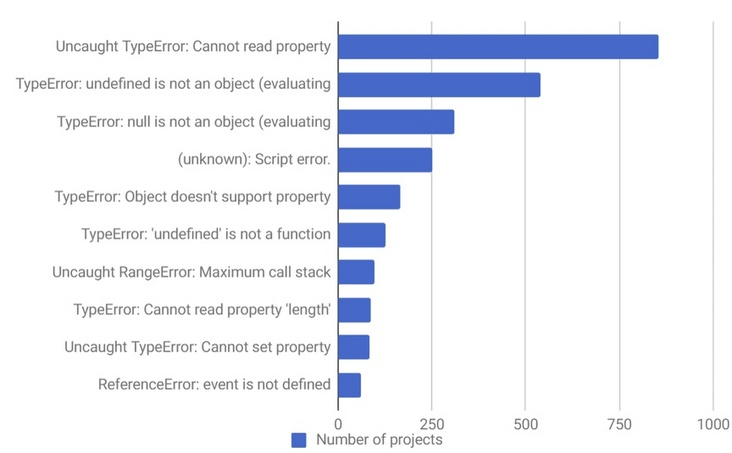
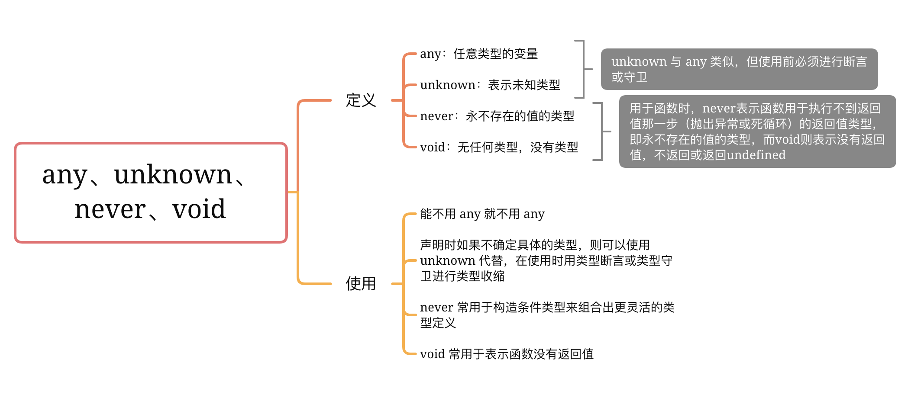

# TypeScript

## Why TypeScript ? 相对于 JavaScript 的优势是什么？

### Why Typescript？

在没有  `Typescript`  以前，大部分项目都是使用原生  `Javascript`  开发。而  `Javascript`  天生是一门"灵活"的语言。所谓所谓"灵活"，表现在：

- 它没有类型约束，一个变量可能初始化时是字符串，过一会儿又被赋值为数字。
- 由于隐式类型转换的存在，有的变量的类型很难在运行前就确定，也可以做一些神奇的操作
- 基于原型的面向对象编程，使得原型上的属性或方法可以在运行时被修改
- 函数是 JavaScript 中的一等公民，可以赋值给变量，也可以当作参数或返回值

而这些灵活通常导致了 JavaScript 代码的肆无忌惮，比如拿数字和数组做求和运算，给函数传入不符合预期的参数等等而这些显而易见的问题编码阶段不会有任何错误提示。

```js
// 数字和数组做求和运算
const number = 1
const arr = [1, 2, 3]
console.log(number + arr)

// 传入不符合预期的参数
function pow2(value) {
  return Math.pow(value, 2)
}
pow2('sister')
```

在大型项目中，一个类型"小改动"可能会导致很多处代码需要跟着调整，而这些需要调整的地方在"小改动"前后可能不会有任何报错提示，开发者只能靠肉眼排查，很难且容易遗漏。

我们使用  `Typescript`  的主要目的就是【类型安全】（type-safe），借助类型声明避免程序做错误的事情。

```js
const number = 1
const arr = [1, 2, 3]
console.log(number + arr)
// 运算符"+"不能应用于类型"number"和"number[]"。

function pow(value: number) {
  return Math.pow(value, 2)
}
pow('sister')
// 类型"string"的参数不能赋给类型"number"的参数。
```

下图是某错误处理平台收集统计的 JavaScript Top10 错误，其中 7 个 TypeError，1 个 ReferenceError：



而这 8 种问题，我们都能用 TypeScript 在编码早期及时应对

### TypeScript 相对于 JavaScript 的优势是什么？

#### 1\. TypeScript 是添加了类型系统的 JavaScript，适用于任何规模的项目，增加了代码的可读性和可维护性

尤其是在第三方开源库中（例如组件库），类型系统尤为重要，现在很多项目都是用 TypeScript 写的，如果依赖的库没有 TypeScript 声明，在调用时就会传递大量类型为 any 的值，最终影响项目自身使用 TypeScript 应该获得的价值（强类型推导）。

因此在开发设计第三方库时，大都会使用 TypeScript 声明。一个库如果足够热门的话，你不做 TypeScript 声明也会有热心用户做一个发布出来的。

#### 2\. TypeScript 是一门静态类型、弱类型的语言，它是完全兼容 JavaScript 的，它不会修改 JavaScript 运行时的特性

类型系统按照「类型检查的时机」来分类，可以分为：

- 动态类型：在运行时才会进行类型检查，往往会导致运行时错误
- 静态类型：指编译阶段就能确定每个变量的类型，往往会导致语法错误

JavaScript 就是一门解释型语言，没有编译阶段，所以它是动态类型：

```js
let foo = 1
foo.split(' ')
// Uncaught TypeError: foo.split is not a function
// 运行时会报错（foo.split 不是一个函数），造成线上 bug
```

TypeScript 在运行前需要先编译为 JavaScript，而在编译阶段就会进行类型检查，所以  TypeScript 是静态类型，这段 TypeScript 代码在编译阶段就会报错了：

```js
let foo = 1
foo.split(' ')
// Property 'split' does not exist on type 'number'.
// 编译时会报错（数字没有 split 方法），无法通过编译
```

另外，得益于 TypeScript 强大的   类型推论，上面的代码并没有手动声明变量  `foo`  的类型，但在变量初始化时自动推论出它是一个  `number`  类型：

```js
let foo: number = 1
foo.split(' ')
// Property 'split' does not exist on type 'number'.
// 编译时会报错（数字没有 split 方法），无法通过编译
```

以下这段代码不管是在 JavaScript 中还是在 TypeScript 中都是可以正常运行的

```js
console.log(1 + '2')
// 打印出字符串 '12'
```

所以，TypeScript 是完全兼容 JavaScript 的，它不会修改 JavaScript 运行时的特性，所以它们都是弱类型

#### 3\. TypeScript 增强了编辑器（IDE）的功能，提供了代码补全、接口提示、跳转到定义、代码重构等能力

TypeScript 增强了编辑器（IDE）的功能，包括代码补全、接口提示、跳转到定义、代码重构等，这在很大程度上提高了开发效率。给开发 TypeScript 项目、中小型项目中迁移 TypeScript 提供了便捷

#### 4\. TypeScript 与标准同步发展，符合最新的 ECMAScript 标准（stage 3）

TypeScript 坚持与 ECMAScript 标准同步发展，并推进了很多 ECMAScript 语法提案，比如可选链操作符（`?.`）、空值合并操作符（`??`）、Throw 表达式、正则匹配索引等

#### 5\. TypeScript 可以和 JavaScript 共存，这意味着 JavaScript 项目能够渐进式的迁移到 TypeScript

在老 JavaScript 项目中，如果你想使用 TypeScript，可以使用 TypeScript 编写新文件，老的 JavaScript 文件可以继续使用

**参考链接**

- https://github.com/sisterAn/blog/issues/124

## TypeScript 的主要特点是什么？

- 跨平台：TypeScript 编译器可以安装在任何操作系统上，包括 Windows、macOS 和 Linux。
- ES6 特性：TypeScript 包含计划中的 ECMAScript 2015 (ES6) 的大部分特性，例如箭头函数。
- 面向对象的语言：TypeScript 提供所有标准的 OOP 功能，如类、接口和模块。
- 静态类型检查：TypeScript 使用静态类型并帮助在编译时进行类型检查。因此，你可以在编写代码时发现编译时错误，而无需运行脚本。
- 可选的静态类型：如果你习惯了 JavaScript 的动态类型，TypeScript 还允许可选的静态类型。

## Typescript 的数据类型有哪些？

> 参考： https://www.tslang.cn/docs/handbook/basic-types.html

typescript 和 javascript 几乎一样，拥有相同的数据类型，另外在 javascript 基础上提供了更加实用的类型供开发使用

在开发阶段，可以为明确的变量定义为某种类型，这样 typescript 就能在编译阶段进行类型检查，当类型不合符预期结果的时候则会出现错误提示。

typescript 的数据类型主要有如下：

- boolean（布尔类型）
- number（数字类型）
- string（字符串类型）
- array（数组类型）
- tuple（元组类型）
- enum（元组类型）
- any（任意类型）
- null 和 undefined 类型
- void 类型
- nerver 类型
- object 类型

### boolean

布尔类型

```ts
let flag: boolean = true
// flag = 123; // 错误
flag = false //正确
```

### number

数字类型，和`javascript`一样，`typescript`的数值类型都是浮点数，可支持二进制、八进制、十进制和十六进制

```ts
let num: number = 123
// num = '456'; // 错误
num = 456 //正确
```

进制表示：

```ts
let decLiteral: number = 6 // 十进制
let hexLiteral: number = 0xf00d // 十六进制
let binaryLiteral: number = 0b1010 // 二进制
let octalLiteral: number = 0o744 // 八进制
```

### string

字符串类型，和`JavaScript`一样，可以使用双引号（`"`）或单引号（`'`）表示字符串

```ts
let str: string = 'this is ts'
str = 'test'
```

作为超集，当然也可以使用模版字符串``进行包裹，通过 \${} 嵌入变量

```ts
let name: string = `Gene`;
let age: number = 37;
let sentence: string = `Hello, my name is ${ name }
```

### array

数组类型，跟`javascript`一致，通过`[]`进行包裹，有两种写法：

方式一：元素类型后面接上  `[]`

```ts
let arr: string[] = ['12', '23']
arr = ['45', '56']
```

方式二：使用数组泛型，`Array<元素类型>`：

```ts
let arr: Array<number> = [1, 2]
arr = ['45', '56']
```

### tuple 元组

元祖类型，允许表示一个已知元素数量和类型的数组，各元素的类型不必相同

```ts
let tupleArr: [number, string, boolean]
tupleArr = [12, '34', true] //ok
typleArr = [12, '34'] // no ok
```

赋值的类型、位置、个数需要和定义（生明）的类型、位置、个数一致

### enum 枚举

`enum`类型是对 JavaScript 标准数据类型的一个补充，使用枚举类型可以为一组数值赋予友好的名字

```ts
enum Color {
  Red,
  Green,
  Blue
}
let c: Color = Color.Green
```

### any

可以指定任何类型的值，在编程阶段还不清楚类型的变量指定一个类型，不希望类型检查器对这些值进行检查而是直接让它们通过编译阶段的检查，这时候可以使用`any`类型

使用`any`类型允许被赋值为任意类型，甚至可以调用其属性、方法

```ts
let num: any = 123
num = 'str'
num = true
```

定义存储各种类型数据的数组时，示例代码如下：

```ts
let arrayList: any[] = [1, false, 'fine']
arrayList[1] = 100
```

### null 和 和 undefined

在`JavaScript`  中  `null`表示 "什么都没有"，是一个只有一个值的特殊类型，表示一个空对象引用，而`undefined`表示一个没有设置值的变量

默认情况下`null`和`undefined`是所有类型的子类型， 就是说你可以把  `null`和  `undefined`赋值给  `number`类型的变量

```ts
let num: number | undefined // 数值类型 或者 undefined
console.log(num) // 正确
num = 123
console.log(num) // 正确
```

但是`ts`配置了`--strictNullChecks`标记，`null`和`undefined`只能赋值给`void`和它们各自

### void

用于标识方法返回值的类型，表示该方法没有返回值。

```ts
function hello(): void {
  alert('Hello Runoob')
}

const hello = ():void => alert('Hello Runoob)
```

### never

`never`是其他类型 （包括`null`和  `undefined`）的子类型，可以赋值给任何类型，代表从不会出现的值

但是没有类型是 never 的子类型，这意味着声明  `never`  的变量只能被  `never`  类型所赋值。

`never`  类型一般用来指定那些总是会抛出异常、无限循环

```ts
let a: never
a = 123 // 错误的写法

a = (() => {
  // 正确的写法
  throw new Error('错误')
})()

// 返回never的函数必须存在无法达到的终点
function error(message: string): never {
  throw new Error(message)
}
```

### object

对象类型，非原始类型，常见的形式通过`{}`进行包裹

```ts
let obj: object
obj = { name: 'Wang', age: 25 }
```

**总结**

和`javascript`基本一致，也分成：

- 基本类型
- 引用类型

在基础类型上，`typescript`增添了`void`、`any`、`emum`等原始类型

## 对 TypeScript 中接口的理解？应用场景？

### 一、是什么

接口是一系列抽象方法的声明，是一些方法特征的集合，这些方法都应该是抽象的，需要由具体的类去实现，然后第三方就可以通过这组抽象方法调用，让具体的类执行具体的方法

简单来讲，一个接口所描述的是一个对象相关的属性和方法，但并不提供具体创建此对象实例的方法

`typescript`的核心功能之一就是对类型做检测，虽然这种检测方式是"鸭式辨型法"，而接口的作用就是为为这些类型命名和为你的代码或第三方代码定义一个约定

### 二、使用方式

接口定义如下：

```ts
interface interface_name {}
```

例如有一个函数，这个函数接受一个  `User`  对象，然后返回这个  `User`  对象的  `name`  属性:

```js
const getUserName = user => user.name
```

可以看到，参数需要有一个`user`的`name`属性，可以通过接口描述`user`参数的结构

```ts
interface User {
  name: string
  age: number
}

const getUserName = (user: User) => user.name
```

这些属性并不一定全部实现，上述传入的对象必须拥有`name`和`age`属性，否则`typescript`在编译阶段会报错，如下图：


如果不想要`age`属性的话，这时候可以采用可选属性 `?`，如下表示：

```ts
interface User {
  name: string
  age?: number
}
```

这时候`age`属性则可以是`number`类型或者`undefined`类型

有些时候，我们想要一个属性变成只读属性，在`typescript`只需要使用`readonly`声明，如下：

```ts
interface User {
  name: string
  age?: number
  readonly isMale: boolean
}
```

当我们修改属性的时候，就会出现警告，如下所示：


这是属性中有一个函数，可以如下表示：

```ts
interface User {
  name: string
  age?: number
  readonly isMale: boolean
  say: (words: string) => string
}
```

如果传递的对象不仅仅是上述的属性，这时候可以使用：

- 类型推断

```ts
interface User {
  name: string
  age: number
}

const getUserName = (user: User) => user.name
getUserName({ color: 'yellow' } as User)
```

- 给接口添加字符串索引签名

```ts
interface User {
  name: string
  age: number
  [propName: string]: any
}
```

接口还能实现继承，如下图：


也可以继承多个，父类通过逗号隔开，如下：

```ts
interface Father {
  color: String
}

interface Mother {
  height: Number
}

interface Son extends Father, Mother {
  name: string
  age: Number
}
```

### 三、应用场景

例如在`javascript`中定义一个函数，用来获取用户的姓名和年龄：

```ts
const getUserInfo = function(user) {
    // ...
    return name: ${user.name}, age: ${user.age}
}

```

如果多人开发的都需要用到这个函数的时候，如果没有注释，则可能出现各种运行时的错误，这时候就可以使用接口定义参数变量：

```ts
// 先定义一个接口
interface IUser {
  name: string
  age: number
}

const getUserInfo = (user: IUser): string => {
  return `name: ${user.name}, age: ${user.age}`
}

// 正确的调用
getUserInfo({ name: 'koala', age: 18 })
```

包括后面讲到类的时候也会应用到接口

**参考文献**

- https://www.tslang.cn/docs/handbook/interfaces.html

## 对 TypeScript 中类的理解？应用场景？

### 一、是什么

类（Class）是面向对象程序设计（OOP，Object-Oriented Programming）实现信息封装的基础

> 类是一种用户定义的引用数据类型，也称类类型

传统的面向对象语言基本都是基于类的，`JavaScript`  基于原型的方式让开发者多了很多理解成本

在  `ES6`  之后，`JavaScript`  拥有了  `class`  关键字，虽然本质依然是构造函数，但是使用起来已经方便了许多

但是`JavaScript`  的`class`依然有一些特性还没有加入，比如修饰符和抽象类

`TypeScript`  的  `class`  支持面向对象的所有特性，比如 类、接口等

### 二、使用方式

定义类的关键字为  `class`，后面紧跟类名，类可以包含以下几个模块（类的数据成员）：

- 字段  ： 字段是类里面声明的变量。字段表示对象的有关数据。
- 构造函数： 类实例化时调用，可以为类的对象分配内存。
- 方法： 方法为对象要执行的操作

如下例子：

```ts
class Car {
  // 字段
  engine: string

  // 构造函数
  constructor(engine: string) {
    this.engine = engine
  }

  // 方法
  disp(): void {
    console.log('发动机为 :   ' + this.engine)
  }
}
```

**继承**

类的继承使用过`extends`的关键字

```ts
class Animal {
  move(distanceInMeters: number = 0) {
    console.log(`Animal moved ${distanceInMeters}m.`)
  }
}

class Dog extends Animal {
  bark() {
    console.log('Woof! Woof!')
  }
}

const dog = new Dog()
dog.bark()
dog.move(10)
dog.bark()
```

`Dog`是一个 派生类，它派生自  `Animal`  基类，派生类通常被称作子类，基类通常被称作 超类

`Dog`类继承了`Animal`类，因此实例`dog`也能够使用`Animal`类`move`方法

同样，类继承后，子类可以对父类的方法重新定义，这个过程称之为方法的重写，通过`super`关键字是对父类的直接引用，该关键字可以引用父类的属性和方法，如下：

```ts
class PrinterClass {
  doPrint(): void {
    console.log('父类的 doPrint() 方法。')
  }
}

class StringPrinter extends PrinterClass {
  doPrint(): void {
    super.doPrint() // 调用父类的函数
    console.log('子类的 doPrint()方法。')
  }
}
```

**修饰符**

可以看到，上述的形式跟`ES6`十分的相似，`typescript`在此基础上添加了三种修饰符：

- 公共 public：可以自由的访问类程序里定义的成员
- 私有 private：只能够在该类的内部进行访问
- 受保护 protect：除了在该类的内部可以访问，还可以在子类中仍然可以访问

**私有修饰符**

只能够在该类的内部进行访问，实例对象并不能够访问


并且继承该类的子类并不能访问，如下图所示：


**受保护修饰符**

跟私有修饰符很相似，实例对象同样不能访问受保护的属性，如下：


有一点不同的是  `protected`  成员在子类中仍然可以访问


除了上述修饰符之外，还有只读修饰符

**只读修饰符**

通过`readonly`关键字进行声明，只读属性必须在声明时或构造函数里被初始化，如下：


除了实例属性之外，同样存在静态属性

**静态属性**

这些属性存在于类本身上面而不是类的实例上，通过`static`进行定义，访问这些属性需要通过 类型.静态属性 的这种形式访问，如下所示：

```ts
class Square {
  static width = '100px'
}

console.log(Square.width) // 100px
```

上述的类都能发现一个特点就是，都能够被实例化，在  `typescript`中，还存在一种抽象类

**抽象类**

抽象类做为其它派生类的基类使用，它们一般不会直接被实例化，不同于接口，抽象类可以包含成员的实现细节

`abstract`关键字是用于定义抽象类和在抽象类内部定义抽象方法，如下所示：

```ts
abstract class Animal {
  abstract makeSound(): void
  move(): void {
    console.log('roaming the earch...')
  }
}
```

这种类并不能被实例化，通常需要我们创建子类去继承，如下：

```ts
class Cat extends Animal {
  makeSound() {
    console.log('miao miao')
  }
}

const cat = new Cat()

cat.makeSound() // miao miao
cat.move() // roaming the earch...
```

### 三、应用场景

除了日常借助类的特性完成日常业务代码，还可以将类（class）也可以作为接口，尤其在  `React`  工程中是很常用的，如下：

```ts
export default class Carousel extends React.Component<Props, State> {}
```

由于组件需要传入  `props`  的类型  `Props` ，同时有需要设置默认  `props`  即  `defaultProps`，这时候更加适合使用`class`作为接口

先声明一个类，这个类包含组件  `props`  所需的类型和初始值：

```ts
// props的类型
export default class Props {
  public children: Array<React.ReactElement<any>> | React.ReactElement<any> | never[] = []
  public speed: number = 500
  public height: number = 160
  public animation: string = 'easeInOutQuad'
  public isAuto: boolean = true
  public autoPlayInterval: number = 4500
  public afterChange: () => {}
  public beforeChange: () => {}
  public selesctedColor: string
  public showDots: boolean = true
}
```

当我们需要传入  `props`  类型的时候直接将  `Props`  作为接口传入，此时  `Props`  的作用就是接口，而当需要我们设置`defaultProps`初始值的时候，我们只需要:

```ts
public static defaultProps = new Props()
```

`Props`  的实例就是  `defaultProps`  的初始值，这就是  `class`作为接口的实际应用，我们用一个  `class`  起到了接口和设置初始值两个作用，方便统一管理，减少了代码量

**参考文献**

- https://www.tslang.cn/docs/handbook/classes.html
- https://www.runoob.com/typescript/ts-class.html

## 对 TypeScript 中函数的理解？与 JavaScript 函数的区别？

### 一、是什么

函数是`JavaScript`  应用程序的基础，帮助我们实现抽象层、模拟类、信息隐藏和模块

在`TypeScript`  里，虽然已经支持类、命名空间和模块，但函数仍然是主要定义行为的方式，`TypeScript`  为  `JavaScript`  函数添加了额外的功能，丰富了更多的应用场景

函数类型在  `TypeScript`  类型系统中扮演着非常重要的角色，它们是可组合系统的核心构建块

### 二、使用方式

跟`javascript`  定义函数十分相似，可以通过`funciton`  关键字、箭头函数等形式去定义，例如下面一个简单的加法函数：

```ts
const add = (a: number, b: number) => a + b
```

上述只定义了函数的两个参数类型，这个时候整个函数虽然没有被显式定义，但是实际上`TypeScript`  编译器是能够通过类型推断到这个函数的类型，如下图所示：


当鼠标放置在第三行`add`函数名的时候，会出现完整的函数定义类型，通过`:`  的形式来定于参数类型，通过  `=>`  连接参数和返回值类型

当我们没有提供函数实现的情况下，有两种声明函数类型的方式，如下所示：

```ts
// 方式一
type LongHand = {
  (a: number, b: number): number
}

const add: LongHand = (a, b) => a + b

// 方式二
type ShortHand = (a: number, b: number) => number

const add: ShortHand = (a, b) => a + b
```

当存在函数重载时，只能使用方式一的形式

### 可选参数

当函数的参数可能是不存在的，只需要在参数后面加上  `?`  代表参数可能不存在，如下：

```ts
const add = (a: number, b?: number) => a + (b ? b : 0)
```

这时候参数`b`可以是`number`类型或者`undefined`类型，即可以传一个`number`类型或者不传都可以

### 剩余类型

剩余参数与`JavaScript`的语法类似，需要用  `...`  来表示剩余参数

如果剩余参数  `rest`  是一个由`number`类型组成的数组，则如下表示：

```ts
const add = (a: number, ...rest: number[]) => rest.reduce((a, b) => a + b, a)
```

### 函数重载

允许创建数项名称相同但输入输出类型或个数不同的子程序，它可以简单地称为一个单独功能可以执行多项任务的能力

关于`typescript`函数重载，必须要把精确的定义放在前面，最后函数实现时，需要使用  `|`操作符或者`?`操作符，把所有可能的输入类型全部包含进去，用于具体实现

这里的函数重载也只是多个函数的声明，具体的逻辑还需要自己去写，`typescript`并不会真的将你的多个重名  `function`的函数体进行合并

例如我们有一个 add 函数，它可以接收  `string`类型的参数进行拼接，也可以接收  `number`  类型的参数进行相加，如下：

```ts
// 上边是声明
function add(arg1: string, arg2: string): string
function add(arg1: number, arg2: number): number
// 因为我们在下边有具体函数的实现，所以这里并不需要添加 declare 关键字

// 下边是实现
function add(arg1: string | number, arg2: string | number) {
  // 在实现上我们要注意严格判断两个参数的类型是否相等，而不能简单的写一个 arg1 + arg2
  if (typeof arg1 === 'string' && typeof arg2 === 'string') {
    return arg1 + arg2
  } else if (typeof arg1 === 'number' && typeof arg2 === 'number') {
    return arg1 + arg2
  }
}
```

### 三、区别

从上面可以看到：

- 从定义的方式而言，typescript 声明函数需要定义参数类型或者声明返回值类型
- typescript 在参数中，添加可选参数供使用者选择
- typescript 增添函数重载功能，使用者只需要通过查看函数声明的方式，即可知道函数传递的参数个数以及类型

**参考文献**

- https://www.tslang.cn/docs/handbook/functions.html
- https://zh.wikipedia.org/wiki/%E5%87%BD%E6%95%B0%E9%87%8D%E8%BD%BD
- https://jkchao.github.io/typescript-book-chinese/typings/functions.html#%E9%87%8D%E8%BD%BD

## 对 TypeScript 中泛型的理解？应用场景？

### 一、是什么

泛型程序设计（generic programming）是程序设计语言的一种风格或范式

泛型允许我们在强类型程序设计语言中编写代码时使用一些**以后才指定的类型**，在实例化时作为参数指明这些类型 在`typescript`中，定义函数，接口或者类的时候，**不预先定义好具体的类型，而在使用的时候在指定类型**的一种特性

假设我们用一个函数，它可接受一个  `number`  参数并返回一个`number`  参数，如下写法：

```ts
function returnItem(para: number): number {
  return para
}
```

如果我们打算接受一个  `string`  类型，然后再返回  `string`类型，则如下写法：

```ts
function returnItem(para: string): string {
  return para
}
```

上述两种编写方式，存在一个最明显的问题在于，代码重复度比较高

虽然可以使用  `any`类型去替代，但这也并不是很好的方案，因为我们的目的是接收什么类型的参数返回什么类型的参数，即在运行时传入参数我们才能确定类型

这种情况就可以使用泛型，如下所示：

```ts
function returnItem<T>(para: T): T {
  return para
}
```

可以看到，泛型给予开发者创造灵活、可重用代码的能力

### 二、使用方式

泛型通过`<>`的形式进行表述，可以声明：

- 函数
- 接口
- 类

**函数声明**

声明函数的形式如下：

```ts
function returnItem<T>(para: T): T {
  return para
}
```

定义泛型的时候，可以一次定义多个类型参数，比如我们可以同时定义泛型  `T`  和 泛型  `U`：

```ts
function swap<T, U>(tuple: [T, U]): [U, T] {
  return [tuple[1], tuple[0]]
}

swap([7, 'seven']) // ['seven', 7]
```

**接口声明**

声明接口的形式如下：

```ts
interface ReturnItemFn<T> {
  (param: T): T
}
```

那么当我们想传入一个 number 作为参数的时候，就可以这样声明函数:

```ts
const returnItem: ReturnItemFn<number> = para => para
```

**类声明**

使用泛型声明类的时候，既可以作用于类本身，也可以作用与类的成员函数

下面简单实现一个元素同类型的栈结构，如下所示：

```ts
class Stack<T> {
  private arr: T[] = []

  public push(item: T) {
    this.arr.push(item)
  }

  public pop() {
    this.arr.pop()
  }
}
```

使用方式如下：

```ts
const stack = new Stacn<number>()
```

如果上述只能传递  `string`  和  `number`  类型，这时候就可以使用  `<T extends xx>`  的方式猜实现约束泛型，如下所示：


除了上述的形式，泛型更高级的使用如下：

例如要设计一个函数，这个函数接受两个参数，一个参数为对象，另一个参数为对象上的属性，我们通过这两个参数返回这个属性的值

这时候就设计到泛型的索引类型和约束类型共同实现

**索引类型、约束类型**

索引类型  `keyof T`  把传入的对象的属性类型取出生成一个联合类型，这里的泛型 U 被约束在这个联合类型中，如下所示：

```ts
function getValue<T extends object, U extends keyof T>(obj: T, key: U) {
  return obj[key] // ok
}
```

上述为什么需要使用泛型约束，而不是直接定义第一个参数为  `object`类型，是因为默认情况  `object`  指的是`{}`，而我们接收的对象是各种各样的，一个泛型来表示传入的对象类型，比如  `T extends object`

使用如下图所示：


**多类型约束**

例如如下需要实现两个接口的类型约束：

```ts
interface FirstInterface {
  doSomething(): number
}

interface SecondInterface {
  doSomethingElse(): string
}
```

可以创建一个接口继承上述两个接口，如下：

```ts
interface ChildInterface extends FirstInterface, SecondInterface {}
```

正确使用如下：

```ts
class Demo<T extends ChildInterface> {
  private genericProperty: T

  constructor(genericProperty: T) {
    this.genericProperty = genericProperty
  }
  useT() {
    this.genericProperty.doSomething()
    this.genericProperty.doSomethingElse()
  }
}

const demo = new Demo({
  doSomething: () => 200,
  doSomethingElse: () => 'false'
})
```

通过泛型约束就可以达到多类型约束的目的

### 三、应用场景

通过上面初步的了解，后述在编写  `typescript`  的时候，定义函数，接口或者类的时候，不预先定义好具体的类型，而在使用的时候在指定类型的一种特性的时候，这种情况下就可以使用泛型

灵活的使用泛型定义类型，是掌握`typescript`  必经之路

**参考文献**

- https://www.tslang.cn/docs/handbook/generics.html

### 四、自己的理解

泛型是指在定义函数、接口或类的时候，不预先指定具体的类型，而在使用的时候再指定类型的一种特性。

比如 Vue3 的 [ref](https://cn.vuejs.org/guide/typescript/composition-api.html#typing-ref) 的类型属性就是泛型:

```ts
function ref<T>(value: T): Ref<UnwrapRef<T>>

interface Ref<T> {
  value: T
}
```

有时我们可能想为 ref 内的值指定一个更复杂的类型，可以通过使用 Ref 这个类型：

```ts
import { ref } from 'vue'
import type { Ref } from 'vue'

const year: Ref<string | number> = ref('2020')

year.value = 2020 // 成功！
```

或者，在调用 ref() 时传入一个泛型参数，来覆盖默认的推导行为：

```ts
// 得到的类型：Ref<string | number>
const year = ref<string | number>('2020')

year.value = 2020 // 成功！
```

如果你指定了一个泛型参数但没有给出初始值，那么最后得到的就将是一个包含 undefined 的联合类型：

```ts
// 推导得到的类型：Ref<number | undefined>
const n = ref<number>()
```

## any、never、unknown 和 void 有什么区别？



### any

`any`  类型用于描述一个我们根本不知道类型的变量，或者说可以是任意类型的变量，不作任何约束，编译时会跳过对其的类型检查

```ts
let notSure: any

// 可以被赋值任意类型
notSure = 'sisterAn!'
notSure = 512
notSure = { hello: () => 'Hello sisterAn!' }

// 它也兼容任何类型
let num: number = 12
notSure = num
num = notSure
```

### unknown

`unknown`  表示未知类型，即写代码的时候还不知道具体会是怎样的数据类型，是  `typescript 3.0`  中引入的新类型，  与  `any`  类似，所有类型都可以分配给`unknown`  类型

```ts
let notSure: unknown = 'sisterAn!'

// 可以被赋值任意类型
notSure = 'sisterAn!'
notSure = 512
notSure = { hello: () => 'Hello sisterAn!' }
```

但与  `any`  不同的是， `unknown`  类型的变量不允许被  `any`  或  `unknown`  以外的变量赋值，也不允许执行  `unknown`  类型变量的方法

```ts
let notSure: unknown = 'sisterAn'
let notSure1: unknown = 'Hello'
let any1: any = 12
let num: number = 12

notSure = notSure1
notSure = any1

num = notSure
// error: Type 'unknown' is not assignable to type 'number'.

notSure.toLowerCase()
// error: Object is of type 'unknown'.
```

这种限制有很强的防御性，但如果我们要对未知类型执行某些操作，也不是没有办法

#### 方式一：使用类型断言缩小未知范围

```ts
let notSure: unknown = 'sisterAn'

console.log((notSure as string).toLowerCase())
```

#### 方式二：使用类型守卫进行类型收缩

```ts
let notSure: unknown = 'sisterAn'

if (typeof notSure === 'string') {
  console.log((notSure as string).toLowerCase())
}
// 或使用 instanceof 来缩小变量的类型
```

我们仅在  `notSure`  为  `string`  类型时，才执行  `toLowerCase`  方法，TypeScript 编译器会理解这一点，并假设类型

总结： any 和 unknown 都是顶级类型，但是 unknown 更加严格，不像 any 那样不做类型检查，反而 unknown 因为未知性质，不允许访问属性，不允许赋值给其他有明确类型的变量。

### never

`never` ，永不存在的值的类型，是  typescript 2.0  中引入的新类型，那什么是永不存在的类型，我们知道变量一旦声明，都会默认初始化为  `undefined` ，也不是永不存在的值，但其实有一些场景，值会永不存在，例如，那些总是会抛出异常或函数中执行无限循环的代码（死循环）的函数返回值类型

```ts
// 抛出异常
function error(msg: string): never {
  throw new Error(msg)
} // 抛出异常会直接中断程序运行，这样程序就运行不到返回值那一步了，即具有不可达的终点，也就永不存在返回了

// 死循环
function loopForever(): never {
  while (true) {}
} //同样程序永远无法运行到函数返回值那一步，即永不存在返回
```

变量也可以声明为  `never`  类型，因为它是永不存在值的类型，所以任何类型都不能赋值给  `never`  类型（除了`never`本身之外）。 即使  `any`  也不可以赋值给  `never`

```ts
let never1: never

// any 也不能分配给 never
let any1: any = 'sisterAn'
never1 = any1 // Error

// 作为函数返回类型的 never
let never2: never = (() => {
  throw new Error('Throw error')
})()

never1 = never2
```

### void

`void`  某种程度上来说正好与  `any`  相反，表示无任何类型，没有类型，如果是函数则应没有返回值或者返回  `undefined` ：

```ts
function hello(): void {
  console.log('Hello sisterAn')
}
```

也可以声明一个  `void`  类型的变量，不过你只能为它赋予  `undefined` 、 `null` （注意，`"strictNullChecks": true`  时会报错）和  `void`  类型的值

```ts
let void1: void
let null1: null = null
let und1: undefined = undefined
let void2: void

void1 = void2
void1 = und1
void1 = null1 // Type 'null' is not assignable to type 'void'.
```

### any、unknown、never、void 区别

#### 1\. 定义

- `any` ：用于描述任意类型的变量，不作任何约束，编译时会跳过对其的类型检查
- `unknown` ：表示未知类型，即写代码的时候还不知道具体会是怎样的数据类型
- `never` ：永不存在的值的类型，常用于表示永不能执行到终点的函数返回值，例如抛出异常或函数中执行无限循环的代码（死循环）的函数返回值类型
- `void` ：表示无任何类型，没有类型，例如没有返回值的函数的返回值类型

any 与 unknown 的区别：

`unknown`  与  `any`  类似，但使用前必须进行断言或守卫

never 与 void 的区别：

用于函数时， `never`  表示函数用于执行不到返回值那一步（抛出异常或死循环）的返回值类型，即永不存在的值的类型，而  `void`  则表示没有返回值，不返回或返回  `undefined`

#### 2\. 使用

- `any`  类型导致问题太多了，如类型污染，使用不存在的属性或方法而不报错等，而且不不方便后期维护，所以，建议能不用  `any`  就不用  `any` ，但是如果声明时并不确定具体的类型，则可以使用  `unknown`  代替，在使用时用类型断言或类型守卫进行类型收缩
- `never`  类型用于表示永不存在的值的类型，所以常用于构造条件类型来组合出更灵活的类型定义

```ts
// never: 从未出现的值的类型
// 如果 T 是 U 的子类型的话，那么就会返回 X，否则返回 Y
// 构造条件类型 : T extends U ? X : Y

type Exclude<T, U> = T extends U ? never : T

// 相当于: type A = 'a'
type A = Exclude<'x' | 'a', 'x' | 'y' | 'z'>
```

- `void`  常用于表示函数没有返回值 (可以被赋值为 null 和 undefined)

- [参考原文](https://github.com/sisterAn/blog/issues/128)

## 使用 TS 实现一个判断传入参数是否是数组类型的方法？

unknown 用于变量类型不确定，但肯定可以确定的情形下，比如下面这个示例中，参数总归会有个值，根据这个值的类型进行不同的处理，这里使用 unknown 替代 any 则会更加类型安全。

```ts
function isArray(x: unknown): boolean {
  if (Array.isArray(x)) {
    return true
  }
  return false
}
```

## interface 与 type 异同点，如何选择？

相同点：

1. 都可以描述对象或函数

```ts
// 接口
// * 描述对象
interface Sister {
  name: string
  age: number
}

// * 描述函数
interface SetSister {
  (name: string, age: number): void
}

// 类型别名
// * 描述对象
type Sister = {
  name: string
  age: number
}

// * 描述函数
type SetSister = (name: string, age: number) => void
```

2. 都可以扩展

```js
// 接口
interface SisterAn {
  name: string;
}

// 类型别名
type SisterRan = {
  age: number
}

// 接口扩展接口
interface Sister extends SisterAn {
  age: number;
}
// 类型别名扩展类型别名
type SisterPro = SisterRan & {
  name: string
}
// 接口扩展类型别名
interface Sister extends SisterRan {
  name: string;
}
// 类型别名扩展接口
type SisterPro = SisterAn & {
  age: number
}
```

区别：

1. 不同声明范围，接口声明中，跟着的是具体的结构，type 可以为任意的类型创建类型别名

类型别名的右边可以是任何类型，包括基本类型、元祖、类型表达式（ & 或 | 等）；而在接口声明中，右边必须为变量结构。例如，下面的类型别名就不能转换成接口

```ts
type Name = string
type Text = string | { text: string }
type Coordinates = [number, number]
```

2. 不同的扩展形式，接口 extends，类型别名 &
3. 不同的重复定义表现形式，接口自动合并，类型别名报错

如何选择

建议优先选择接口，当接口不满足时再使用类型别名

### 及格线

- interface 与 type 都可以描述对象类型、函数类型、Class 类型，但 interface 无法像 type 那样表达元组、一组联合类型等等。
- 在对象扩展情况下，interface 使用 extends 关键字，而 type 使用交叉类型（`&`）。interface 和 type 可以混合扩展，也就是说 interface 可以扩展 type，type 也可以扩展 interface
- 同名的 interface 会自动合并，并且在合并时会要求兼容原接口的结构, 而 type 类型别名定义多次会报错
- interface 无法使用映射类型等类型工具，也就意味着在类型编程场景中我们还是应该使用 type 。

```ts
type Person = {
  name: string
  age: number
  hobbies: string[]
}

// 对索引类型做变换会用到映射类型的语法，它可以对索引类型的索引和值做一些变换，然后产生新的索引类型。

// 比如给每个索引加上 readonly 的修饰：
type ToReadonly<Obj> = {
  readonly [Key in keyof Obj]: Obj[Key]
}
type res = ToReadonly(Person)

// typeScript 也内置了很多基于映射类型实现的工具类型，比如 Partial、Required 等。

// 总之，会了映射类型就能够对索引类型做各种变换了。
```

### 优秀回答

使用 interface 来定义对象类型，使用类型别名来处理函数签名、联合类型、工具类型等等。这同样也代表了你对这两个工具的理解：interface 就是描述对象对外暴露的接口，其不应该具有过于复杂的类型逻辑，最多局限于泛型约束与索引类型这个层面。而 type alias 就是用于将一组类型的重命名，或是对类型进行复杂编程。

**如何选择 Interface 、 Type**

虽然 [官方](https://www.typescriptlang.org/docs/handbook/2/everyday-types.html#differences-between-type-aliases-and-interfaces)  中说几乎接口的所有特性都可以通过类型别名来实现，但建议优先选择接口，接口满足不了再使用类型别名，在 typescript 官网  [Preferring Interfaces Over Intersections](https://github.com/microsoft/TypeScript/wiki/Performance#writing-easy-to-compile-code)  有说明，具体内容如下：

> 大多数时候，对象类型的简单类型别名的作用与接口非常相似
>
> ```ts
> interface Foo {
>   prop: string
> }
>
> type Bar = { prop: string }
> ```
>
> 但是，一旦你需要组合两个或多个类型来实现其他类型时，你就可以选择使用接口扩展这些类型，或者使用类型别名将它们交叉在一个中（交叉类型），这就是差异开始的时候。
>
> - 接口创建一个单一的平面对象类型来检测属性冲突，这通常很重要！  而交叉类型只是递归的进行属性合并，在某种情况下可能产生  `never`  类型
> - 接口也始终显示得更好，而交叉类型做为其他交叉类型的一部分时，直观上表现不出来，还是会认为是不同基本类型的组合。
> - 接口之间的类型关系会被缓存，而交叉类型会被看成组合起来的一个整体。
> - 最后一个值得注意的区别是，在检查到目标类型之前会先检查每一个组分。
>
> 出于这个原因，建议使用接口/扩展扩展类型而不是创建交叉类型。
>
> ```ts
> - type Foo = Bar & Baz & {
> -     someProp: string;
> - }
> + interface Foo extends Bar, Baz {
> +     someProp: string;
> + }
> ```

简单的说，接口更加符合 JavaScript 对象的工作方式，简单的说明下，当出现属性冲突时：

```ts
// 接口扩展
interface Sister {
  sex: number
}

interface SisterAn extends Sister {
  sex: string
}
// index.ts(5,11): error TS2430: Interface 'SisterAn' incorrectly extends interface 'Sister'.
//  Types of property 'sex' are incompatible.
//    Type 'string' is not assignable to type 'number'.
```

```ts
// 交叉类型
type Sister1 = {
  sex: number
}

type Sister2 = {
  sex: string
}

type SisterAn = Sister1 & Sister2
// 不报错，此时的 SisterAn 是一个'number & string'类型，也就是 never
```

**Interface 和 Type 的不同点**

1. 基本类型别名、联合类型、元组

由于 Type 定义的实际是一个别名，所以 Type 可以描述一些基本类型、联合类型和元组的别名。

```ts
// 基本类型别名
type HZFEMember = number

// 联合类型
type HZFEMemberTechStack = string | string[]

// 元组
type HZFEMember = [number, string]
```

2. 声明合并

Interface 可以重复定义，并将合并所有声明的属性为单个接口。而 Type 不可重复定义。

```ts
// Interface
interface IHzfe {
  name: string
}
interface IHzfe {
  member: number
}

const hzfe: IHzfe = { name: 'HZFE', member: 17 }
```

3. 动态属性

Type 可以使用 in 关键字动态生成属性，而 Interface 的索引值必须是 string 或 number 类型，所以 Interface 并不支持动态生成属性。

```ts
type HZFELanguage = 'JavaScript' | 'Go'
type HZFEProjects = {
  [key in HZFELanguage]?: string[]
}

const hzfeProjects: HZFEProjects = {
  JavaScript: ['xx', 'xx']
}
```

## 什么是类型谓词

收窄类型，类型守卫。

**类型保护是可执行运行时检查的一种表达式，用于确保该类型在一定的范围内**。 换句话说，类型保护可以保证一个字符串是一个字符串，尽管它的值也可以是一个数值。类型保护与特性检测并不是完全不同，其主要思想是尝试检测属性、方法或原型，以确定如何处理值。

换句话说：**类型守卫是运行时检查，确保一个值在所要类型的范围内**

目前主要有四种的方式来实现类型保护：

- 1、in 关键字

```ts
interface InObj1 {
  a: number
  x: string
}
interface InObj2 {
  a: number
  y: string
}
function isIn(arg: InObj1 | InObj2) {
  // x 在 arg 打印 x
  if ('x' in arg) console.log('x')
  // y 在 arg 打印 y
  if ('y' in arg) console.log('y')
}
isIn({ a: 1, x: 'xxx' })
isIn({ a: 1, y: 'yyy' })
```

- 2、typeof 关键字

```ts
function isTypeof(val: string | number) {
  if (typeof val === 'number') return 'number'
  if (typeof val === 'string') return 'string'
  return '啥也不是'
}
```

> typeof 只支持：typeof 'x' === 'typeName' 和 typeof 'x' !== 'typeName'，x 必须是 'number', 'string', 'boolean', 'symbol'。

- 3、instanceof

```ts
function creatDate(date: Date | string) {
  console.log(date)
  if (date instanceof Date) {
    date.getDate()
  } else {
    return new Date(date)
  }
}
```

- 4、自定义类型保护的类型谓词

```ts
function isNumber(num: any): num is number {
  return typeof num === 'number'
}
function isString(str: any): str is string {
  return typeof str === 'string'
}
```

## 对 TypeScript 中高级类型的理解？有哪些？

### 一、是什么

除了`string`、`number`、`boolean`  这种基础类型外，在  `typescript`  类型声明中还存在一些高级的类型应用

这些高级类型，是`typescript`为了保证语言的灵活性，所使用的一些语言特性。这些特性有助于我们应对复杂多变的开发场景

### 二、有哪些

常见的高级类型有如下：

- 交叉类型 &
- 联合类型 |
- 类型别名 type
- 类型索引 keyof
- 类型约束 extend
- 映射类型 in
- 条件类型 三元

**交叉类型**

通过  `&`  将多个类型合并为一个类型，包含了所需的所有类型的特性，本质上是一种并的操作

语法如下：

```ts
T & U
```

适用于对象合并场景，如下将声明一个函数，将两个对象合并成一个对象并返回：

```ts
function extend<T , U>(first: T, second: U) : T & U {
    let result: <T & U> = {}
    for (let key in first) {
        result[key] = first[key]
    }
    for (let key in second) {
        if(!result.hasOwnProperty(key)) {
            result[key] = second[key]
        }
    }
    return result
}

```

**联合类型**

联合类型的语法规则和逻辑 "或" 的符号一致，表示其类型为连接的多个类型中的任意一个，本质上是一个交的关系

语法如下：

```ts
T | U
```

例如  `number` | `string` | `boolean`  的类型只能是这三个的一种，不能共存

如下所示：

```ts
function formatCommandline(command: string[] | string) {
  let line = ''
  if (typeof command === 'string') {
    line = command.trim()
  } else {
    line = command.join(' ').trim()
  }
}
```

**类型别名**

类型别名会给一个类型起个新名字，类型别名有时和接口很像，但是可以作用于原始值、联合类型、元组以及其它任何你需要手写的类型

可以使用  `type SomeName = someValidTypeAnnotation`的语法来创建类型别名：

```ts
type some = boolean | string

const b: some = true // ok
const c: some = 'hello' // ok
const d: some = 123 // 不能将类型"123"分配给类型"some"
```

此外类型别名可以是泛型:

```ts
type Container<T> = { value: T }
```

也可以使用类型别名来在属性里引用自己：

```ts
type Tree<T> = {
  value: T
  left: Tree<T>
  right: Tree<T>
}
```

可以看到，类型别名和接口使用十分相似，都可以描述一个对象或者函数

两者最大的区别在于，`interface`只能用于定义对象类型，而  `type`  的声明方式除了对象之外还可以定义交叉、联合、原始类型等，类型声明的方式适用范围显然更加广泛

**类型索引**

`keyof`  类似于  `Object.keys` ，用于获取一个接口中 Key 的联合类型。

```ts
interface Button {
  type: string
  text: string
}

type ButtonKeys = keyof Button
// 等效于
type ButtonKeys = 'type' | 'text'
```

**类型约束**

通过关键字  `extend`  进行约束，不同于在  `class`  后使用  `extends`  的继承作用，泛型内使用的主要作用是对泛型加以约束

```ts
type BaseType = string | number | boolean

// 这里表示 copy 的参数
// 只能是字符串、数字、布尔这几种基础类型
function copy<T extends BaseType>(arg: T): T {
  return arg
}
```

类型约束通常和类型索引一起使用，例如我们有一个方法专门用来获取对象的值，但是这个对象并不确定，我们就可以使用  `extends`  和  `keyof`  进行约束。

```ts
function getValue<T, K extends keyof T>(obj: T, key: K) {
  return obj[key]
}

const obj = { a: 1 }
const a = getValue(obj, 'a')
```

**映射类型**
通过  `in`  关键字做类型的映射，遍历已有接口的  `key`  或者是遍历联合类型，如下例子：

```ts
type Readonly<T> = {
  readonly [P in keyof T]: T[P]
}

interface Obj {
  a: string
  b: string
}

type ReadOnlyObj = Readonly<Obj>
```

上述的结构，可以分成这些步骤：

- keyof T：通过类型索引 keyof 的得到联合类型 'a' | 'b'
- P in keyof T 等同于 p in 'a' | 'b'，相当于执行了一次 forEach 的逻辑，遍历 'a' | 'b'

所以最终`ReadOnlyObj`的接口为下述：

```ts
interface ReadOnlyObj {
  readonly a: string
  readonly b: string
}
```

**条件类型**

条件类型的语法规则和三元表达式一致，经常用于一些类型不确定的情况。

```ts
T extends U ? X : Y
```

上面的意思就是，如果 T 是 U 的子集，就是类型 X，否则为类型 Y

### 三、总结

可以看到，如果只是掌握了  `typeScript`  的一些基础类型，可能很难游刃有余的去使用  `typeScript`，需要了解一些`typescript`的高阶用法

并且`typescript`在版本的迭代中新增了很多功能，需要不断学习与掌握

**参考文献**

- https://www.tslang.cn/docs/handbook/advanced-types.html
- https://juejin.cn/post/6844904003604578312
- https://zhuanlan.zhihu.com/p/103846208

## 对 TypeScript 装饰器的理解？应用场景？

## TypeScript 中的 Declare 关键字有什么作用？

我们知道所有的 JavaScript 库/框架都没有 TypeScript 声明文件，但是我们希望在 TypeScript 文件中使用它们时不会出现编译错误。为此，我们使用 declare 关键字。在我们希望定义可能存在于其他地方的变量的环境声明和方法中，可以使用 declare 关键字。

例如，假设我们有一个名为 myLibrary 的库，它没有 TypeScript 声明文件，在全局命名空间中有一个名为 myLibrary 的命名空间。如果我们想在 TypeScript 代码中使用这个库，我们可以使用以下代码:

```ts
declare let myLibrary
```

TypeScript 运行时将把 myLibrary 变量赋值为任意类型(any)。这是一个问题，我们不会得到智能感知在设计时，但我们将能够使用库在我们的代码。

还有更多的声明用法：

- [`declare var`](https://ts.xcatliu.com/basics/declaration-files.html#declare-var)  声明全局变量
- [`declare function`](https://ts.xcatliu.com/basics/declaration-files.html#declare-function)  声明全局方法
- [`declare class`](https://ts.xcatliu.com/basics/declaration-files.html#declare-class)  声明全局类
- [`declare enum`](https://ts.xcatliu.com/basics/declaration-files.html#declare-enum)  声明全局枚举类型
- [`declare namespace`](https://ts.xcatliu.com/basics/declaration-files.html#declare-namespace)  声明（含有子属性的）全局对象
- [`interface`  和  `type`](https://ts.xcatliu.com/basics/declaration-files.html#interface-%E5%92%8C-type)  声明全局类型
- [`export`](https://ts.xcatliu.com/basics/declaration-files.html#export)  导出变量
- [`export namespace`](https://ts.xcatliu.com/basics/declaration-files.html#export-namespace)  导出（含有子属性的）对象
- [`export default`](https://ts.xcatliu.com/basics/declaration-files.html#export-default) ES6 默认导出
- [`export =`](https://ts.xcatliu.com/basics/declaration-files.html#export-1) commonjs 导出模块
- [`export as namespace`](https://ts.xcatliu.com/basics/declaration-files.html#export-as-namespace) UMD 库声明全局变量
- [`declare global`](https://ts.xcatliu.com/basics/declaration-files.html#declare-global)  扩展全局变量
- [`declare module`](https://ts.xcatliu.com/basics/declaration-files.html#declare-module)  扩展模块
- [`/// <reference />`](https://ts.xcatliu.com/basics/declaration-files.html#san-xie-xian-zhi-ling)  三斜线指令

## 对 TypeScript 中命名空间与模块的理解？区别？

### 一、模块

`TypeScript`  与`ECMAScript` 2015 一样，任何包含顶级  `import`  或者  `export`  的文件都被当成一个模块

相反地，如果一个文件不带有顶级的`import`或者`export`声明，那么它的内容被视为**全局可见的**

例如我们在在一个  `TypeScript`  工程下建立一个文件  `1.ts`，声明一个变量`a`，如下：

```ts
const a = 1
```

然后在另一个文件同样声明一个变量`a`，这时候会出现错误信息


提示重复声明`a`变量，但是所处的空间是全局的

如果需要解决这个问题，则通过`import`或者`export`引入模块系统即可，如下：

```ts
const a = 10

export default a
```

在`typescript`中，`export`关键字可以导出变量或者类型，用法与`es6`模块一致，如下：

```ts
export const a = 1
export type Person = {
  name: String
}
```

通过`import`  引入模块，如下：

```ts
import { a, Person } from './export'
```

### 二、命名空间

命名空间一个最明确的目的就是解决**重名问题**

命名空间定义了标识符的可见范围，一个标识符可在多个名字空间中定义，它在不同名字空间中的含义是互不相干的

这样，在一个新的名字空间中可定义任何标识符，它们不会与任何已有的标识符发生冲突，因为已有的定义都处于其他名字空间中

`TypeScript`  中命名空间使用  `namespace`  来定义，语法格式如下：

```ts
namespace SomeNameSpaceName {
  export interface ISomeInterfaceName {}
  export class SomeClassName {}
}
```

以上定义了一个命名空间  `SomeNameSpaceName`，如果我们需要在外部可以调用  `SomeNameSpaceName`  中的类和接口，则需要在类和接口添加  `export`  关键字

使用方式如下：

```ts
SomeNameSpaceName.SomeClassName
```

命名空间本质上是一个对象，作用是将一系列相关的全局变量组织到一个对象的属性，如下：

```ts
namespace Letter {
  export let a = 1
  export let b = 2
  export let c = 3
  // ...
  export let z = 26
}
```

编译成`js`如下：

```ts
var Letter
;(function(Letter) {
  Letter.a = 1
  Letter.b = 2
  Letter.c = 3
  // ...
  Letter.z = 26
})(Letter || (Letter = {}))
```

### 三、区别

- 命名空间是位于全局命名空间下的一个普通的带有名字的 JavaScript 对象，使用起来十分容易。但就像其它的全局命名空间污染一样，它很难去识别组件之间的依赖关系，尤其是在大型的应用中
- 像命名空间一样，模块可以包含代码和声明。 不同的是模块可以声明它的依赖
- 在正常的 TS 项目开发过程中并不建议用命名空间，但通常在通过 d.ts 文件标记 js 库类型的时候使用命名空间，主要作用是给编译器编写代码的时候参考使用

**参考文献**

- https://www.tslang.cn/docs/handbook/modules.html
- https://www.tslang.cn/docs/handbook/namespaces.html
- https://www.tslang.cn/docs/handbook/namespaces-and-modules.html

## 如何在 React 项目中应用 TypeScript？

### 一、前言

单独的使用  `TypeScript`  并不会导致学习成本很高，但是绝大部分前端开发者的项目都是依赖于框架的

例如与  `Vue`、`React`  这些框架结合使用的时候，会有一定的门槛

使用  `TypeScript`  编写  `React`  代码，除了需要  `TypeScript`  这个库之外，还需要安装  `@types/react`、`@types/react-dom`

```ts
npm i @types/react -s

npm i @types/react-dom -s

```

至于上述使用  `@types`  的库的原因在于，目前非常多的  `JavaScript`  库并没有提供自己关于  `TypeScript`  的声明文件

所以，`ts`  并不知道这些库的类型以及对应导出的内容，这里  `@types`  实际就是社区中的  `DefinitelyTyped`  库，定义了目前市面上绝大多数的  `JavaScript`  库的声明

所以下载相关的  `JavaScript`  对应的  `@types`  声明时，就能够使用使用该库对应的类型定义

### 二、使用方式

在编写  `React`  项目的时候，最常见的使用的组件就是：

- 无状态组件
- 有状态组件
- 受控组件

**无状态组件**

主要作用是用于展示  `UI`，如果使用  `js`  声明，则如下所示：

```ts
import * as React from 'React'

export const Logo = props => {
  const { logo, className, alt } = props

  return 
}
```

但这时候  `ts`  会出现报错提示，原因在于没有定义  `porps`  类型，这时候就可以使用  `interface`  接口去定义  `porps`  即可，如下：

```ts
import * as React from 'React'

interface IProps {
  logo?: string
  className?: string
  alt?: string
}

export const Logo = (props: IProps) => {
  const { logo, className, alt } = props

  return 
}
```

但是我们都知道  `props`  里面存在  `children`  属性，我们不可能每个  `porps`  接口里面定义多一个  `children`，如下：

```ts
interface IProps {
  logo?: string
  className?: string
  alt?: string
  children?: ReactNode
}
```

更加规范的写法是使用  `React`  里面定义好的  `FC`  属性，里面已经定义好  `children`  类型，如下：

```ts
export const Logo: React.FC<IProps> = props => {
  const { logo, className, alt } = props

  return 
}
```

- React.FC 显式地定义了返回类型，其他方式是隐式推导的

- React.FC 对静态属性：displayName、propTypes、defaultProps 提供了类型检查和自动补全

- React.FC 为 children 提供了隐式的类型（ReactElement | null）

**有状态组件**

可以是一个类组件且存在  `props`  和  `state`  属性

如果使用  `TypeScript`  声明则如下所示：

```ts
import * as React from 'React'

interface IProps {
  color: string
  size?: string
}
interface IState {
  count: number
}
class App extends React.Component<IProps, IState> {
  public state = {
    count: 1
  }
  public render() {
    return <div>Hello world</div>
  }
}
```

上述通过泛型对  `props`、`state`  进行类型定义，然后在使用的时候就可以在编译器中获取更好的智能提示

关于  `Component`  泛型类的定义，可以参考下 React 的类型定义文件  `node_modules/@types/React/index.d.ts`，如下所示：

```ts
class Component<P, S> {
  readonly props: Readonly<{ children?: ReactNode }> & Readonly<P>

  state: Readonly<S>
}
```

从上述可以看到，`state`  属性也定义了可读类型，目的是为了防止直接调用  `this.state`  更新状态

**\*受控组件**

受控组件的特性在于元素的内容通过组件的状态  `state`  进行控制

由于组件内部的事件是合成事件，不等同于原生事件，

例如一个  `input`  组件修改内部的状态，常见的定义的时候如下所示：

```ts
private updateValue(e: React.ChangeEvent<HTMLInputElement>) {
    this.setState({ itemText: e.target.value })
}

```

常用  `Event`  事件对象类型：

- ClipboardEvent<T = Element> 剪贴板事件对象
- DragEvent<T = Element> 拖拽事件对象
- ChangeEvent<T = Element> Change 事件对象
- KeyboardEvent<T = Element> 键盘事件对象
- MouseEvent<T = Element> 鼠标事件对象
- TouchEvent<T = Element> 触摸事件对象
- WheelEvent<T = Element> 滚轮事件对象
- AnimationEvent<T = Element> 动画事件对象
- TransitionEvent<T = Element> 过渡事件对象

`T`  接收一个  `DOM`  元素类型

### 三、总结

上述只是简单的在  `React`  项目使用  `TypeScript`，但在编写  `React`  项目的时候，还存在  `hooks`、默认参数、以及  `store`  等等......

`TypeScript`  在框架中使用的学习成本相对会更高，需要不断编写才能熟练

**參考文献**

- [https://juejin.cn/post/6952696734078369828(opens new window)](https://juejin.cn/post/6952696734078369828)
- <https://juejin.cn/post/6844903684422254606>

## 如何在 Vue 项目中应用 TypeScript？

- [搭配 TypeScript 使用 Vue](https://cn.vuejs.org/guide/typescript/overview.html)
- [TypeScript 与选项式 API](https://cn.vuejs.org/guide/typescript/options-api.html)
- [TypeScript 与组合式 API](https://cn.vuejs.org/guide/typescript/composition-api.html)

## 如何将项目从 JavaScript 迁移到 TypeScript？

> 源自 TypeScript 入门教程（掘金小册）

将一个 JavaScript 项目迁移到 TypeScript 的过程中，你可以很好地避免这些问题，专注于 TypeScript 本身的逻辑编写。同时，由于你对这个项目原本的脉络已经相当熟悉，包括其中的各种数据与状态，因此在编写类型时也可以更加得心应手。

但要注意的是，从 JavaScript 到 TypeScript 的迁移也是有技巧的，可不能直接盲干，这里我们介绍一个推荐的迁移方案与它的步骤组成，供你作为实践的参考：

- 首先，基于项目规模，设计迁移顺序。

根据项目规模的不同，你可以考虑「全量迁移」与「渐进迁移」两个方案。注意，全量迁移并不是说空出一个月时间专门做 TS 的迁移，而是先将所有的 JS 文件改成 TS 文件，先享受到 TypeScript 的完整类型检查能力，但实际的迁移工作还没开始。而渐进迁移则是说，你可以每个月抽一周时间来搞迁移，比如说这次想改  ` <UserProfile ``/> `  组件，就把这个组件文件后缀改成  `.tsx`，然后必须完成文件内的所有类型迁移。而对于渐进迁移，你也可以通过启用 allowJs 与 checkJs 配置，来先使用一部分类型检查能力。

这两种方案可以根据你对项目规模的定义来选择，如果你认为这个项目还是比较庞大的，你担心牵一发动全身，那就可以选择渐进迁移。反之，如果你觉得你能 hold 住，那么完全可以一步到位！

- 谨记，不要发生逻辑重构，只做类型的补充。不要发生技术栈的替换，只做类型包的补充。

在迁移过程中的一个大忌就是，你明明只应该补充下类型，却觉得原来的逻辑不顺眼直接顺手改掉了，或者感觉使用的 npm 包太老，顺手替换了个更潮流的包。千万不要这么做！否则如果迁移过程中哪里出现了问题，为了定位问题根源，大概率你又要将它们回退回去，甚至包括一些无辜的类型代码...，简直就是在给你自己增加工作量了。

每次迁移应该是纯粹的，在针对 TypeScript 类型的迁移过程中，不要修改任何有关逻辑的部分，计算你实在忍不住，也只能标个 TODO，下次再发起个针对逻辑优化的重构吧。

- 编码工作的第一步，一定是尽可能补充类型定义。

迁移的第一步，一定是基于项目的数据补充类型定义，比如页面组件的状态、接口的响应、枚举、全局状态等等等等。为什么？TypeScript 再智能，也不可能为你自动补全这些类型，而没有这些类型，它的能力就是相当局限的。大部分地方会被推断为 any / unknown 类型，导致类型检查基本失效了。只有你先完善了项目的整个类型体系，才能在后面的重构过程中，不断得到来自类型的提示与警告，从而"安全"地完成迁移流程。

同时最开始的类型补充可以是粗糙的，到处复制粘贴也没问题，毕竟你不能未卜先知哪些类型是有关联的。但随着迁移的进行，这些类型定义应该是要被不断完善，慢慢关联起来，编织成一张类型大网的。

- 先迁移通用工具方法，再迁移前端组件。

完成类型定义补充后，你应该首先完善项目中那些工具方法，因为正常情况下，大部分的数据变化都发生在工具方法中，完成了对这些工具方法的入参与出参的定义后，所有引用了它们的组件都能从中受益。但这一步往往也需要一定时间，毕竟在数据变化的过程中你很容易发现到处都是 TS 类型报错，如果你希望更快一点点，也可以仅仅完成出入参类型的明确，对于过程中的类型日后再来完善。

- 通用类型定义的沉淀

如果这个项目其实是一套产品的一部分，那么推荐你可以有意识地标记那些可提供给其它项目复用的类型，并将它们的类型定义尽可能完善。这样一来，以后就算你是直接复制粘贴，也能省下一笔功夫了。

总结一下，就是这么几点：选择合适的迁移方案、避免发生逻辑改动、优先补充类型定义与完善工具方法以及有意识地沉淀通用的类型定义。使用这一套组合拳，能让你的迁移过程更加合理与稳定，同时也能帮助你更好地磨炼自己的技巧。

## tsconfig.json 有什么作用？

tsconfig.json 文件是 JSON 格式的文件。

在 tsconfig.json 文件中，可以指定不同的选项来告诉编译器如何编译当前项目。

目录中包含 tsconfig.json 文件，表明该目录是 TypeScript 项目的根目录。

```json
// 常用配置
{
  /*
      tsconfig.json是ts编译器的配置文件，ts可以根据它的信息来对待吗进行编译 可以再tsconfig中写注释
      include : 用来指定哪些文件需要被编译
      exclude : 用来指定哪些文件不需要被编译 ：默认node_module
      extends : 用来指定继承的配置文件
      files   : 用来指定被编译的文件列表，只有编译少量文件才使用
      compilerOptions : 编译器的选项是配置文件中非常重要也是非常复杂的配置选项
  */
  "include": [
    // ** : 任意目录 ， * : 任意文件
    "./src/**/*"
  ],
  "exclude": ["./src/hello/**/*"],
  // "extends": "./configs/base",
  "files": [
    "1.ts"
    // "2.ts"
  ],
  "compilerOptions": {
    // 用来指定 ES 版本 ESNext : 最新版。 'ES3', 'ES5', 'ES6'/'ES2015', 'ES2016', 'ES2017', 'ES2018', 'ES2019', 'ES2020', 'ESNext'
    "target": "ES2020",
    // 指定要使用模块化的规范 : 'None', 'CommonJS', 'AMD', 'System', 'UMD', 'ES6'/'ES2015', 'ES2020' or 'ESNext'
    "module": "ESNext",
    // 用来指定项目中要使用的库 'ES5', 'ES6', 'ES2015', 'ES7', 'ES2016', 'ES2017', 'ES2018', 'ESNext', 'DOM', 'DOM.Iterable',
    //                          'WebWorker', 'ScriptHost', 'ES2015.Core', 'ES2015.Collection', 'ES2015.Generator', 'ES2015.Iterable',
    //                          'ES2015.Promise', 'ES2015.Proxy', 'ES2015.Reflect', 'ES2015.Symbol', 'ES2015.Symbol.WellKnown',
    //                          'ES2016.Array.Include', 'ES2017.object', 'ES2017.Intl', 'ES2017.SharedMemory', 'ES2017.String',
    //                          'ES2017.TypedArrays', 'ES2018.Intl', 'ES2018.Promise', 'ES2018.RegExp', 'ESNext.AsyncIterable',
    //                          'ESNext.Array', 'ESNext.Intl', 'ESNext.Symbol'
    // 运行在浏览器中不用设置，运行在node或其他中才需要设置
    // "lib":[]，
    // 用来指定编译后文件的存放位置
    "outDir": "./dist",
    // 将代码合并为一个文件,设置之后所有的全局作用域中的代码会合并到同一个文件中 但是只能在  'amd' and 'system' 中才能使用
    // "outFile": "./dist/app.js",
    // 是否对js文件进行编译，默认false
    "allowJs": false,
    // 是否检查js代码是否符合语法规范，默认false
    "checkJs": false,
    // 是否移除注释，默认false
    "removeComments": false,
    // 是否不生成编译后文件，默认false
    "noEmit": false,
    // 当有错误时是否生成文件，默认false
    "noEmitOnError": false,
    // 是否生成sourceMap，默认false  这个文件里保存的，是转换后代码的位置，和对应的转换前的位置。有了它，出错的时候，通过断点工具可以直接显示原始代码，而不是转换后的代码。
    "sourceMap": false,

    // 所有的严格检查的总开关，默认false
    "strict": false,
    // 编译后的文件是否开启严格模式，默认false
    "alwaysStrict": false,
    // 不允许隐式的any，默认false(允许)
    "noImplicitAny": false,
    // 不允许隐式的this，默认false(允许)
    "noImplicitThis": false,
    // 是否严格的检查空值，默认false 检查有可能为null的地方
    "strictNullChecks": true,
    // 是否严格检查bind、call和apply的参数列表，默认false  检查是否有多余参数
    "strictBindCallApply": false,
    // 是否严格检查函数的类型，
    "strictFunctionTypes": false,
    // 是否严格检查属性是否初始化，默认false
    "strictPropertyInitialization": false,

    // 是否检查switch语句包含正确的break，默认false
    "noFallthroughCasesInSwitch": false,
    // 检查函数没有隐式的返回值，默认false
    "noImplicitReturns": false,
    // 是否检查检查未使用的局部变量，默认false
    "noUnusedLocals": false,
    // 是否检查未使用的参数，默认false
    "noUnusedParameters": false,

    // 是否检查不可达代码报错，默认false   true，忽略不可达代码 false，不可达代码将引起错误
    "allowUnreachableCode": false
  }
}
```

## 参考

- https://vue3js.cn/interview/typescript/data_type.html
- https://github.com/Advanced-Frontend/Daily-Interview-Question/labels/TS%E5%9F%BA%E7%A1%80
