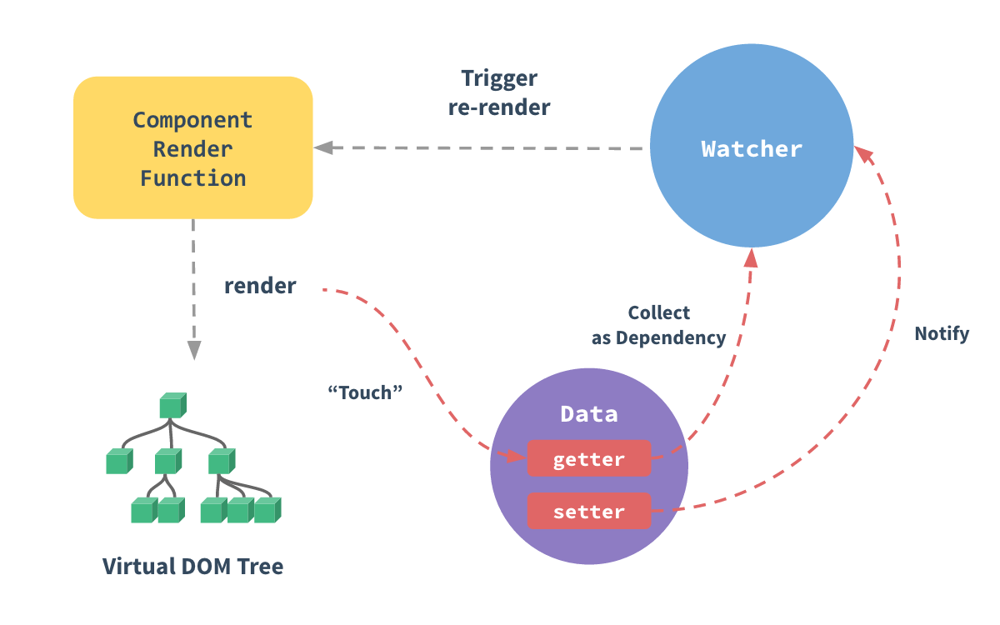
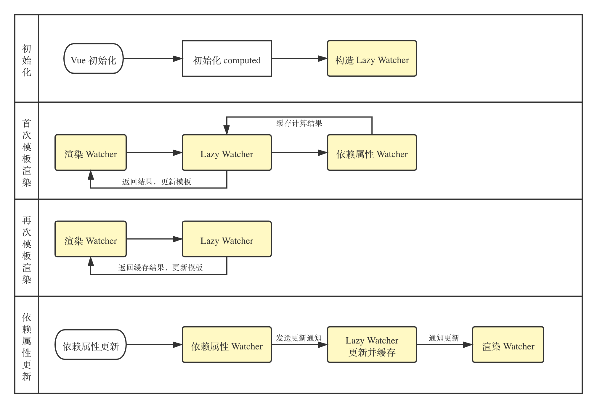
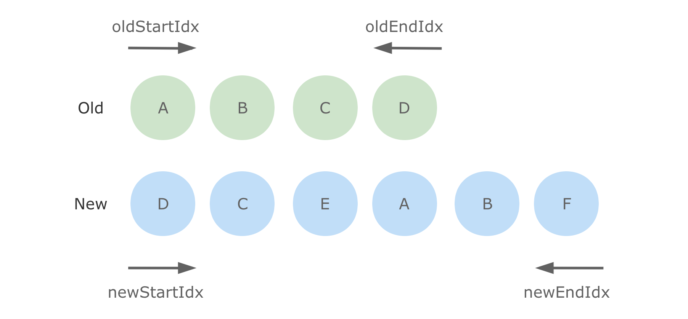

## 前言

> GitHub Pages 在线访问最新：[我的前端态度 —— 前端知识体系](https://yanyue404.github.io/fe-attitude/)。

## 什么是 mvvm

MVVM 最早由微软提出来，它借鉴了桌面应用程序的 MVC 思想，在前端页面中，把 Model 用纯 JavaScript 对象表示，View 负责显示，两者做到了最大限度的分离 把 Model 和 View 关联起来的就是 ViewModel。

ViewModel 负责把 Model 的数据同步到 View 显示出来，还负责把 View 的修改同步回 Model，View 和 Model 之间的同步工作完全是自动的，无需人为干涉（由 viewModel 完成，在这里指 VUE）。

因此开发者只需关注业务逻辑，不需要手动操作 DOM, 不需要关注数据状态的同步问题，复杂的数据状态维护完全由 MVVM 来统一管理。

## Vue 的响应式系统原理



Vue 为 MVVM 框架，当数据模型 data 变化时，页面视图会得到响应更新，其原理对 data 的 getter/setter 方法进行拦截（Object.defineProperty 或者 Proxy），利用发布订阅的设计模式，在 getter 方法中进行订阅，在 setter 方法中发布通知，让所有订阅者完成响应。

在响应式系统中，Vue 会为数据模型 `data` 的每一个属性新建一个订阅中心作为发布者，而监听器 `watch`、计算属性 `computed`、视图渲染 `template/render` 三个角色同时作为订阅者，对于监听器 watch，会直接订阅观察监听的属性，对于计算属性 computed 和视图渲染 template/render，如果内部执行获取了 data 的某个属性，就会执行该属性的 getter 方法，然后自动完成对该属性的订阅，当属性被修改时，就会执行该属性的 `setter` 方法，从而完成该属性的发布通知，通知所有订阅者进行更新。

```js
// 简易版响应式原理
let data = { price: 5, quantity: 2 }
let target = null

// Our simple Dep class
class Dep {
  constructor() {
    this.subscribers = []
  }
  depend() {
    if (target && !this.subscribers.includes(target)) {
      // Only if there is a target & it's not already subscribed
      this.subscribers.push(target)
    }
  }
  notify() {
    this.subscribers.forEach(sub => sub())
  }
}

// Go through each of our data properties
Object.keys(data).forEach(key => {
  let internalValue = data[key]

  // Each property gets a dependency instance
  const dep = new Dep()

  Object.defineProperty(data, key, {
    get() {
      dep.depend() // <-- Remember the target we're running
      return internalValue
    },
    set(newVal) {
      internalValue = newVal
      dep.notify() // <-- Re-run stored functions
    }
  })
})

// The code to watch to listen for reactive properties
function watcher(myFunc) {
  target = myFunc
  target()
  target = null
}

watcher(() => {
  data.total = data.price * data.quantity
})

console.log('total = ' + data.total)
data.price = 20
console.log('total = ' + data.total)
data.quantity = 10
console.log('total = ' + data.total)
```

数据响应的实现由两部分构成: **观察者( Observe )**   和  **依赖收集器( Dep )** ，其核心是  `defineProperty`这个方法，它可以  **重写属性的 get 与 set**  方法，从而完成监听数据的改变。

- Observe (观察者)观察 props 与 state
  - 遍历 props 与 state，对每个属性创建独立的监听器( watcher )
- 使用  `defineProperty`  重写每个属性的 get/set(`defineReactive`）
  - `get`: 收集依赖
    - `Dep.depend()`
      - `watcher.addDep()`
  - `set`: 派发更新
    - `Dep.notify()`
    - `watcher.update()`
    - `queenWatcher()`
    - `nextTick`
    - `flushScheduleQueue`
    - `watcher.run()`
    - `updateComponent()`

大家可以先看下面的数据相应的代码实现后，理解后就比较容易看懂上面的简单脉络了。

```js
let data = { a: 1 }
// 数据响应性
observe(data)

// 初始化观察者
new Watcher(data, 'name', updateComponent)
data.a = 2

// 简单表示用于数据更新后的操作
function updateComponent() {
  vm._update() // patchs
}

// 监视对象
function observe(obj) {
  // 遍历对象，使用 get/set 重新定义对象的每个属性值
  Object.keys(obj).map(key => {
    defineReactive(obj, key, obj[key])
  })
}

function defineReactive(obj, k, v) {
  // 递归子属性
  if (type(v) == 'object') observe(v)

  // 新建依赖收集器
  let dep = new Dep()
  // 定义get/set
  Object.defineProperty(obj, k, {
    enumerable: true,
    configurable: true,
    get: function reactiveGetter() {
      // 当有获取该属性时，证明依赖于该对象，因此被添加进收集器中
      if (Dep.target) {
        dep.addSub(Dep.target)
      }
      return v
    },
    // 重新设置值时，触发收集器的通知机制
    set: function reactiveSetter(nV) {
      v = nV
      dep.nofify()
    }
  })
}

// 依赖收集器
class Dep {
  constructor() {
    this.subs = []
  }
  addSub(sub) {
    this.subs.push(sub)
  }
  notify() {
    this.subs.map(sub => {
      sub.update()
    })
  }
}

Dep.target = null

// 观察者
class Watcher {
  constructor(obj, key, cb) {
    Dep.target = this
    this.cb = cb
    this.obj = obj
    this.key = key
    this.value = obj[key]
    Dep.target = null
  }
  addDep(Dep) {
    Dep.addSub(this)
  }
  update() {
    this.value = this.obj[this.key]
    this.cb(this.value)
  }
  before() {
    callHook('beforeUpdate')
  }
}
```

参考链接

- <https://cn.vuejs.org/v2/guide/reactivity.html>
- <https://www.vuemastery.com/courses/advanced-components/build-a-reactivity-system/>

## 对于生命周期的理解

创建一个 Vue 实例，是一个漫长的过程，要经历初始化，数据合并，模板解析，数据渲染等等一系列过程。 所以，为了能实现在这个过程里面插入自己想要提前做的事情，就有了生命周期钩子函数。

1.  create x 2 (before + ed)（SSR 可用）
1.  mount x 2 （before + ed）（SSR 阶段不可用）
1.  update x 2
1.  destroy x 2

还有三个写在[钩子列表](https://cn.vuejs.org/v2/api/#%E9%80%89%E9%A1%B9-%E7%94%9F%E5%91%BD%E5%91%A8%E6%9C%9F%E9%92%A9%E5%AD%90)里：

1.  activated（被 keep-alive 缓存的组件激活时调用）
1.  deactivated（被 keep-alive 缓存的组件失活时调用）
1.  errorCaptured

Vue 中的生命周期也是一样，对应了 Vue 实例从创建到结束之间的每一个过程。 例如，Vue 的`beforeCreate`周期，指的就是 Vue 在实例初始化之后，数据观测 (data observer) 和 event/watcher 事件配置之前被调用。

Vue.js 生命周期 主要有 8 个阶段：

- 创建前 / 后（beforeCreate / created）：在 beforeCreate 阶段，Vue 实例的挂载元素 el 和 data、methods、computed 以及 watch 上的数据和方法都不能被访问，还未初始化。在 created 阶段，Vue 实例的数据对象 data 有了，el 还没有。在当前阶段无法与 Dom 进行交互，如果非要想，可以通过 vm.\$nextTick 来访问 Dom。

  - 可以在 create 中发起请求，能更快获取到服务端数据，1.减少页面 loading 时间；2.ssr 不支持 beforeMount 、mounted 钩子函数，所以放在 created 中有助于一致性；

- 载入前 / 后（beforeMount / mounted）：在 beforeMount 为发生在挂载之前，在这之前 template 模板已导入渲染函数编译。而当前阶段虚拟 Dom 已经创建完成，即将开始渲染。在此时也可以对数据进行更改，不会触发 updated。在 mounted 阶段 ，在挂载完成后发生，在当前阶段，真实的 Dom 挂载完毕，数据完成双向绑定，可以访问到 Dom 节点，使用\$refs 属性对 Dom 进行操作。

- 更新前 / 后（beforeUpdate / updated）：beforeUpdate 发生在更新之前，也就是响应式数据发生更新，虚拟 dom 重新渲染之前被触发，你可以在当前阶段进行更改数据，不会造成重渲染。updated 发生在更新完成之后，当前阶段组件 Dom 已完成更新。要注意的是避免在此期间更改数据，因为这可能会导致无限循环的更新。

- 销毁前 / 后（beforeDestroy / destroyed）：beforeDestroy 是在 Vue 实例销毁前触发，一般在这里要通过 removeEventListener 解除手动绑定的事件。destroyed 发生在实例销毁之后，这个时候只剩下了 dom 空壳。组件已被拆解，数据绑定被卸除，监听被移出，子实例也统统被销毁。

至于 Vue 具体的生命周期函数有哪些，请看官网[API 文档](https://cn.vuejs.org/v2/api/#%E9%80%89%E9%A1%B9-%E7%94%9F%E5%91%BD%E5%91%A8%E6%9C%9F%E9%92%A9%E5%AD%90)

## 父子组件生命周期执行顺序

1.加载渲染过程

父 beforeCreate->父 created->父 beforeMount->子 beforeCreate->子 created->子 beforeMount->子 mounted->父 mounted

2.子组件更新过程

父 beforeUpdate->子 beforeUpdate->子 updated->父 updated

3.父组件更新过程

父 beforeUpdate->父 updated

4.销毁过程

父 beforeDestroy->子 beforeDestroy->子 destroyed->父 destroyed

> 总结：从外到内，再从内到外

注意  `mounted`  不会保证所有的子组件也都一起被挂载。如果你希望等到整个视图都渲染完毕，可以在  `mounted`  内部使用  `vm.$nextTick`：

```js
mounted: function () {
  this.$nextTick(function () {
    // Code that will run only after the
    // entire view has been rendered
  })
}
```

## 源码的生命周期

- `_init_`

  - `initLifecycle/Event`，往`vm`上挂载各种属性

  - `callHook: beforeCreated`: 实例刚创建

  - `initInjection/initState`: 初始化注入和 data 响应性

  - `created`: 创建完成，属性已经绑定， 但还未生成真实`dom`

  - 进行元素的挂载： `$el / vm.$mount()`

  - 是否有`template`: 解析成`render function`

    - `*.vue`文件: `vue-loader`会将`<template>`编译成`render function`

  - `beforeMount`: 模板编译/挂载之前

  - 执行`render function`，生成真实的`dom`，并替换到`dom tree`中

  - `mounted`: 组件已挂载

- `update`:

  - 执行`diff`算法，比对改变是否需要触发 UI 更新

  - `flushScheduleQueue`

    - `watcher.before`: 触发`beforeUpdate`钩子 - `watcher.run()`: 执行`watcher`中的  `notify`，通知所有依赖项更新 UI

  - 触发`updated`钩子: 组件已更新

- `actived / deactivated(keep-alive)`: 不销毁，缓存，组件激活与失活

- `destroy`:

  - `beforeDestroy`: 销毁开始

  - 销毁自身且递归销毁子组件以及事件监听

    - `remove()`: 删除节点
    - `watcher.teardown()`: 清空依赖
    - `vm.$off()`: 解绑监听

  - `destroyed`: 完成后触发钩子

上面是`vue`的声明周期的简单梳理，接下来我们直接以代码的形式来完成`vue`的初始化

```js
new Vue({})

// 初始化Vue实例
function _init() {
	 // 挂载属性
    initLifeCycle(vm)
    // 初始化事件系统，钩子函数等
    initEvent(vm)
    // 编译slot、vnode
    initRender(vm)
    // 触发钩子
    callHook(vm, 'beforeCreate')
    // 添加inject功能
    initInjection(vm)
    // 完成数据响应性 props/data/watch/computed/methods
    initState(vm)
    // 添加 provide 功能
    initProvide(vm)
    // 触发钩子
    callHook(vm, 'created')

	 // 挂载节点
    if (vm.$options.el) {
        vm.$mount(vm.$options.el)
    }
}

// 挂载节点实现
function mountComponent(vm) {
	 // 获取 render function
    if (!this.options.render) {
        // template to render
        // Vue.compile = compileToFunctions
        let { render } = compileToFunctions()
        this.options.render = render
    }
    // 触发钩子
    callHook('beforeMount')
    // 初始化观察者
    // render 渲染 vdom，
    vdom = vm.render()
    // update: 根据 diff 出的 patchs 挂载成真实的 dom
    vm._update(vdom)
    // 触发钩子
    callHook(vm, 'mounted')
}

// 更新节点实现
funtion queueWatcher(watcher) {
	nextTick(flushScheduleQueue)
}

// 清空队列
function flushScheduleQueue() {
	 // 遍历队列中所有修改
    for(){
	    // beforeUpdate
        watcher.before()

        // 依赖局部更新节点
        watcher.update()
        callHook('updated')
    }
}

// 销毁实例实现
Vue.prototype.$destory = function() {
	 // 触发钩子
    callHook(vm, 'beforeDestory')
    // 自身及子节点
    remove()
    // 删除依赖
    watcher.teardown()
    // 删除监听
    vm.$off()
    // 触发钩子
    callHook(vm, 'destoryed')
}
```

## 为什么组件的 data 必须是一个函数

每一个 vue 组件都是一个 vue 实例，通过 new Vue()实例化，引用同一个对象，如果 data 直接是一个对象的话，那么一旦修改其中一个组件的数据，其他组件相同数据就会被改变。

而 data 是函数的话，每个 vue 组件的 data 都因为函数有了自己的作用域，每个实例可以维护一份被返回对象的独立的拷贝，互不干扰。

理解两点：

- 每个组件都是 Vue 的实例。
- 组件共享 data 属性，当 data 的值是同一个引用类型的值时，改变其中一个会影响其他。

## 常见的事件修饰符及其作用

- `.stop`：等同于 JavaScript 中的  `event.stopPropagation()` ，防止事件冒泡；
- `.prevent` ：等同于 JavaScript 中的  `event.preventDefault()` ，防止执行预设的行为（如果事件可取消，则取消该事件，而不停止事件的进一步传播）；
- `.capture` ：与事件冒泡的方向相反，事件捕获由外到内；
- `.self` ：只会触发自己范围内的事件，不包含子元素；
- `.once` ：只会触发一次。

## Vue.extend 能做什么

这个 API 在独立开发组件时很有用，作用是扩展组件生成一个构造器，通常会与 \$mount 一起使用。

创建一个 Vue 实例时，都会有一个选项 el，来指定实例的根节点，如果不写 el 选项，那组件就处于未挂载状态。Vue.extend 的作用，就是基于 Vue 构造器，创建一个“子类”，它的参数跟 new Vue 的基本一样，但 data 要跟组件一样，是个函数，再配合 \$mount ，就可以让组件渲染，并且挂载到任意指定的节点上，比如 body。

```html
<body>
  <div id="app-extend"></div>
</body>
<script>
  // 创建构造器
  var Profile = Vue.extend({
    template: '<div><p>{{extendData}}</p><p>实例传入的数据为:{{propsExtend}}</p></div>',
    props: ['propsExtend'],
    // data 选项是特例，需要注意 - 在 Vue.extend() 中它必须是函数
    data: function() {
      return {
        extendData: '这是extend扩展的数据'
      }
    }
  })
  // 创建 Profile 实例，并挂载到一个元素上。
  // propsData: 创建实例时传递 props(只用于 new 创建的实例中。)。主要作用是方便测试。
  new Profile({ propsData: { propsExtend: '我是实例传入的数据' } }).$mount('#app-extend')
</script>
```

实现同样的效果，除了用 extend 外，也可以直接创建 Vue 实例，并且用一个 Render 函数来渲染一个 .vue 文件：

```js
import Vue from 'vue'
import Notification from './notification.vue'

const props = {} // 这里可以传入一些组件的 props 选项

const Instance = new Vue({
  render(h) {
    return h(Notification, {
      props: props
    })
  }
})

// 标准的 Vue 组件实例，因此它的 $el 属性也可以被访问：
const component = Instance.$mount()
document.body.appendChild(component.$el)
```

这样既可以使用 .vue 来写复杂的组件（毕竟在 template 里堆字符串很痛苦），还可以根据需要传入适当的 props。渲染后，如果想操作 Render 的 Notification 实例，也是很简单的：

```js
const notification = Instance.$children[0]
```

需要注意的是，我们是用 \$mount 手动渲染的组件，如果要销毁，也要用 `$destroy` 来手动销毁实例，必要时，也可以用 removeChild 把节点从 DOM 中移除。

据此我们可以封装一个渲染方法和卸载方法：

```js
import Vue from 'vue'
export function mount(component, opt, el) {
  if (!component) {
    console.warn('亲，请传入正确的组件')
  }
  if (!el) {
    el = document.createElement('div')
    document.body.appendChild(el)
  }
  let vm = new Vue({
    el,
    render(h) {
      return h(component, opt)
    }
  })
  return vm
}

export function destroy(vm) {
  vm.$el.remove()
  vm.$destroy()
}
```

## mixin 和 mixins 区别

`mixin` 用于全局混入，会影响到每个组件实例，通常插件都是这样做初始化的。

```js
Vue.mixin({
  beforeCreate() {
    // ...逻辑
    // 这种方式会影响到每个组件的 beforeCreate 钩子函数
  }
})
```

虽然文档不建议在应用中直接使用 `mixin`，但是如果不滥用的话也是很有帮助的，比如可以全局混入封装好的 `ajax` 或者一些工具函数等等。

`mixins` 应该是最常使用的扩展组件的方式了。如果多个组件中有相同的业务逻辑，就可以将这些逻辑剥离出来，通过 `mixins` 混入代码，比如上拉下拉加载数据这种逻辑等等。 另外需要注意的是 `mixins` 混入的钩子函数会先于组件内的钩子函数执行，并且在遇到同名选项的时候也会有选择性的进行合并。

## computed 和 watch 的区别

computed 是计算属性，依赖其他属性计算值，会创建新的响应式数据,并且 computed 的值有缓存，只有当计算值变化才会返回内容。

watch 监听到值的变化就会执行回调，在回调中可以进行一些逻辑操作。

`watch`  与计算属性的区别有两个：一是计算属性依赖其他属性和有缓存，它没有；二是  `watch`  可以进行异步操作。

为什么计算属性不能进行异步操作？因为计算属性必须将计算后的值  `return`  回去，如果在计算属性中使用异步操作，那会返回一个  `undefined`：

所以一般来说需要依赖别的属性来动态获得值的时候可以使用 computed，对于监听到值的变化需要做一些复杂业务逻辑的情况可以使用 watch。

## Vue 中的 computed 是如何实现的

主要分为四个阶段



1. 初始化：为 computed 属性创建 lazy watcher（此处 watcher 指双向绑定中的监听器，下同）。

2. 首次模板渲染：渲染 watcher 检测到 computed 属性时，会调用 computed 属性的 getter 方法，而 computed 属性的 getter 方法会调用依赖属性的 getter，从而形成链式调用，同时保存引用关系用于更新。取得计算结果后 lazy watcher 会将结果缓存，并返回给渲染 watcher 进行模板渲染。

3. 多次模板渲染：直接取 lazy watcher 中的缓存值给到渲染 watcher 进行渲染。

4. 依赖属性更新：根据首次模板渲染阶段构建的依赖关系向上通知 lazy watcher 进行重新计算，缓存计算结果并通知渲染 watcher 重新渲染更新页面。

computed 本身是通过代理的方式代理到组件实例上的，所以读取计算属性的时候，执行的是一个内部的 getter，而不是用户定义的方法。

computed 内部实现了一个惰性的 watcher，在实例化的时候不会去求值，其内部通过 dirty 属性标记计算属性是否需要重新求值。当 computed 依赖的任一状态（不一定是 return 中的）发生变化，都会通知这个惰性 watcher，让它把 dirty 属性设置为 true。所以，当再次读取这个计算属性的时候，就会重新去求值。

参考链接

- https://ustbhuangyi.github.io/vue-analysis/v2/reactive/computed-watcher.html#computed
- http://febook.hzfe.org/awesome-interview/book1/frame-vue-computed-watch

## watch 原理

watch 本质上是为每个监听属性 setter 创建了一个 watcher，当被监听的属性更新时，调用传入的回调函数。常见的配置选项有 deep 和 immediate，对应原理如下：

1. deep：深度监听对象，为对象的每一个属性创建一个 watcher，从而确保对象的每一个属性更新时都会触发传入的回调函数。主要原因在于对象属于引用类型，单个属性的更新并不会触发对象 setter，因此引入 deep 能够很好地解决监听对象的问题。同时也会引入判断机制，确保在多个属性更新时回调函数仅触发一次，避免性能浪费。

2. immediate：在初始化时直接调用回调函数，可以通过在 created 阶段手动调用回调函数实现相同的效果。

## v-show 与 v-if 区别

v-show 只是在 display: none 和 display: block 之间切换。无论初始条件是什么都会被渲染出来，后面只需要切换 CSS，DOM 还是一直保留着的。所以总的来说 v-show 在初始渲染时有更高的开销，但是切换开销很小，更适合于频繁切换的场景。

v-if 的话就得说到 Vue 底层的编译了（就是三元表达式呀，`isShow ? vNode : null`）。当属性初始为 false 时，组件就不会被渲染，直到条件为 true，并且切换条件时会触发销毁/挂载组件，所以总的来说在切换时开销更高，更适合不经常切换的场景。

并且基于 v-if 的这种惰性渲染机制，可以在必要的时候才去渲染组件，减少整个页面的初始渲染开销。

参考链接：

<https://cn.vuejs.org/v2/guide/conditional.html#v-if-vs-v-show>

## Vue2 数组的响应性支持情况如何

数组的以下方法，都是可以触发视图更新的，也就是响应性的：

push()、pop()、shift()、unshift()、splice()、sort()、reverse()。

\$set，有两种情况会用到它：

- 由于 JavaScript 的限制，Vue 不能检测以下变动的数组：

当利用索引直接设置一个项时，例如：this.items[index] = value; 当修改数组的长度时，例如：vm.items.length = newLength。

- 由于 JavaScript 的限制，Vue 不能检测对象属性的添加或删除。

还有一种小技巧，就是先 copy 一个数组，然后通过 index 修改后，再把原数组整个替换，比如：

```js
handler () {
  const data = [...this.items];
  data[1] = 'x';
  this.items = data;
}
```

假设定义了一个数组 a=[1,2,3]，相应的，页面上显示的值为 1,2,3，现设 a[0]=5，页面上的值会变成 5,2,3 吗？为什么？

不会

因为 Vue 是使用  `Object.defineProperty`  来监听数值变化的，而直接修改数组的值的这种操作无法监听。

例如：`vm.items[indexOfItem] = newValue`  这种操作是无法监听的。

如果需要直接修改数组元素的值，可以使用  `Vue.set`

```js
Vue.set(vm.items, indexOfItem, newValue)
```

[数组更新检测](https://cn.vuejs.org/v2/guide/list.html#%E6%95%B0%E7%BB%84%E6%9B%B4%E6%96%B0%E6%A3%80%E6%B5%8B)

## 组件间通信

**父子通信**

- 父向子传递数据是通过 props，子向父是通过 events（\$emit）；
- `v-model`
- Vue 2.3 及以上版本的话还可以使用  `$listeners`  和  `.sync`  这两个属性
- 通过父链 / 子链也可以通信（$parent / $children）；
- \$refs 也可以访问组件实例；
- provide / inject API。

·.sync· 属性是个语法糖，可以很简单的实现子组件与父组件通信

```html
<!--父组件中-->
<input :value.sync="value" />
<!--以上写法等同于-->
<input :value="value" @update:value="v => value = v"></comp>
<!--子组件中-->
<script>
  this.$emit('update:value', 1)
</script>
```

**兄弟通信**

对于这种情况可以通过查找父组件中的子组件实现，也就是 this.$parent.$children，在 \$children 中可以通过组件 name 查询到需要的组件实例，然后进行通信。

**跨级通信**

对于这种情况可以使用 Vue 2.2 新增的 API `provide / inject`。

**任意组件**

这种方式可以通过 Vuex 或者 Event Bus 解决。

## 双向绑定原理

一般使用 v-model / .sync 实现，`v-model`  是 v-bind:value 和 v-on:input 的语法糖

- a. `v-bind:value="message"`  实现了 data ⇒ UI 的单向绑定
- b. `v-on:input="message = $event.target.value"`  实现了 UI ⇒ data 的单向绑定
- c. 加起来就是双向绑定了

这两个单向绑定是如何实现的呢？

- a. 前者通过 Object.defineProperty API 给 data 创建 getter 和 setter，用于监听 data 的改变，data 一变就会安排改变 UI
- b. 后者通过 template compiler 给 DOM 添加事件监听，DOM input 的值变了就会去修改 data。

参考

- <https://www.cnblogs.com/canfoo/p/6891868.html>

## 自定义组件的语法糖 v-model 是怎样实现的

v-model 是一个语法糖，可以拆解为 props: value 和 events: input。就是说组件必须提供一个名为 value 的 prop，以及名为 input 的自定义事件

这个组件中，只有一个 props，但是名字叫 value，内部还有一个 currentValue，当改变 currentValue 时，会触发一个自定义事件 @input，并把 currentValue 的值返回。这就是一个 v-model 的语法糖，它要求 props 有一个叫 value 的项，同时触发的自定义事件必须叫 input。这样就可以在自定义组件上用 v-model 了：

props 一般不能在组件内修改，它是通过父级修改的，因此实现 v-model 一般都会有一个 currentValue 的内部 data，初始时从 value 获取一次值，当 value 修改时，也通过 watch 监听到及时更新；组件不会修改 value 的值，而是修改 currentValue，同时将修改的值通过自定义事件 input 派发给父组件，父组件接收到后，由父组件修改 value。

```html
<custom-component v-model="value"></custom-component>

<input :value="message" @input="message = $event.targer.value" />`
```

```html
<template>
  <div>
    {{ currentValue }}
    <button @click="handleClick">Click</button>
  </div>
</template>
<script>
  export default {
    props: {
      value: {
        type: Number,
        default: 0
      }
    },
    data() {
      return {
        currentValue: this.value
      }
    },
    methods: {
      handleClick() {
        this.currentValue += 1
        this.$emit('input', this.currentValue)
      }
    },
    watch: {
      value(val) {
        this.currentValue = val
      }
    }
  }
</script>
```

## keep-alive 有什么作用

`keep-alive`  可以使被包含的组件保留状态，或避免重新渲染。在  `Vue`  中，每次切换组件时，都会重新渲染。如果有多个组件切换，又想让它们保持原来的状态，避免重新渲染，这个时候就可以使用  `keep-alive`。

对于 keep-alive 组件来说，它拥有两个独有的生命周期钩子函数，分别为 activated 和 deactivated 。用 keep-alive 包裹的组件在切换时不会进行销毁，而是缓存到内存中并执行 activated 缓存激活钩子函数，缓存失活后会执行 deactivated 钩子函数。

```html
<!-- 失活的组件将会被缓存！-->
<keep-alive>
  <component v-bind:is="currentTabComponent"></component>
</keep-alive>
```

keep-alive 有以下三个属性：

- include 字符串或正则表达式，只有名称匹配的组件会被匹配；
- exclude 字符串或正则表达式，任何名称匹配的组件都不会被缓存；
- max 数字，最多可以缓存多少组件实例。

注意：keep-alive 包裹动态组件时，会缓存不活动的组件实例。

主要流程

1.  判断组件 name ，不在 include 或者在 exclude 中，直接返回 vnode，说明该组件不被缓存。
1.  获取组件实例 key ，如果有获取实例的 key，否则重新生成。
1.  key 生成规则，cid +"∶∶"+ tag ，仅靠 cid 是不够的，因为相同的构造函数可以注册为不同的本地组件。
1.  如果缓存对象内存在，则直接从缓存对象中获取组件实例给 vnode ，不存在则添加到缓存对象中。
1.  最大缓存数量，当缓存组件数量超过 max 值时，清除 keys 数组内第一个组件。

- [https://cn.vuejs.org/v2/guide/components-dynamic-async.html#在动态组件上使用-keep-alive](https://cn.vuejs.org/v2/guide/components-dynamic-async.html#%E5%9C%A8%E5%8A%A8%E6%80%81%E7%BB%84%E4%BB%B6%E4%B8%8A%E4%BD%BF%E7%94%A8-keep-alive)

## 如何强制刷新 Vue 组件

- 使用 key
- 使用 this.\$forceUpdate
- 使用 v-if
- 刷新当前页面

## Vue 为何是异步渲染

Vue 在更新 DOM 时是异步执行的。只要侦听到数据变化，Vue 将开启一个队列，并缓冲在同一事件循环中发生的所有数据变更。如果同一个 watcher 被多次触发，只会被推入到队列中一次。这种在缓冲时去除重复数据对于避免不必要的计算和 DOM 操作是非常重要的。然后，在下一个的事件循环“tick”中，Vue 刷新队列并执行实际 (已去重的) 工作。Vue 在内部对异步队列尝试使用原生的 Promise.then、MutationObserver 和 setImmediate，如果执行环境不支持，则会采用 setTimeout(fn, 0) 代替。

例如，当你设置 vm.someData = 'new value'，该组件不会立即重新渲染。当刷新队列时，组件会在下一个事件循环“tick”中更新。多数情况我们不需要关心这个过程，但是如果你想基于更新后的 DOM 状态来做点什么，这就可能会有些棘手。虽然 Vue.js 通常鼓励开发人员使用“数据驱动”的方式思考，避免直接接触 DOM，但是有时我们必须要这么做。为了在数据变化之后等待 Vue 完成更新 DOM，可以在数据变化之后立即使用 Vue.nextTick(callback)。这样回调函数将在 DOM 更新完成后被调用。例如：

```html
<div id="example">{{message}}</div>
```

```js
var vm = new Vue({
  el: '#example',
  data: {
    message: '123'
  }
})
vm.message = 'new message' // 更改数据
vm.$el.textContent === 'new message' // false
Vue.nextTick(function() {
  vm.$el.textContent === 'new message' // true
})
```

参考链接

- [为什么 Vue 使用异步更新队列？](https://juejin.cn/post/6844903591052836878)
- [https://cn.vuejs.org/v2/guide/reactivity.html#异步更新队列](https://cn.vuejs.org/v2/guide/reactivity.html#%E5%BC%82%E6%AD%A5%E6%9B%B4%E6%96%B0%E9%98%9F%E5%88%97)

## nextTick

nextTick 是 Vue.js 提供的一个函数，并非浏览器内置。nextTick 函数接收一个回调函数 cb，在下一个 DOM 更新循环之后执行。比如下面的示例：

```js
export default {
  data() {
    return {
      show: false
    }
  },
  methods: {
    handleShow() {
      this.show = true
      console.log(this.$refs.node) // undefined
      this.$nextTick(() => {
        console.log(this.$refs.node) // <p>内容</p>
      })
    }
  }
}
```

在下次 dom 更新循环结束之后执行延迟回调，可用于获取更新后的 dom 状态

- 新版本中默认是 microtasks, v-on 中会使用 macrotasks

- macrotasks 任务的实现:

  - setImmediate / MessageChannel / setTimeout

另一个例子，当我们按下 click 按钮的时候，number 会被循环增加 1000 次。

```html
<template>
  <div>
    <div>{{ number }}</div>
    <div @click="handleClick">click</div>
  </div>
</template>
<script>
  export default {
    data() {
      return {
        number: 0
      }
    },
    methods: {
      handleClick() {
        for (let i = 0; i < 1000; i++) {
          this.number++
        }
      }
    }
  }
</script>
```

在这个例子中， `number`  会被不停地进行  `++`  操作，不断地触发它对应的  `Dep`  中的  `Watcher`  对象的  `update`  方法。然后最终  `queue`  中因为对相同  `id`  的  `Watcher`  对象进行了筛选，从而  `queue`  中实际上只会存在一个  `number`  对应的  `Watcher`  对象。在下一个 tick 的时候（此时  `number`  已经变成了 1000），触发  `Watcher`  对象的  `run`  方法来更新视图，将视图上的  `number`  从 0 直接变成 1000。

```js
let uid = 0

class Watcher {
  constructor() {
    this.id = ++uid
  }

  update() {
    console.log('watch' + this.id + ' update')
    queueWatcher(this)
  }

  run() {
    console.log('watch' + this.id + '视图更新啦～')
  }
}
```

```js
let has = {}
let queue = []
let waiting = false
let callbacks = []
let pending = false

function queueWatcher(watcher) {
  const id = watcher.id
  if (has[id] == null) {
    has[id] = true
    queue.push(watcher)

    if (!waiting) {
      waiting = true
      // 执行完成再恢复 waiting flag
      nextTick(flushSchedulerQueue)
    }
  }
}

function flushSchedulerQueue() {
  let watcher, id
  for (index = 0; index < queue.length; index++) {
    watcher = queue[index]
    id = watcher.id
    has[id] = null
    watcher.run()
  }
  waiting = false
}

function nextTick(cb) {
  callbacks.push(cb)

  if (!pending) {
    pending = true
    setTimeout(flushCallbacks, 0)
  }
}

function flushCallbacks() {
  pending = false
  const copies = callbacks.slice(0)
  callbacks.length = 0
  for (let i = 0; i < copies.length; i++) {
    copies[i]()
  }
}
```

## Vue 事件绑定原理说一下

每一个 Vue 实例都是一个 Event Bus，当子组件被创建的时候，父组件将事件传递给子组件，子组件初始化的时候是有$on方法将事件注册到内部，在需要的时候使用$emit 触发函数，而对于原生 native 事件，使用 addEventListener 绑定到真实的 DOM 元素上。

## slot 是什么？有什么作用？原理是什么？

slot 又名插槽，是 Vue 的内容分发机制，组件内部的模板引擎使用 slot 元素作为承载分发内容的出口。插槽 slot 是子组件的一个模板标签元素，而这一个标签元素是否显示，以及怎么显示是由父组件决定的。

slot 又分三类，默认插槽，具名插槽和作用域插槽。

- 默认插槽：又名匿名插槽，当 slot 没有指定 name 属性值的时候一个默认显示插槽，一个组件内只有有一个匿名插槽。
- 具名插槽：带有具体名字的插槽，也就是带有 name 属性的 slot，一个组件可以出现多个具名插槽。
- 作用域插槽：默认插槽、具名插槽的一个变体，可以是匿名插槽，也可以是具名插槽，该插槽的不同点是在子组件渲染作用域插槽时，可以将子组件内部的数据传递给父组件，让父组件根据子组件的传递过来的数据决定如何渲染该插槽。

实现原理：当子组件 vm 实例化时，获取到父组件传入的 slot 标签的内容，存放在 vm.$slot中，默认插槽为vm.$slot.default，具名插槽为 vm.$slot.xxx，xxx 为插槽名，当组件执行渲染函数时候，遇到slot标签，使用$slot 中的内容进行替换，此时可以为插槽传递数据，若存在数据，则可称该插槽为作用域插槽。

## Vue 模板渲染的原理是什么？

vue 中的模板 template 无法被浏览器解析并渲染，因为这不属于浏览器的标准，不是正确的 HTML 语法，所有需要将 template 转化成一个 JavaScript 函数，这样浏览器就可以执行这一个函数并渲染出对应的 HTML 元素，就可以让视图跑起来了，这一个转化的过程，就成为模板编译。

模板编译又分三个阶段，解析 parse，优化 optimize，生成 generate，最终生成可执行函数 render。

- parse 阶段：使用大量的正则表达式对 template 字符串进行解析，将标签、指令、属性等转化为抽象语法树 AST。
- optimize 阶段：遍历 AST，找到其中的一些静态节点并进行标记，方便在页面重渲染的时候进行 diff 比较时，直接跳过这一些静态节点，优化 runtime 的性能。
- generate 阶段：将最终的 AST 转化为 render 函数字符串。

## template 预编译是什么？

对于 Vue 组件来说，模板编译只会在组件实例化的时候编译一次，生成渲染函数之后在也不会进行编译。因此，编译对组件的 runtime 是一种性能损耗。

而模板编译的目的仅仅是将 template 转化为 render function，这个过程，正好可以在项目构建的过程中完成，这样可以让实际组件在 runtime 时直接跳过模板渲染，进而提升性能，这个在项目构建的编译 template 的过程，就是预编译。

## 那 template 和 jsx 的有什么分别？

对于 runtime 来说，只需要保证组件存在 render 函数即可，而我们有了预编译之后，我们只需要保证构建过程中生成 render 函数就可以。

在 webpack 中，我们使用 vue-loader 编译.vue 文件，内部依赖的 vue-template-compiler 模块，在 webpack 构建过程中，将 template 预编译成 render 函数。

与 react 类似，在添加了 jsx 的语法糖解析器 babel-plugin-transform-vue-jsx 之后，就可以直接手写 render 函数。

所以，template 和 jsx 的都是 render 的一种表现形式，不同的是：

JSX 相对于 template 而言，具有更高的灵活性，在复杂的组件中，更具有优势，而 template 虽然显得有些呆滞。但是 template 在代码结构上更符合视图与逻辑分离的习惯，更简单、更直观、更好维护。

## Virtual DOM

Virtual DOM 是 DOM 节点在 JavaScript 中的一种抽象数据结构，之所以需要虚拟 DOM，是因为浏览器中操作 DOM 的代价比较昂贵，频繁操作 DOM 会产生性能问题。虚拟 DOM 的作用是在每一次响应式数据发生变化引起页面重渲染时，Vue 对比更新前后的虚拟 DOM，匹配找出尽可能少的需要更新的真实 DOM，从而达到提升性能的目的。

```js
const ul = {
  tag: 'ul',
  props: {
    class: 'list'
  },
  children: {
    tag: 'li',
    children: '1'
  }
}
```

上述代码对应的 DOM 就是

```js
<ul class="list">
  <li>1</li>
</ul>
```

那么既然 DOM 可以通过 JS 对象来模拟，反之也可以通过 JS 对象来渲染出对应的 DOM。当然了，通过 JS 来模拟 DOM 并且渲染对应的 DOM 只是第一步，难点在于如何判断新旧两个 JS 对象的**最小差异**并且实现**局部更新** DOM。

首先 DOM 是一个多叉树的结构，如果需要完整的对比两颗树的差异，那么需要的时间复杂度会是 O(n ^ 3)，这个复杂度肯定是不能接受的。于是 React 团队优化了算法，实现了 O(n) 的复杂度来对比差异。 实现 O(n) 复杂度的关键就是只对比同层的节点，而不是跨层对比，这也是考虑到在实际业务中很少会去跨层的移动 DOM 元素。 所以判断差异的算法就分为了两步

- 首先从上至下，从左往右遍历对象，也就是树的深度遍历，这一步中会给每个节点添加索引，便于最后渲染差异
- 一旦节点有子元素，就去判断子元素是否有不同

在第一步算法中我们需要判断新旧节点的  `tagName`  是否相同，如果不相同的话就代表节点被替换了。如果没有更改  `tagName`  的话，就需要判断是否有子元素，有的话就进行第二步算法。

在第二步算法中，我们需要判断原本的列表中是否有节点被移除，在新的列表中需要判断是否有新的节点加入，还需要判断节点是否有移动。

举个例子来说，假设页面中只有一个列表，我们对列表中的元素进行了变更

```
// 假设这里模拟一个 ul，其中包含了 5 个 li
[1, 2, 3, 4, 5]
// 这里替换上面的 li
[1, 2, 5, 4]
```

从上述例子中，我们一眼就可以看出先前的  `ul`  中的第三个  `li`  被移除了，四五替换了位置。

那么在实际的算法中，我们如何去识别改动的是哪个节点呢？这就引入了  `key`  这个属性，想必大家在 Vue 或者 React 的列表中都用过这个属性。这个属性是用来给每一个节点打标志的，用于判断是否是同一个节点。

当然在判断以上差异的过程中，我们还需要判断节点的属性是否有变化等等。

当我们判断出以上的差异后，就可以把这些差异记录下来。当对比完两棵树以后，就可以通过差异去局部更新 DOM，实现性能的最优化。

当然了 Virtual DOM 提高性能是其中一个优势，其实**最大的优势**还是在于：

1.  将 Virtual DOM 作为一个兼容层，让我们还能对接非 Web 端的系统，实现跨端开发。
1.  同样的，通过 Virtual DOM 我们可以渲染到其他的平台，比如实现 SSR、同构渲染等等。
1.  实现组件的高度抽象化

[如何理解虚拟 DOM?](https://www.zhihu.com/question/29504639)

## 介绍一下 Vue 中的 Diff 算法

在新老虚拟 DOM 对比时

- 首先，对比节点本身，判断是否为同一节点，如果不为相同节点，则删除该节点重新创建节点进行替换
- 如果为相同节点，进行 patchVnode，判断如何对该节点的子节点进行处理，先判断一方有子节点一方没有子节点的情况(如果新的 children 没有子节点，将旧的子节点移除)
- 比较如果都有子节点，则进行 updateChildren，判断如何对这些新老节点的子节点进行操作（diff 核心）。
- 匹配时，找到相同的子节点，递归比较子节点
- 同一层级的一组节点，可以通过唯一标识符进行区分

在 diff 中，只对同层的子节点进行比较，放弃跨级的节点比较，使得时间复杂从 O(n^3)降低值 O(n)，也就是说，只有当新旧 children 都为多个子节点时才需要用核心的 Diff 算法进行同层级比较。

Vue 的 Diff 算法和 React 的类似，只在同一层次进行比较，不进行跨层比较。如果两个元素被判定为不相同，则不继续递归比较。在 Diff 子元素的过程中，采用双端比较的方法，设立 4 个指针：

- oldStartIdx 指向旧子元素列表中，从左边开始 Diff 的元素索引。初始值：第一个元素的索引。
- newStartIdx 指向新子元素列表中，从左边开始 Diff 的元素索引。初始值：第一个元素的索引。
- oldEndIdx 指向旧子元素列表中，从右边开始 Diff 的元素索引。初始值：最后一个元素的索引。
- newEndIdx 指向新子元素列表中，从右边开始 Diff 的元素索引。初始值：最后一个元素的索引。



Vue 同时遍历新老子元素虚拟 DOM 列表，并采用头尾比较。一般有 4 种情况：

1. **当新老 start 指针指向的是相同节点**

复用节点并按需更新。

新老 start 指针向右移动一位。

2. **当新老 end 指针指向的是相同节点**

复用节点并按需更新。

新老 end 指针向左移动一位。

3. **当老 start 指针和新 end 指针指向的是相同节点**

复用节点并按需更新，将节点对应的真实 DOM 移动到子元素列表队尾。

老 start 指针向右移动一位。

新 end 指针向左移动一位。

4. **当老 end 指针和新 start 指针指向的是相同节点**

复用节点并按需更新，将节点对应的真实 DOM 移动到子元素列表队头。

老 end 指针向左移动一位。

新 start 指针向右移动一位。

在不满足以上情况的前提下，会尝试检查新 start 指针指向的节点是否有唯一标识符 key，如果有且能在旧列表中找到拥有相同 key 的相同类型节点，则可复用并按需更新，且移动节点到新的位置。新 start 指针向右移动一位。如果依旧不满足条件，则新增相关节点。

当新老列表的中任意一个列表的头指针索引大于尾指针索引时，循环遍历结束，按需删除或新增相关节点即可。

## Vue 中 key 的作用

vue 中 key 值的作用可以分为两种情况来考虑：

- 第一种情况是 v-if 中使用 key。由于 Vue 会尽可能高效地渲染元素，通常会复用已有元素而不是从头开始渲染。因此当使用 v-if 来实现元素切换的时候，如果切换前后含有相同类型的元素，那么这个元素就会被复用。如果是相同的 input 元素，那么切换前后用户的输入不会被清除掉，这样是不符合需求的。因此可以通过使用 key 来唯一的标识一个元素，这个情况下，使用 key 的元素不会被复用。这个时候 key 的作用是用来标识一个独立的元素。
- 第二种情况是 v-for 中使用 key。用 v-for 更新已渲染过的元素列表时，它默认使用“就地复用”的策略。如果数据项的顺序发生了改变，Vue 不会移动 DOM 元素来匹配数据项的顺序，而是简单复用此处的每个元素。因此通过为每个列表项提供一个 key 值，来以便 Vue 跟踪元素的身份，从而高效的实现复用。这个时候 key 的作用是为了高效的更新渲染虚拟 DOM。

key 是为 Vue 中 vnode 的唯一标记，通过这个 key，diff 操作可以更准确、更快速

1. 更准确

因为带 key 就不是就地复用了，在 sameNode 函数 a.key === b.key 对比中可以避免就地复用的情况。所以会更加准确。

2. 更快速

利用 key 的唯一性生成 map 对象来获取对应节点，比遍历方式更快

vue 部分源码如下：

```js
// vue项目  src/core/vdom/patch.js  -488行
// 以下是为了阅读性进行格式化后的代码

// oldCh 是一个旧虚拟节点数组
if (isUndef(oldKeyToIdx)) {
  oldKeyToIdx = createKeyToOldIdx(oldCh, oldStartIdx, oldEndIdx)
}
if (isDef(newStartVnode.key)) {
  // map 方式获取
  idxInOld = oldKeyToIdx[newStartVnode.key]
} else {
  // 遍历方式获取
  idxInOld = findIdxInOld(newStartVnode, oldCh, oldStartIdx, oldEndIdx)
}
```

创建 map 函数

```js
function createKeyToOldIdx(children, beginIdx, endIdx) {
  let i, key
  const map = {}
  for (i = beginIdx; i <= endIdx; ++i) {
    key = children[i].key
    if (isDef(key)) map[key] = i
  }
  return map
}
```

遍历寻找

```js
// sameVnode 是对比新旧节点是否相同的函数
function findIdxInOld(node, oldCh, start, end) {
  for (let i = start; i < end; i++) {
    const c = oldCh[i]

    if (isDef(c) && sameVnode(node, c)) return i
  }
}
```

## vue 怎么实现页面的权限控制

利用  `vue-router`  的  `beforeEach`  事件，可以在跳转页面前判断用户的权限（利用 cookie 或 token），是否能够进入此页面，如果不能则提示错误或重定向到其他页面，在后台管理系统中这种场景经常能遇到。

## vue-router 基础

Vue Router 是 Vue.js 的官方路由。

- mode
  - hash
  - history
- 跳转
  - this.\$router.push()
- 占位
- 常用 this.$router.push/this.$router.replace/this.\$route.params
- 导航守卫
  - 追加子路由 addRoute
  - 前置 beforeEach
  - 后置 afterEach
- 懒加载
  - `const List = () => import('@/components/list.vue')`

Hash 模式和 History 模式的区别：

- 一个用的 Hash，一个用的 History API
- 一个不需要后端 nginx 配合，一个需要

## $route 和$router 的区别

$route 是“路由信息对象”，包括 path，params，hash，query，fullPath，matched，name 等路由信息参数 $router 是“路由实例”对象包括了路由的跳转方法，钩子函数等。

## 路由原理

前端路由实现起来其实很简单，本质就是监听 URL 的变化，然后匹配路由规则，显示相应的页面，并且无须刷新页面。目前前端使用的路由就只有两种实现方式

- Hash 模式
- History 模式

**Hash 模式**

`www.test.com/#/`  就是 Hash URL，当 # 后面的哈希值发生变化时，可以通过  `hashchange`  事件来监听到 URL 的变化，从而进行跳转页面，并且无论哈希值如何变化，服务端接收到的 URL 请求永远是  `www.test.com`。

```js
window.addEventListener('hashchange', () => {
  // ... 具体逻辑
})
```

Hash 模式相对来说更简单，并且兼容性也更好。

**History 模式**

History 模式是 HTML5 新推出的功能，主要使用  `history.pushState`  和  `history.replaceState`  改变 URL。

通过 History 模式改变 URL 同样不会引起页面的刷新，只会更新浏览器的历史记录。

```js
// 新增历史记录
history.pushState(stateObject, title, URL)
// 替换当前历史记录
history.replaceState(stateObject, title, URL)
当用户做出浏览器动作时，比如点击后退按钮时会触发 popState 事件

window.addEventListener('popstate', e => {
// e.state 就是 pushState(stateObject) 中的 stateObject
console.log(e.state)
})
```

**两种模式对比**

- Hash 模式只可以更改 # 后面的内容，History 模式可以通过 API 设置任意的同源 URL
- History 模式可以通过 API 添加任意类型的数据到历史记录中，Hash 模式只能更改哈希值，也就是字符串
- Hash 模式无需后端配置，并且兼容性好。History 模式在用户手动输入地址或者刷新页面的时候会发起 URL 请求，后端需要配置 index.html 页面用于匹配不到静态资源的时候

> 拓展：[面试官: 你了解前端路由吗?](https://juejin.im/post/6844903589123457031)。

## vuex 基础

Vuex 是一个专为 Vue.js 应用程序开发的状态管理模式。

- state： 状态中心
- mutations: 更改状态
- actions: 异步更改状态，通知 mutations
- getters: 获取状态
- modules: 将 state 分成多个 modules，便于管理

Vuex 中 mutations 和 actions 的区别

主要的区别是，actions 可以执行异步。actions 是调用 mutations，而 mutations 来修改 store。

- 同步 —— 触发 mutations：store.commit('increment')
- 异步 —— 触发 dispatch： dispatch 触发 actions 定义的方法 -> commit 触发 mutations 定义的方法 -> store.state -> render

辅助函数 mapState, mapMutations

## 为什么 Vuex 的 mutation 中不能做异步操作？

- Vuex 中所有的状态更新的唯一途径都是 mutation，异步操作通过 Action 来提交 mutation 实现，这样可以方便地跟踪每一个状态的变化，从而能够实现一些工具帮助更好地了解我们的应用。
- 每个 mutation 执行完成后都会对应到一个新的状态变更，这样 devtools 就可以打个快照存下来，然后就可以实现 time-travel 了。如果 mutation 支持异步操作，就没有办法知道状态是何时更新的，无法很好的进行状态的追踪，给调试带来困难。

## vuex 原理

vuex 的原理其实非常简单，它为什么能实现所有的组件共享同一份数据？  
因为 vuex 生成了一个 store 实例，并且把这个实例挂在了所有的组件上，所有的组件引用的都是同一个 store 实例。  
store 实例上有数据，有方法，方法改变的都是 store 实例上的数据。由于其他组件引用的是同样的实例，所以一个组件改变了 store 上的数据， 导致另一个组件上的数据也会改变，就像是一个对象的引用。

> 拓展: 模拟 vue 轮子对应的[vuex 插件](https://github.com/woai3c/mini-vuex/blob/master/mini-vuex.js)。它实现了除 vuex 模块外的所有功能。

## Vue 和 React 之间的区别

Vue 的表单可以使用  `v-model`  支持双向绑定，相比于 React 来说开发上更加方便，当然了  `v-model`  其实就是个语法糖，本质上和 React 写表单的方式没什么区别。

改变数据方式不同，Vue 修改状态相比来说要简单许多，React 需要使用  `setState`  来改变状态，并且使用这个 API 也有一些坑点。并且 Vue 的底层使用了依赖追踪，页面更新渲染已经是最优的了，但是 React 还是需要用户手动去优化这方面的问题。

React 16 以后，有些钩子函数会执行多次，这是因为引入 Fiber 的原因。

React 需要使用 JSX，有一定的上手成本，并且需要一整套的工具链支持，但是完全可以通过 JS 来控制页面，更加的灵活。Vue 使用了模板语法，相比于 JSX 来说没有那么灵活，但是完全可以脱离工具链，通过直接编写  `render`  函数就能在浏览器中运行。

在生态上来说，两者其实没多大的差距，当然 React 的用户是远远高于 Vue 的。

在上手成本上来说，Vue 一开始的定位就是尽可能的降低前端开发的门槛，然而 React 更多的是去改变用户去接受它的概念和思想，相较于 Vue 来说上手成本略高。

## Vue 3 对比 Vue 2 做了哪些改动？

1.  重构响应式系统，使用 Proxy 替换 Object.defineProperty，使用 Proxy 优势：

- 可直接监听数组类型的数据变化
- 监听的目标为对象本身，不需要像 Object.defineProperty 一样遍历每个属性，有一定的性能提升
- 可拦截 apply、ownKeys、has 等 13 种方法，而 Object.defineProperty 不行
- 直接实现对象属性的新增/删除

2.  新增 Composition API，更好的逻辑复用和代码组织
3.  重构 Virtual DOM

- 模板编译时的优化，将一些静态节点编译成常量
- slot 优化，将 slot 编译为 lazy 函数，将 slot 的渲染的决定权交给子组件
- 模板中内联事件的提取并重用（原本每次渲染都重新生成内联函数）

4.  代码结构调整，更便于 Tree shaking，使得体积更小

- 全局 Vue API 已更改为使用应用程序实例: new Vue() => createApp()
- 全局和内部 API 已经被重构为支持 tree-shake

5.  使用 Typescript 替换 Flow
6.  其他特性

- v-model 代替了以前的 v-model 和 .sync
- 在同一元素上使用的 v-if 和 v-for 优先级已更改
- 根元素可以有不止一个元素了
- 新增 Teleport 传送门
- destroyed 被改名为 unmounted 了（before 当然也改了）
- 渲染函数 API h

> [https://v3.cn.vuejs.org/guide/migration/introduction.html#非兼容的变更](https://v3.cn.vuejs.org/guide/migration/introduction.html#%E9%9D%9E%E5%85%BC%E5%AE%B9%E7%9A%84%E5%8F%98%E6%9B%B4)

## Proxy 相比于 defineProperty 的优势

- 数组变化也能监听到，不需要劫持改变原数组的方法，也支持通过索引对数组进行修改。
- 动态创建的 data 属性不再需要用 Vue.set 来赋值
- defineProperty 需要提前递归地遍历 data 做到响应式，而 Proxy 可以在真正用到 深层数据的时候再做响应式（惰性, 可以代理动态增加的属性）
- 更多的监听方法

```js
// Object.defineProperty
function observer(obj) {
  if (typeof obj === 'object') {
    for (let key in obj) {
      if (obj.hasOwnProperty(key)) {
        defineReactive(obj, key, obj[key])
      }
    }
  }
}

function defineReactive(obj, key, value) {
  //针对value是对象，递归检测
  observer(value)
  //劫持对象的key
  Object.defineProperty(obj, key, {
    get() {
      console.log('获取：' + key)
      return value
    },
    set(val) {
      //针对所设置的val是对象
      observer(val)
      console.log(key + '-数据改变了')
      value = val
    }
  })
}

let obj = {
  name: 'yanyue404',
  flag: {
    book: {
      name: 'js',
      page: 325
    },
    like: ['吃饭']
  }
}

observer(obj)

// 1. 新增一个属性，由于在 执行 observer(obj) 的时候没有这个属性，所以无法监听到，删除的属性页无法监听到。
// 2. 数组的变化无法监听到 (! 数组属性实际修改成功， push， splice，pop)
// 3. 递归遍历对象，使用 Object.defineProperty 劫持对象属性，如果遍历的对象很深，花费的时间比较久，甚至性能问题

function observerProxy(obj) {
  const handler = {
    get(target, prop, receiver) {
      console.log('正在读取', prop)
      if (typeof target[prop] === 'object' && target[prop] !== null) {
        return new Proxy(target[prop], handler)
      }
      return Reflect.get(...arguments) // 将操作转发给对象
    },
    set(target, prop, val) {
      console.log('正在写入', prop, val)
      return Reflect.set(...arguments) // 将操作转发给对象
    },
    deleteProperty(target, prop) {
      console.log('正在删除', prop)
      delete target[prop]
    }
  }
  return new Proxy(obj, handler)
}
let obj = {
  name: 'yanyue404',
  flag: {
    book: {
      name: 'js',
      page: 325
    },
    like: ['吃饭']
  }
}

let obj2 = observerProxy(obj)
// 拦截方式除了 get、set、deleteProperty 还有很多监听方法，
// 也可以兼容 Object.defineProperty 监听不到的操作，如 监听数组（对数组进行push shift 等操作，会触发对应的方法名称和 length 变化），监听对象属性的新增、删除等

// 使用场景
// 1. 负索引数组
// 2. 表单校验
// 3. 增加附加属性
// 4. 数据格式化
```

```js
let target = [1, 2, 3]
let proxy = new Proxy(target, {
  get(target, prop, receiver) {
    console.log('正在读取', prop)
    if (target[prop]) {
      return Reflect.set(...arguments)
    } else if (prop < 0) {
      return target[target.length - -prop]
    } else {
      throw new ReferenceError(`Property doesn't exist: "${prop}"`)
    }
  },
  set(target, prop, val) {
    console.log('正在写入', prop, val)
    return Reflect.set(...arguments) // 将操作转发给对象
  }
})

console.log(proxy[-1])
```

- [MDN Proxy](https://developer.mozilla.org/zh-CN/docs/Web/JavaScript/Reference/Global_Objects/Proxy)
- <https://zh.javascript.info/proxy>

## Vue 3 为什么使用 Composition API？

Vue2.0 中，随着功能的增加，组件变得越来越复杂，越来越难维护，而难以维护的根本原因是 Vue 的 API 设计迫使开发者使用 watch，computed，methods 选项组织代码，而不是实际的业务逻辑。

另外 Vue2.0 缺少一种较为简洁的低成本的机制来完成逻辑复用，虽然可以 minxis 完成逻辑复用，但是当 mixin 变多的时候，会使得难以找到对应的 data、computed 或者 method 来源于哪个 mixin，使得类型推断难以进行。

所以 Composition API 的出现，主要是也是为了解决 Option API 带来的问题。

第一个是代码组织问题，Compostion API 可以让开发者根据业务逻辑组织自己的代码，让代码具备更好的可读性和可扩展性，也就是说当下一个开发者接触这一段不是他自己写的代码时，他可以更好的利用代码的组织反推出实际的业务逻辑，或者根据业务逻辑更好的理解代码。

第二个是实现代码的逻辑提取与复用，当然 mixin 也可以实现逻辑提取与复用，但是像前面所说的，多个 mixin 作用在同一个组件时，很难看出 property 是来源于哪个 mixin，来源不清楚，另外，多个 mixin 的 property 存在变量命名冲突的风险。而 Composition API 刚好解决了这两个问题。

第三个更适合 TypeScript。

参考

- [尤雨溪的博客：Vue Function-based API RFC](https://zhuanlan.zhihu.com/p/68477600)

## vue-cli4、vue-cli43、vue-cli2 的区别

- <https://cli.vuejs.org/zh/guide/>
- <https://github.com/vuejs/vue-cli/blob/dev/CHANGELOG.md>
- <https://juejin.cn/post/7063754985581838367>

## 如何设计一个通用组件？

一个再复杂的组件，都是由三部分组成的：属性 prop、插槽 slot、事件 event、，它们构成了 Vue.js 组件的 API。如果你开发的是一个通用组件，那一定要事先设计好这三部分，因为组件一旦发布，后面再修改 API 就很困难了，使用者都是希望不断新增功能，修复 bug，而不是经常变更接口。如果你阅读别人写的组件，也可以从这三个部分展开，它们可以帮助你快速了解一个组件的所有功能。

- prop 定义了这个组件有哪些可配置的属性
- 插槽 slot，它可以分发组件的内容，比如在组件中定义一个具名插槽或作用域插槽等支持扩展
- 自定义事件 event， 通过 `$emit`，就可以触发自定义的事件  `on-click` ，在父级通过  `@on-click`  来监听。

## 在 VS Code 中调试 Vue

**先决条件**

请确保你安装了 VS Code 以及适合的浏览器，并且安装激活了最新版的相应的 Debugger 扩展：`Debugger for Chrome`。

**在浏览器中展示源代码**

在可以从 VS Code 调试你的 Vue 组件之前，你需要更新 webpack 配置以构建 source map。做了这件事之后，我们的调试器就有机会将一个被压缩的文件中的代码对应回其源文件相应的位置。这会确保你可以在一个应用中调试，即便你的资源已经被 webpack 优化过了也没关系。

如果你使用的是 Vue CLI 3，请设置并更新 vue.config.js 内的 devtool property：

```js
module.exports = {
  configureWebpack: {
    devtool: 'source-map'
  }
}
```

**从 VS Code 启动应用**

> 我们这里假设端口号为 8080。如果与实际情况不符 (比如 8080 端口已经被占用且 Vue CLI 为你自动选取了另一个端口号)，可以修改相应的配置。

点击在 Activity Bar 里的 Debugger 图标来到 Debug 视图，然后点击那个齿轮图标来配置一个 launch.json 的文件，选择 `Chrome：Launch` 环境。然后将生成的 launch.json 的内容替换成为相应的配置：

```json
{
  "version": "0.2.0",
  "configurations": [
    {
      "type": "chrome",
      "request": "launch",
      "name": "vuejs: chrome",
      "url": "http://localhost:8080",
      "webRoot": "${workspaceFolder}/src",
      "breakOnLoad": true,
      "sourceMapPathOverrides": {
        "webpack:///src/*": "${webRoot}/*"
      }
    }
}
```

sourceMapPathOverrides 配置是为了准确的源码文件映射，将会移除文件后的时间戳等信息，这部分也可以在 webpack 编译中配置，例如在 nuxt 项目中配置 `nuxt.config.js`:

```js
    extend(config, { isClient }) {
          // 非生产环境开启 source-map
      if (process.env.PATH_TYPE !== 'production') {
        config.devtool = 'eval-source-map'
        Object.assign(config.output, {
          devtoolModuleFilenameTemplate: 'yanyue404://[resource-path]'
        })
      }
    }
```

**断点调试**

1. 在 src 源码中设置一个断点准备调试。

2. 在根目录打开你惯用的终端并使用 Vue CLI 开启这个应用：

```bash
npm run serve
```

> 注意，调试开始先使用命令行方式将项目启动起来，调试运行的项目 url 地址就是这里启动好的项目。

3. 来到 Debug 视图，选择“vuejs：chrome”配置，然后按 F5 或点击那个绿色的 play 按钮。

4. 随着一个新的浏览器实例打开 `http://localhost:8080`，你的断点现在应该被命中了。

**其他替代方案**

- Vue Devtools
- 简单的 debugger 语句

- https://v2.cn.vuejs.org/v2/cookbook/debugging-in-vscode.html

## vue 渲染大量数据时应该怎么优化？

1. 异步渲染组件
1. 按需加载局部数据, 分页，虚拟列表，无限下拉刷新
1. js 运行异步处理: 分割任务，实现时间切片处理, 类似 react fiber, 每次执行记录时间, 超过一定执行时间则 settimeout 或 requestAnimation 推迟到下一个时间片,一般一个时间片为 16ms
1. 大量纯展示的数据,不需要追踪变化的 用 object.freeze 冻结
1. 利用服务器渲染 SSR，在服务端渲染组件

## vue 如何优化首页的加载速度？vue 首页白屏是什么问题引起的？如何解决呢？

首页白屏的原因：单页面应用的 html 是靠 js 生成，因为首屏需要加载很大的 js 文件(app.js vendor.js)，所以当网速差的时候会产生一定程度的白屏

解决办法：（按优先级划分）

- 整站 ssr/ssg 服务端渲染，在服务端事先拼装好首页所需的 html
- 使用首屏 SSR + 跳转 SPA 方式来优化，改单页应用为多页应用，需要修改 webpack 的 entry
- 首页加 loading 或 骨架屏 （仅仅是优化体验）
- 优化 webpack 减少模块打包体积，code-split 按需加载
- 使用 Quicklink，在网速好的时候 可以帮助你预加载页面资源
- 接入 service worker 缓存，和 ssr 一起搭配使用更佳
- 常规操作：cdn、减少请求、雪碧图、gzip、浏览器缓存什么的就不多说了
- 非首屏资源，使用 preload、prefetch 避免阻塞渲染进程，减少 FP（首次渲染）时间
- 借助一些工具进行性能评测，重点调优

## v-if、v-show、v-html 的原理是什么，它是如何封装的？

- v-if 会调用 addIfCondition 方法，生成 vnode 的时候会忽略对应节点，render 的时候就不会渲染；
- v-show 会生成 vnode，render 的时候也会渲染成真实节点，只是在 render 过程中会在节点的属性中修改 show 属性值，也就是常说的 display；
- v-html 会先移除节点下的所有节点，调用 html 方法，通过 addProp 添加 innerHTML 属性，归根结底还是设置 innerHTML 为 v-html 的值

## vue 在 v-for 时给每项元素绑定事件需要用事件代理吗？为什么？

可以使用

事件代理作用主要是 2 个

1. 将事件处理程序代理到父节点，减少内存占用率
2. 动态生成子节点时能自动绑定事件处理程序到父节点

vue 源码内部并不会自动做事件代理，但是一般给 v-for 绑定事件时，都会让节点指向同一个事件处理程序，一定程度上比每生成一个节点都绑定一个不同的事件处理程序性能好，但是监听器的数量仍不会变，所以使用事件代理会更好一点，无论是监听器数量和内存占用率都会要少

## Vue SSR 有了解吗？原理是什么？

在客户端请求服务器的时候，服务器到数据库中获取到相关的数据，并且在服务器内部将 Vue 组件渲染成 HTML，并且将数据、HTML 一并返回给客户端，这个在服务器将数据和组件转化为 HTML 的过程，叫做服务端渲染 SSR。

而当客户端拿到服务器渲染的 HTML 和数据之后，由于数据已经有了，客户端不需要再一次请求数据，而只需要将数据同步到组件或者 Vuex 内部即可。除了数据意外，HTML 也结构已经有了，客户端在渲染组件的时候，也只需要将 HTML 的 DOM 节点映射到 Virtual DOM 即可，不需要重新创建 DOM 节点，这个将数据和 HTML 同步的过程，又叫做客户端激活。

> Vue.js 服务器端渲染指南的解释：

> Vue.js 是构建客户端应用程序的框架。默认情况下，可以在浏览器中输出 Vue 组件，进行生成 DOM 和操作 DOM。然而，也可以将同一个组件渲染为服务器端的 HTML 字符串，将它们直接发送到浏览器，最后将这些静态标记"激活"为客户端上完全可交互的应用程序。

> 服务器渲染的 Vue.js 应用程序也可以被认为是"同构"或"通用"，因为应用程序的大部分代码都可以在服务器和客户端上运行。

使用 SSR 的好处：

有利于 SEO：其实就是有利于爬虫来爬你的页面，因为部分页面爬虫是不支持执行 JavaScript 的，这种不支持执行 JavaScript 的爬虫抓取到的非 SSR 的页面会是一个空的 HTML 页面，而有了 SSR 以后，这些爬虫就可以获取到完整的 HTML 结构的数据，进而收录到搜索引擎中。

白屏时间更短：相对于客户端渲染，服务端渲染在浏览器请求 URL 之后已经得到了一个带有数据的 HTML 文本，浏览器只需要解析 HTML，直接构建 DOM 树就可以。而客户端渲染，需要先得到一个空的 HTML 页面，这个时候页面已经进入白屏，之后还需要经过加载并执行 JavaScript、请求后端服务器获取数据、JavaScript 渲染页面几个过程才可以看到最后的页面。特别是在复杂应用中，由于需要加载 JavaScript 脚本，越是复杂的应用，需要加载的 JavaScript 脚本就越多、越大，这会导致应用的首屏加载时间非常长，进而降低了体验感。

使用服务器端渲染 (SSR) 时还需要有一些权衡之处：

- 开发条件所限。浏览器特定的代码，只能在某些生命周期钩子函数 (lifecycle hook) 中使用；一些外部扩展库 (external library) 可能需要特殊处理，才能在服务器渲染应用程序中运行。

- 涉及构建设置和部署的更多要求。与可以部署在任何静态文件服务器上的完全静态单页面应用程序 (SPA) 不同，服务器渲染应用程序，需要处于 Node.js server 运行环境。

- 更多的服务器端负载。在 Node.js 中渲染完整的应用程序，显然会比仅仅提供静态文件的 server 更加大量占用 CPU 资源 (CPU-intensive - CPU 密集)，因此如果你预料在高流量环境 (high traffic) 下使用，请准备相应的服务器负载，并明智地采用缓存策略。

在对你的应用程序使用服务器端渲染 (SSR) 之前，你应该问的第一个问题是，是否真的需要它。这主要取决于内容到达时间 (time-to-content) 对应用程序的重要程度。例如，如果你正在构建一个内部仪表盘，初始加载时的额外几百毫秒并不重要，这种情况下去使用服务器端渲染 (SSR) 将是一个小题大作之举。然而，内容到达时间 (time-to-content) 要求是绝对关键的指标，在这种情况下，服务器端渲染 (SSR) 可以帮助你实现最佳的初始加载性能。

更多详情查看[彻底理解服务端渲染 - SSR 原理](https://github.com/yacan8/blog/issues/30)

## 服务器端渲染 vs 预渲染 (SSR vs Prerendering)

如果你调研服务器端渲染 (SSR) 只是用来改善少数营销页面（例如 `/`, `/about`, `/contact` 等）的 SEO，那么你可能需要**预渲染**。无需使用 web 服务器实时动态编译 HTML，而是使用预渲染方式，在构建时 (build time) 简单地生成针对特定路由的静态 HTML 文件。优点是设置预渲染更简单，并可以将你的前端作为一个完全静态的站点。

如果你使用 webpack，你可以使用 [prerender-spa-plugin](https://github.com/chrisvfritz/prerender-spa-plugin) 轻松地添加预渲染。它已经被 Vue 应用程序广泛测试 - 事实上，[作者](https://github.com/chrisvfritz)是 Vue 核心团队的成员。

## 什么是预渲染(SSG)

预渲染指的是构建时渲染页面 HTML（运行 `$vite build` 时）

如果不使用预渲染，那么页面 HTML 会在请求时渲染（当用户页面导航时）

使用预渲染的话，我们不需要 Node.js 服务：我们的应用程序仅包含静态文件（HTML、JS、CSS、images 等），我们可以将其部署到“静态 host”上，比如： GitHub Pages， Cloudflare Pages， 或 Netlify

如果不使用预渲染，那么我们需要一个 Node.js 生产环境服务，（或类 Node.js 环境，如：Cloudflare Workers 或 Vercel），以便在请求时动态渲染页面 HTML

> Tools that pre-render pages are also known as "SSG" (Static-Site Generators). 预渲染页面也被称为 “SSG” （静态站点生成器）

## SSG vs SSR

SSG 和 SSR 之间唯一的区别是渲染 HTML 的时间点

- SSG：页面在构建时渲染（调用 `$ vite build` 命令时）
- SSR：页面在请求时渲染（用户进入网页和调用 `renderPage()` 时）

> 客户端代码在用户浏览器中加载执行，始终在请求时执行

## 我应该使用预渲染吗？

简言之：我们应该尽可能使用预渲染

预渲染不需要 Node.js 服务，这使得部署更简单。其性能也明显更好，因为 HTML 不会在每次请求时重新生成

预渲染不能用户所有类型的网站。所以问题来了：我应该使用预渲染吗？

预渲染不能用于内容高度动态的网站，例如：Hacker News 或 Reddit：用户每次发布链接或撰写评论时，内容都会发生改变。这种情况下我们不能使用预渲染：a) 预渲染的 HTML 卡在构建时，b) 如果每秒都有新内容，我们无法重新构建整个网站

预渲染适用于内容偶尔改变的网站，一天更新几次那种。比如：https://vite-plugin-ssr.com 只是偶尔更新，每次 vite-plugin-ssr 维护者改变内容的时候，整个 https://vite-plugin-ssr.com 都重新构建。预渲染支持把 https://vite-plugin-ssr.com 部署到 Github Pages，这比使用 Node.js 生产服务更容易（并且性能更高）一个数量级。

## 让 Vue 使用指定配置文件进行构建

以 vue-cli 为例, [参考](https://moe.best/gotagota/vue-build-from-specified-config.html)：

```js
const { spawnSync } = require('child_process')
const { resolve } = require('path')

spawnSync('npm', ['run', 'build'], {
  shell: true,
  env: {
    ...process.env, // 要记得导入原本的环境变量
    VUE_CLI_SERVICE_CONFIG_PATH: resolve(\_\_\_\_\_\_\_\_\_\_\_\_\_\_\_\_\_\_\_\_\_dirname, 'my.vue.config.js')
  },
  stdio: 'inherit'
})
```

## 参考链接

- https://juejin.cn/post/6844904166742048782
- https://github.com/haizlin/fe-interview/labels/vue
- https://github.com/yacan8/blog/issues/31
- https://github.com/Advanced-Frontend/Daily-Interview-Question/labels/Vue
- https://v2.ssr.vuejs.org/zh/
- https://cn.vite-plugin-ssr.com/pre-rendering
